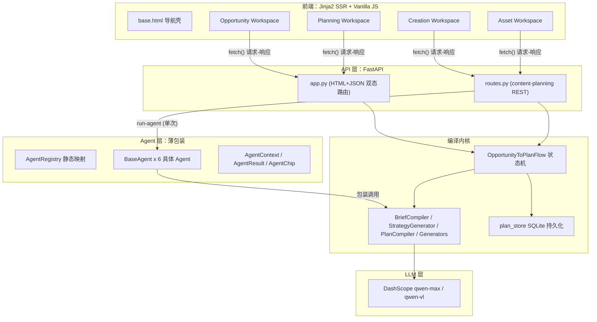
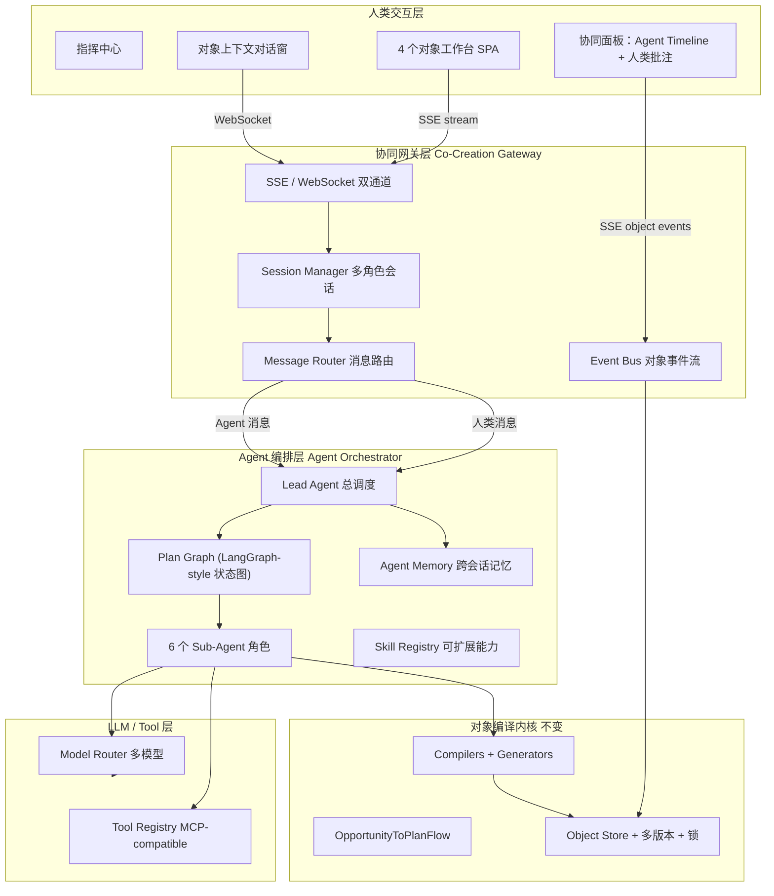
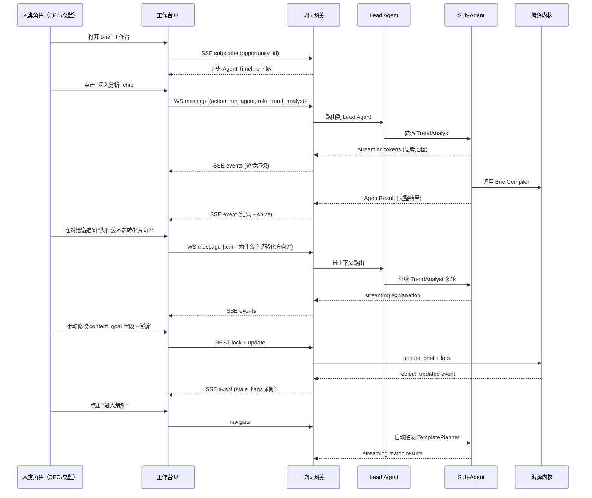

# AI-native 多角色协同交互架构升级方案

---

## 一、当前架构全景（As-Is）

### 当前核心问题

- **无实时通道**：全部请求-响应，无 WebSocket/SSE；Agent 调用后整包返回 JSON，用户看到的是 loading → 结果突然出现
- **Agent 层是旁路**：6 个 Agent 不参与主 pipeline 编排；`AgentContext` 构造不完整（缺 card、template、source_notes）；前端 `runAgent()` 函数定义了但从未调用
- **无对话能力**：Agent 无 message history、无多轮上下文、无追问能力；一次 `run-agent` 返回后上下文丢失
- **无协同状态**：ObjectLock 是布尔标记但重生成不检查锁；`append_version` 从未被调用；多版本历史始终为空
- **前端交互薄**：Jinja2 服务端渲染 + 内联 JS；无组件化、无状态管理、无流式渲染

---

## 二、目标架构全景（To-Be）

借鉴 DeerFlow 的 **Lead Agent + Sub-Agent + Sandbox + Memory** 和 Hermes 的 **Learning Loop + Skill System + Multi-Platform Gateway** 理念，设计以下四层协同架构：

---

## 三、升级分层详解

### Layer 1：协同网关层（新增）

**核心借鉴**：DeerFlow 的 Gateway API（标准/Gateway 双模式）+ Hermes 的多平台 Gateway

- **SSE Endpoint** (`/stream/{opportunity_id}`)：对象级事件流，前端通过 `EventSource` 订阅，接收 Agent 思考过程、生成 token 流、对象状态变更
- **WebSocket Endpoint** (`/ws/{opportunity_id}`)：双向通道，用于人类在对象上下文中发消息（追问、修改指令、确认操作）
- **Session Manager**：绑定 `opportunity_id` + `role`（CEO / 产品总监 / 增长总监 / 视觉总监）+ `agent_roles`，维护多角色会话状态
- **Event Bus**：对象变更事件（brief_updated / strategy_regenerated / field_locked / version_created）广播给所有订阅者

关键文件变更：

- 新增 `apps/content_planning/gateway/` 目录
- 新增 `apps/content_planning/gateway/sse_handler.py`
- 新增 `apps/content_planning/gateway/ws_handler.py`
- 新增 `apps/content_planning/gateway/session_manager.py`
- 新增 `apps/content_planning/gateway/event_bus.py`

### Layer 2：Agent 编排层（重构）

**核心借鉴**：DeerFlow 的 Lead Agent + Sub-Agent + Plan Graph；Hermes 的 Skill System + Learning Loop

**A. Lead Agent（总调度）**

- 接收人类消息 + 当前对象上下文，决定委派哪个 Sub-Agent
- 维护 Plan Graph：类似 LangGraph 的状态图，节点是 Agent 角色，边是数据依赖
- 支持 interrupt/redirect：人类随时可以打断当前 Agent 行为

**B. Sub-Agent 升级（现有 6 个 Agent 增强）**

| Agent            | 现状               | 升级后                            |
| ---------------- | ---------------- | ------------------------------ |
| TrendAnalyst     | 只读 card 产出 chips | 支持多轮对话、能主动搜索竞品、记忆过往分析          |
| BriefSynthesizer | 单次编译             | 支持追问 "为什么选这个方向"、能对比多个 Brief 版本 |
| TemplatePlanner  | 单次匹配             | 支持 "换个风格试试" 的多轮修正、能解释匹配理由      |
| StrategyDirector | 缺 template 无法运行  | 修复上下文注入、支持策略辩论（给出两个方向让人选）      |
| VisualDirector   | 单次图片指令           | 支持参考图分析、风格迁移建议、图位级别修改          |
| AssetProducer    | 单次组包             | 支持 Campaign 批量、导出格式协商、变体对比     |

**C. Agent Context 完整化**

- 修复 `run-agent` 中 `AgentContext` 的构造：注入 `card`（从 review_store 获取）、`template`（从 match_result 获取）、`source_notes`、`review_summary`
- 新增 `message_history: list[AgentMessage]` 支持多轮

**D. Agent Memory（借鉴 Hermes）**

- 跨会话记忆：某个机会卡上的决策理由、用户偏好、过往策略效果
- Skill 学习：完成复杂任务后自动提取可复用策略模式

**E. Skill Registry（借鉴 DeerFlow）**

- 将 Prompt YAML 配置升级为 Skill：每个 Skill 是一个 YAML + 工作流定义
- 支持动态加载、按需激活（不占上下文窗口）

关键文件变更：

- 重构 `apps/content_planning/agents/base.py`：增加 `AgentMessage`、`AgentThread`
- 新增 `apps/content_planning/agents/lead_agent.py`
- 新增 `apps/content_planning/agents/plan_graph.py`
- 新增 `apps/content_planning/agents/memory.py`
- 重构所有 6 个具体 Agent：增加多轮 `run_turn()` 方法
- 修复 `apps/content_planning/api/routes.py` 中 `AgentContext` 构造

### Layer 3：对象交互层（增强）

- **ObjectLock enforcement**：在所有 `build_`* / `regenerate_`* 方法中检查锁，锁定字段跳过重写
- **append_version 接线**：在 `build_brief`、`build_strategy`、`build_plan` 成功后自动调用 `append_version`
- **Object Event 广播**：每次对象变更通过 Event Bus 通知前端

关键文件变更：

- 修改 `apps/content_planning/services/opportunity_to_plan_flow.py`：在 `build`_* 后调用 `append_version` + emit event
- 增强锁检查逻辑

### Layer 4：前端交互层（重大升级）

**技术路径选择**（两个方案，建议方案 A）：

**方案 A（推荐）：渐进增强 — Jinja2 + Alpine.js + htmx + SSE**

- 保留现有 Jinja2 模板结构作为 shell
- 引入 Alpine.js 做轻量响应式状态管理
- 引入 htmx 做局部 DOM 更新（不需要全页刷新）
- SSE 订阅 Agent 输出流，逐 token 渲染
- 适合当前团队规模和原型阶段

**方案 B：SPA 重写 — Next.js（已有基础）**

- 利用根目录已有的 Next.js 15 + React 19 工程
- 全面 SPA 体验，但需要重写所有 4 个工作台
- 适合后期产品化阶段

**前端升级要点（无论哪个方案）**：

1. **Agent Timeline**：右栏从静态文本 → 滚动时间线，每条是一个 AgentResult，包含角色头像、解释、置信度、chips
2. **对象上下文对话**：在每个 Workspace 底部或右栏增加对话窗，消息绑定当前 opportunity_id，支持追问
3. **流式渲染**：Agent 思考过程逐步呈现（类似 ChatGPT 的 token 流）
4. **多角色标识**：不同 Agent 和人类角色用颜色/头像区分
5. **锁定 / 版本 UI**：锁定状态可视化增强，版本 diff 对比视图
6. **Chip 真正接线**：AI Chips 点击后真正调用 `run-agent`，返回结果流式渲染到 Agent Timeline

---

## 四、人 + Agent 协同交互模型

借鉴 DeerFlow 的 Lead Agent 委派模式和 Hermes 的 "interrupt-and-redirect" 能力：

### 人类角色 vs Agent 角色的权责边界

| 角色类型             | 谁            | 能做什么                          | 不能做什么        |
| ---------------- | ------------ | ----------------------------- | ------------ |
| CEO              | 人类           | 审批关键决策、设定优先级、确认机会方向           | 不直接编辑内容细节    |
| 产品总监             | 人类           | 编辑 Brief、确认策略方向、Review 资产     | -            |
| 增长总监             | 人类           | 评估增长潜力、调整投放建议、确认 Campaign     | -            |
| 视觉总监             | 人类           | 审核图片方向、确认视觉风格、标注修改意见          | -            |
| Lead Agent       | AI           | 理解人类意图、分解任务、委派 Sub-Agent、汇总结果 | 不能自动修改已锁定字段  |
| TrendAnalyst     | AI Sub-Agent | 分析机会、竞品对比、趋势判断                | 不能直接修改 Brief |
| BriefSynthesizer | AI Sub-Agent | 编译 Brief、解释决策                 | 不能跳过人类确认     |
| StrategyDirector | AI Sub-Agent | 生成策略、对比方案                     | 不能自动选定最终策略   |
| VisualDirector   | AI Sub-Agent | 图片规划、风格建议                     | 不能替代人类审美判断   |
| AssetProducer    | AI Sub-Agent | 组包、导出、变体生成                    | 不能自动发布       |

---

## 五、实施路径建议

### Phase 0：基础修复（1 周）

- 修复 AgentContext 构造完整性（注入 card/template/source_notes）
- 接线 append_version（每次 build 后自动写入）
- ObjectLock enforcement（重生成时检查锁）
- 前端 runAgent() 真正调用 run-agent 并渲染结果

### Phase 1：协同网关 + SSE 流式（2 周）

- 实现 SSE endpoint，Agent 输出逐步推送
- 前端 EventSource 订阅 + Agent Timeline UI
- Lead Agent 基础版（消息路由 + 单 Agent 委派）

### Phase 2：多轮对话 + 对象上下文（2 周）

- Agent 增加 message_history / thread
- 工作台增加对话窗组件
- Session Manager 实现多角色会话隔离

### Phase 3：Plan Graph 编排 + Memory（2 周）

- LangGraph-style 状态图实现 Agent 间依赖编排
- Agent Memory 持久化（决策理由 + 用户偏好）
- Skill Registry 初始化

### Phase 4：前端富交互（2 周）

- 版本 diff 对比视图
- 多策略/多变体并排对比
- Chip 驱动的快速迭代循环
- 协同面板（多人 + 多 Agent 时间线合并视图）

