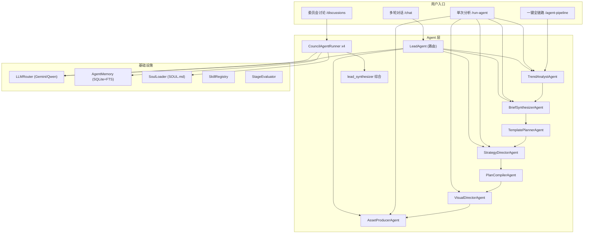

# AI/Agent 交互方式升级方案

## 一、当前实现全景

### 1.1 Agent 架构概览

### 1.2 当前四种交互模式

| 模式                            | 入口                              | 行为                   | 痛点                         |
| ----------------------------- | ------------------------------- | -------------------- | -------------------------- |
| **单次分析** (`run-agent`)        | 各页面「分析」按钮/Chips                 | 调一个 Agent，返回解释+建议    | 孤立、无上下文、无记忆延续              |
| **多轮对话** (`/chat`)            | Brief/Strategy/Plan/Asset 页的聊天框 | LeadAgent 路由到子 Agent | 路由靠关键词/LLM 猜测，常答非所问；上下文丢失快 |
| **委员会** (`/discussions`)      | 各页面「发起讨论」                       | 多角色 SOUL 辩论 + 综合     | 启动慢（每角色一次 LLM）；与对话/分析割裂    |
| **一键全链路** (`/agent-pipeline`) | Pipeline 面板                     | 7 节点顺序执行             | 全自动黑盒，用户只能等；中途无法干预/修正      |

### 1.3 核心痛点总结

**A. Agent 之间是孤岛**

- `run-agent`、`chat`、`council` 三条路径各自独立，用户在一个入口获得的洞察无法自动流入另一个
- 例：Council 讨论出的品牌风险，不会自动出现在下次 `strategy_director` 分析中

**B. AI 是被动工具，不是主动伙伴**

- 所有 AI 行为都需要用户主动触发按钮
- 没有「主动提醒」「异常预警」「阶段推进建议」
- Brief 有明显问题（如缺 target_user）时，系统不会主动提示

**C. 对话路由不精准**

- `LeadAgent` 的路由策略：先试 tool_calls → 再试 DeerFlow LLM → 最后关键词匹配
- DashScope 不支持 tools，Gemini 通过代理可能也不稳定，常退化到关键词匹配
- 用户问「帮我优化标题」可能被路由到错误的 Agent

**D. 上下文注入不够智能**

- 每个 Agent 只看到自己阶段的对象，看不到全链路状态
- Memory 是 SQLite FTS，无语义相关性，常注入无关记忆
- Council 角色看到的「先前专家发言」只在本次讨论内，不跨讨论

**E. 结果只有文字，缺乏可操作性**

- Agent 返回一段 explanation，用户需要自己理解并手动修改
- Council 的 `proposed_updates` 需要用户点「采纳」才生效，且只支持 Brief 阶段
- 没有「帮我改」「帮我生成」的直接执行能力

---

## 二、升级方案

### Phase 1: 统一上下文 + 精准路由（1-2 周）

**目标：让每次 AI 交互都基于完整的策划状态，而非碎片信息**

- **1a. 构建 `PlanningContextAssembler`**
  - 新文件 `apps/content_planning/agents/context_assembler.py`
  - 为每次 AI 调用自动组装：当前阶段对象 + 全链路完成度 + 最近 3 条 Council 共识 + 未解决的 open_questions + 当前阶段评分短板
  - 所有入口（chat / run-agent / council）统一调用
- **1b. 改造 LeadAgent 路由为确定性规则 + LLM 兜底**
  - 在 [lead_agent.py](apps/content_planning/agents/lead_agent.py) 中，优先用正则/关键词 map 到明确意图（如「优化标题」→ `plan` 阶段 + `generate-titles`），命中率不足时才走 LLM
  - 把 `current_stage` 作为强约束：用户在 Strategy 页提问，默认只路由到 strategy 相关 Agent
  - 新增意图识别结果中的 `action_type`：`analyze`（只分析）/ `generate`（生成/修改）/ `discuss`（需要 Council）/ `evaluate`（评分）
- **1c. 跨讨论记忆串联**
  - 在 [memory.py](apps/content_planning/agents/memory.py) 的 `council_memory_block` 中增加：自动检索同 opportunity 的历史 Council 共识（`category=discussion_consensus`），注入当前 Council 上下文
  - 每次 `run-agent` 时也注入最近的 Council 结论摘要

### Phase 2: 主动 AI — 异常检测 + 阶段推进（1-2 周）

**目标：AI 主动发现问题并建议行动，而非等用户点按钮**

- **2a. `StageHealthChecker` — 阶段健康自检**
  - 新文件 `apps/content_planning/agents/health_checker.py`
  - 页面加载时自动运行（轻量规则检查，不调 LLM）
  - 检查项示例：Brief 缺必填字段、Strategy 与 Brief 不一致、Plan 标题数不足、Asset 图位未生成
  - 输出 `HealthIssue[]`，前端渲染为页面顶部的黄色/红色提醒条
- **2b. `NextStepAdvisor` — 阶段推进建议**
  - 在各页面加载时，根据全链路完成度 + 评分，给出下一步建议
  - 示例：「Brief 评分 0.82，建议发起 Council 讨论品牌调性」「Strategy 已就绪，可进入 Plan 编译」
  - 以 `suggestion_chips` 形式展示在页面顶部
- **2c. SSE 主动推送**
  - 当后台完成评分/检测到异常时，通过现有 `event_bus` + SSE 推送 `health_alert` 事件
  - 前端监听并在任意页面顶部弹出提醒卡片

### Phase 3: 可执行 AI — 从「建议」到「执行」（2-3 周）

**目标：Agent 不仅告诉你怎么改，还能帮你改**

- **3a. Council Proposal 全阶段可应用**
  - 当前 `apply-as-draft` 仅支持 Brief；扩展到 Strategy / Plan / Asset
  - Council 的 `proposed_updates` 直接映射到 `OpportunityToPlanFlow.apply_stage_updates`
  - 前端在 Proposal 卡片上显示逐字段 diff 预览
- **3b. Agent 分析结果 → 一键执行**
  - `run-agent` 返回的 `suggestions` 不再只是文字建议
  - 每个 suggestion 带 `action`（如 `regenerate_titles`、`refine_brief_field:target_user`）
  - 前端渲染为可点击的 chip，点击直接触发对应 API
  - 在 [base.py](apps/content_planning/agents/base.py) 中扩展 `AgentChip` 加 `confirmation_required: bool`
- **3c. 对话中的内联执行**
  - 用户在 Chat 里说「帮我重新生成标题」，LeadAgent 识别意图后不仅返回文字，还返回 `action_chips`
  - 用户确认后前端自动调用 `generate-titles` 等 API
  - 在 [lead_agent.py](apps/content_planning/agents/lead_agent.py) 的 `_make_result` 中加 `pending_actions` 字段

### Phase 4: 协作 AI — 人机协同工作流（3-4 周）

**目标：AI 和人在同一个工作流里协作，而非各干各的**

- **4a. Guided Workflow（引导式工作流）**
  - 新增 `WorkflowGuide` 组件：用户首次进入某阶段时，AI 自动提出 2-3 个需要人类决策的关键问题
  - 示例（Brief 阶段）：「1. 这个机会面向哪类用户？ 2. 核心卖点是什么？ 3. 品牌调性偏活泼还是专业？」
  - 用户回答后，AI 基于回答自动填充 Brief 字段并生成初稿
- **4b. 实时协同编辑**
  - 用户手动修改 Brief 某字段后，AI 检测变更并给出评论（如「target_user 改为'新手宝妈'后，建议同步调整 content_goal」）
  - 通过 SSE 推送 `field_change_suggestion` 事件
- **4c. Review Loop 闭环**
  - Pipeline 完成后，自动触发全链路评分
  - 低分环节自动生成改进建议并创建「待办」
  - 改进完成后自动重新评分，形成闭环

---

## 三、建议实施顺序

**Phase 1 > Phase 2 > Phase 3 > Phase 4**

Phase 1 是其他所有升级的基础（统一上下文 + 精准路由）。Phase 2 见效最快（用户立即感受到 AI 更「聪明」）。Phase 3 让产品从「分析工具」变成「执行助手」。Phase 4 是终极形态。