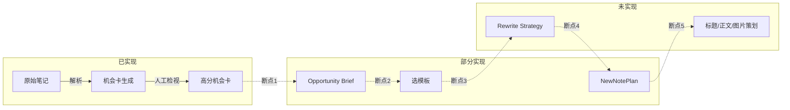

# 小红书笔记 → 内容策划 全链路审计报告

## 链路总览

用户期望的完整链路包含 8 个阶段：

## 阶段 1: 原始笔记采集与解析 -- 已实现

**实现位置**:

- [apps/intel_hub/ingest/mediacrawler_loader.py](apps/intel_hub/ingest/mediacrawler_loader.py) -- 从 MediaCrawler JSONL/JSON/SQLite 加载原始记录
- [apps/intel_hub/parsing/xhs_note_parser.py](apps/intel_hub/parsing/xhs_note_parser.py) -- dict -> XHSNoteRaw -> XHSParsedNote
- [apps/intel_hub/schemas/xhs_raw.py](apps/intel_hub/schemas/xhs_raw.py) -- `XHSNoteRaw` 数据模型（含 `from_mediacrawler_dict`）
- [apps/intel_hub/schemas/xhs_parsed.py](apps/intel_hub/schemas/xhs_parsed.py) -- `XHSParsedNote` 归一化模型

**数据流**: MediaCrawler JSONL (`search_contents_*.jsonl`) -> `parse_raw_note(dict)` -> `XHSNoteRaw` -> `parse_note()` -> `XHSParsedNote`

**XHSParsedNote 包含**:

- `raw_note` (完整 XHSNoteRaw 引用)
- `normalized_title` / `normalized_body` / `normalized_tags`
- `parsed_images` (含 is_cover / index / url)
- `engagement_summary` (like_count / collect_count / comment_count / share_count / total / save_ratio 等)

**实现质量**: 完整可用。CDN URL 规范化、评论关联、去重都已实现。

**已知问题**:

- `mediacrawler_loader` 输出的归一化 dict 格式与 `parse_raw_note` 期望的 MediaCrawler 原始 dict 格式不同，两者不能直接串联
- `/strategy-templates` 页面通过构造 `XHSNoteRaw` 再调 `parse_note` 绕开了这个问题

---

## 阶段 2: 机会卡生成 -- 已实现

**实现位置**:

- [apps/intel_hub/extraction/visual_extractor.py](apps/intel_hub/extraction/visual_extractor.py) -- 视觉信号提取（规则层 + VLM 可选层 + 合并层）
- [apps/intel_hub/extraction/selling_theme_extractor.py](apps/intel_hub/extraction/selling_theme_extractor.py) -- 卖点主题提取（文本 + 评论验证 + LLM 补充 + 分类）
- [apps/intel_hub/extraction/scene_extractor.py](apps/intel_hub/extraction/scene_extractor.py) -- 场景提取（显式 + 隐式 + LLM + 组合生成）
- [apps/intel_hub/extraction/cross_modal_validator.py](apps/intel_hub/extraction/cross_modal_validator.py) -- 跨模态一致性校验
- [apps/intel_hub/projector/ontology_projector.py](apps/intel_hub/projector/ontology_projector.py) -- 三维信号 -> XHSOntologyMapping（本体映射）
- [apps/intel_hub/compiler/opportunity_compiler.py](apps/intel_hub/compiler/opportunity_compiler.py) -- 本体映射 -> XHSOpportunityCard 列表
- [apps/intel_hub/workflow/xhs_opportunity_pipeline.py](apps/intel_hub/workflow/xhs_opportunity_pipeline.py) -- 端到端流水线

**数据流**: `XHSParsedNote` -> 三维信号提取 (`VisualSignals` / `SellingThemeSignals` / `SceneSignals`) -> `CrossModalValidation` -> `XHSOntologyMapping` -> `list[XHSOpportunityCard]`

**XHSOpportunityCard 包含**:

- `opportunity_id` / `opportunity_type` (visual / demand / scene 等)
- `title` / `summary` / `tags`
- `scene_refs` / `style_refs` / `need_refs` / `audience_refs`
- `confidence` / `priority` / `evidence_refs`
- `source_note_ids` / `suggested_next_step`
- V0.7 新增: `review_count` / `manual_quality_score_avg` / `composite_review_score` / `opportunity_status` / `qualified_opportunity`

**实现质量**: 完整可用。规则层始终运行，LLM/VLM 可选增强（需 DashScope API Key）。

**已知问题**:

- `opportunity_rules.yaml` 中部分触发阈值（如 `min_click_differentiation_score`）在代码中未实际读取
- 桌布品类词表耦合较强，泛化到其他品类需改配置

---

## 阶段 3: 人工评分/检视 -- 已实现

**实现位置**:

- [apps/intel_hub/schemas/opportunity_review.py](apps/intel_hub/schemas/opportunity_review.py) -- `OpportunityReview` 数据模型
- [apps/intel_hub/storage/xhs_review_store.py](apps/intel_hub/storage/xhs_review_store.py) -- SQLite 双表存储
- [apps/intel_hub/services/review_aggregator.py](apps/intel_hub/services/review_aggregator.py) -- 检视聚合（composite_review_score 公式）
- [apps/intel_hub/services/opportunity_promoter.py](apps/intel_hub/services/opportunity_promoter.py) -- 升级判定
- API 路由: `POST /xhs-opportunities/{id}/reviews` + `GET /xhs-opportunities`（含 status/qualified 筛选）

**数据流**: 人工提交 `OpportunityReview` -> 聚合统计 -> `composite_review_score = 0.5*(avg_quality/10) + 0.3*actionable_ratio + 0.2*evidence_ratio` -> 升级判定 (全部满足阈值 -> `promoted`)

**升级阈值**: `review_count >= 1`, `quality_avg >= 7.5`, `actionable_ratio >= 0.6`, `evidence_ratio >= 0.7`, `composite >= 0.72`

**获取高分卡**: `review_store.list_promoted_cards()` 方法已实现（返回 `opportunity_status = "promoted"` 的卡）

**实现质量**: 完整可用，有 UI 表单和 API。

**已知问题**:

- `list_promoted_cards()` 方法存在但**未被任何模块调用**，这是链路断点的起点
- 无自动 `rejected` 状态路径
- `MainImagePlan` schema 中没有 `opportunity_id` 字段，无法回溯关联

---

## 阶段 4: 生成 Opportunity Brief -- 未实现

**现状**: **不存在** `OpportunityBrief` schema 或任何相关模块。

**"Brief" 在系统中的近似概念**:

- `TemplateMatcher.match_templates` 的 `product_brief` 参数 -- 但这只是一个普通字符串入参，不是结构化的 Brief 对象
- `MainImagePlanCompiler` 中的 `product_brief` -- 同上，只是传入的文本
- `/strategy-templates` 页面用 `title + body[:100]` 充当 brief -- 临时拼接，非正式 Brief

**缺什么**:

- `OpportunityBrief` Pydantic 模型（应从 promoted 机会卡中提炼：目标场景、核心卖点、目标受众、价格定位、视觉风格倾向、内容意图）
- `brief_compiler` 服务（`XHSOpportunityCard` + 原始笔记上下文 -> `OpportunityBrief`）
- API 端点（`POST /xhs-opportunities/{id}/generate-brief`）

---

## 阶段 5: 选模板 -- 部分实现（模块存在，但与上游断开）

**实现位置**:

- [apps/template_extraction/agent/template_retriever.py](apps/template_extraction/agent/template_retriever.py) -- 加载 6 套模板
- [apps/template_extraction/agent/template_matcher.py](apps/template_extraction/agent/template_matcher.py) -- `TemplateMatcher` 启发式打分
- [apps/template_extraction/agent/**init**.py](apps/template_extraction/agent/__init__.py) -- `build_main_image_plan` 一站式入口
- 6 套模板 JSON: [data/template_extraction/templates/](data/template_extraction/templates/)

**TemplateMatcher 打分逻辑**:

- 意图关键词映射（种草/转化/礼赠/平价改造 -> template_id 子串）: +0.4
- 模板专属关键词命中（6 组共 60+ 中文关键词）: +0.15 ~ +0.35
- `fit_scenarios` / `fit_styles` 文本匹配: +0.06 ~ +0.08 each
- `opportunity_card.opportunity_type` 与 template_id 的粗规则: +0.2

**断点问题**:

- `match_templates` 接受 `opportunity_card: dict | None`，设计上**可以**接收机会卡，但**当前没有任何代码把 promoted 机会卡传给它**
- `/strategy-templates` 页面传的是 `opportunity_card=None`，用笔记标题+正文做匹配
- `build_main_image_plan` 函数**未在 API 中暴露**
- `match_templates` 中 `recommended_phrases` 的遍历是 `for word in phrase[:4]`（遍历的是前 4 个字符而非词），行为与意图不一致

---

## 阶段 6: 生成 Rewrite Strategy -- 未实现

**现状**: **不存在** `RewriteStrategy` 或任何改写策略相关的 schema / 模块。

**缺什么**:

- `RewriteStrategy` Pydantic 模型（应基于选定模板 + Opportunity Brief，生成：内容改写方向、标题策略、正文策略、图片策略、语气风格、核心钩子、避免事项）
- `strategy_generator` 服务（`Template` + `OpportunityBrief` -> `RewriteStrategy`，可调 LLM）
- 这是从「选了什么模板」到「具体怎么写」的关键翻译层

---

## 阶段 7: 生成 NewNotePlan -- 部分实现（MainImagePlan 存在，但范围有限）

**实现位置**:

- [apps/template_extraction/schemas/agent_plan.py](apps/template_extraction/schemas/agent_plan.py) -- `MainImagePlan` + `ImageSlotPlan`
- [apps/template_extraction/agent/plan_compiler.py](apps/template_extraction/agent/plan_compiler.py) -- `MainImagePlanCompiler`

**MainImagePlan 包含**:

- `plan_id` / `template_id` / `template_name` / `template_version`
- `priority_axis` (填入 template_goal)
- `matcher_rationale` (匹配原因)
- `global_notes` (多行：goal + hook + 商品摘要 + 风险规则)
- `image_slots`: 5 个 `ImageSlotPlan`（`slot_index` / `role` / `intent` / `visual_brief` / `copy_hints` / `must_include_elements` / `avoid_elements`）

**缺什么**:

- `MainImagePlan` 只覆盖了 **图片策划**（5 张主图），**没有**标题策划、正文策划
- 没有 `opportunity_id` 字段，无法回溯到哪张机会卡
- `plan_compiler` 的 `opportunity_card` 参数虽然接收但**其 ID 未写入输出**
- 需要一个更完整的 `NewNotePlan`，包含：标题方案、正文大纲、图片策划（现有 MainImagePlan 可嵌入）、标签策略、发布建议

---

## 阶段 8: 生成标题/正文/图片策划 -- 未实现

**现状**: **不存在** LLM 驱动的内容生成模块。

**缺什么**:

- `title_generator` -- 基于 RewriteStrategy + 模板 copy_rules 生成 3-5 个候选标题
- `body_generator` -- 基于 RewriteStrategy + 模板 scene_rules 生成正文大纲或正文草稿
- `image_brief_generator` -- 基于 MainImagePlan 的 5 个 ImageSlotPlan 生成可供视觉 Agent 执行的详细图片指令
- 所有生成器应可调 LLM（复用现有 `llm_client`）
- API 端点将完整方案返回给前端展示

---

## 模块间断点汇总

| 断点   | 上游输出                                   | 下游输入                     | 状态                                       |
| ---- | -------------------------------------- | ------------------------ | ---------------------------------------- |
| 断点 1 | `promoted` 机会卡 (`list_promoted_cards`) | Opportunity Brief 生成     | **完全断开**: Brief 不存在                      |
| 断点 2 | Opportunity Brief                      | 模板选择 (`match_templates`) | **完全断开**: Brief 不存在；Matcher 当前只接笔记文本     |
| 断点 3 | 选定的模板                                  | Rewrite Strategy         | **完全断开**: Strategy 不存在                   |
| 断点 4 | Rewrite Strategy                       | NewNotePlan              | **部分断开**: MainImagePlan 存在但只覆盖图片，且未接 API |
| 断点 5 | NewNotePlan                            | 标题/正文/图片内容               | **完全断开**: 无 LLM 生成模块                     |

---

## 已实现 vs 未实现 清单

| 模块                       | 状态      | 说明                             |
| ------------------------ | ------- | ------------------------------ |
| 原始笔记解析                   | 已实现     | XHSNoteRaw -> XHSParsedNote，完整 |
| 三维信号提取                   | 已实现     | 规则+LLM/VLM 双层，完整               |
| 跨模态校验                    | 已实现     | CrossModalValidation           |
| 本体映射                     | 已实现     | XHSOntologyMapping             |
| 机会卡编译                    | 已实现     | XHSOpportunityCard，含合并去重       |
| 端到端 Pipeline             | 已实现     | CLI + JSON 输出                  |
| 人工检视                     | 已实现     | SQLite + API + UI 表单           |
| 检视聚合与升级                  | 已实现     | composite_score + 自动 promoted  |
| 策略模板库                    | 已实现     | 6 套模板 + 展示页面                   |
| 模板匹配器                    | 已实现     | 启发式关键词打分                       |
| 主图方案编译器                  | 已实现     | MainImagePlan (5 slot)         |
| **Opportunity Brief**    | **未实现** | 无 schema、无服务、无 API             |
| **promoted 卡 -> 模板选择桥接** | **未实现** | `list_promoted_cards` 无调用方     |
| **Rewrite Strategy**     | **未实现** | 无 schema、无服务                   |
| **NewNotePlan (完整版)**    | **未实现** | 现有 MainImagePlan 只覆盖图片部分       |
| **标题生成**                 | **未实现** | 无 LLM 生成模块                     |
| **正文生成**                 | **未实现** | 无 LLM 生成模块                     |
| **图片指令详细化**              | **未实现** | ImageSlotPlan 为策划级别，非执行级别      |
| **完整链路 API**             | **未实现** | 各环节未通过 API 串联                  |

---

## 要补齐完整链路，需要新增的模块

按优先级排列:

1. `**OpportunityBrief` schema + `brief_compiler` 服务** -- 从 promoted 机会卡提炼结构化 Brief
2. **promoted 卡 -> 模板选择 的 API 桥接** -- 让 `TemplateMatcher` 接收真实机会卡数据
3. `**RewriteStrategy` schema + `strategy_generator` 服务** -- 将模板规则转化为具体内容策略
4. `**NewNotePlan` (完整版) schema** -- 整合标题/正文/图片三维策划
5. `**title_generator` / `body_generator` / `image_brief_generator`** -- LLM 驱动的内容生成
6. **完整链路 API** -- 一个或多个端点串联上述步骤，支持 UI 展示

