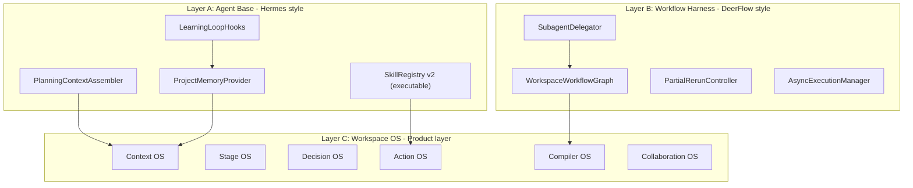

# V2 三层架构升级：Hermes Base + DeerFlow Harness + Workspace OS

## 当前代码 vs 文档要求的差距地图

### 已有基础（可复用）

- `AgentMemory`（SQLite + FTS）— 但仅按 opportunity 碎片存取，无项目/品牌级记忆
- `SkillRegistry` — 但多数技能仅文案描述，无 executable_steps
- `CouncilAgentRunner` + `SOUL.md` x 5 — 但输出是文本共识，非结构化 diff
- `GraphExecutor` + `build_agent_pipeline_graph` — 但无子代理委派、无 partial rerun
- `StageEvaluator` — 但有固定 1.0 品牌维度注水、match 规则与 schema 不一致
- `LLMRouter`（Gemini + Qwen）— 但 DashScope 不支持 tools、非 OpenAI 流式为假流式
- SSE `event_bus` — 已可用，Council 流式已接通

### 需要新建的核心模块




---

## Phase A: Agent Base Layer（Hermes 风格基座）

**目标**：所有 Agent 吃同一种项目级记忆和 skill，解决「Agent 之间是孤岛」问题。

### A1. PlanningContextAssembler

**新建** `apps/content_planning/agents/context_assembler.py`

当前问题：`run-agent`、`chat`、`council` 三条路径各自组装上下文，互不通气。

实现：

- `assemble(opportunity_id, stage, mode) -> PlanningContext`
- 统一组装：当前阶段对象 + 上游对象摘要 + 下游完成度 + 最近 3 条 Council 共识 + open_questions + 当前阶段评分短板 + 项目级记忆
- 从 [routes.py](apps/content_planning/api/routes.py) 的 `_build_agent_context` 提取并增强
- 所有入口统一调用：改造 `_run_stage_discussion`、`run-agent`、`/chat` 三处

### A2. ProjectMemoryProvider

**改造** [memory.py](apps/content_planning/agents/memory.py)

当前问题：只有 opportunity 维度碎片记忆，无品牌/项目/跨机会级别。

增强：

- 新增 `brand_id` / `campaign_id` 维度存储和检索
- `inject_project_context(brand_id)` — 返回该品牌历史偏好（常用模板、常被采纳的策略风格、品牌调性要求）
- `inject_cross_opportunity_lessons(opportunity_id)` — 返回同品牌/同品类下的历史 Council 共识和评分教训
- Council 结束时自动将共识写入 `project_memory`（category=`project_consensus`），而不仅是 `council_opinion`

### A3. SkillRegistry v2

**改造** [skill_registry.py](apps/content_planning/agents/skill_registry.py)

当前问题：6 个默认技能中 5 个仅文案无 `executable_steps`。

改造：

- 为所有高频动作补上 `executable_steps`：`generate_brief_from_promoted_opportunity`、`rematch_templates_for_brief`、`compare_strategy_blocks`、`regenerate_image_slot`、`compile_asset_bundle`
- 每个 step 绑定 `tool_registry` 中的实际工具函数
- Hermes 式 skill 版本：新增 `version` / `success_rate` / `last_updated` 字段

### A4. LearningLoopHooks

**改造** [hermes_adapter.py](apps/content_planning/adapters/hermes_adapter.py) + [comparison.py](apps/content_planning/evaluation/comparison.py)

当前问题：`apply_learning_loop` 存在但钩子未闭环。

改造：

- Council Proposal 被采纳时 → 自动提取该讨论的策略模式存入 project_memory
- 评分低于阈值时 → 自动写入 `lesson_learned` 到 project_memory
- Skill 执行成功率追踪 → 低成功率 skill 触发 prompt 版本更新标记

---

## Phase B: Workflow Harness Layer（DeerFlow 风格编排）

**目标**：4 个 Workspace 的后台流程变成可观测、可局部重跑的 workflow graph。

### B1. WorkspaceWorkflowGraph

**改造** [plan_graph.py](apps/content_planning/agents/plan_graph.py) + [graph_executor.py](apps/content_planning/agents/graph_executor.py)

当前问题：只有一张全链路 pipeline 图，不支持单 Workspace 内的子图执行。

改造：

- 为每个 Workspace 定义子图：
  - Opportunity: `evaluate_opportunity → sanity_check → promote_decision`
  - Planning: `compile_brief → match_templates → generate_strategy → evaluate_strategy`
  - Creation: `compile_note_plan → generate_titles → generate_body → generate_image_briefs → consistency_check`
  - Asset: `assemble_bundle → generate_variants → judge_score → export_package`
- `GraphExecutor` 增加 `execute_subgraph(graph, start_node, context)` — 支持从某节点重跑
- 状态持久化到 `ContentPlanStore`，页面可恢复

### B2. Partial Rerun + Async Execution

**改造** [agent_pipeline_runner.py](apps/content_planning/services/agent_pipeline_runner.py)

当前问题：全链路要么全跑要么不跑，中途无法干预。

改造：

- `rerun_from_node(run_id, node_id)` — 从指定节点重跑，复用上游 context
- `cancel_node(run_id, node_id)` — 取消正在执行的节点
- 所有执行异步化（已有 `run_in_executor` 基础），节点完成即 SSE 推送

### B3. Subagent Delegation

**改造** [lead_agent.py](apps/content_planning/agents/lead_agent.py)

当前问题：LeadAgent 路由靠关键词猜测，退化率高。

改造：

- 构建 `IntentRouter`：`current_stage` 作为强约束 → 阶段内意图正则 map → LLM 兜底
- 意图分类为四种：`analyze` / `generate` / `discuss` / `evaluate`
- 每种意图映射到明确的 Agent + API endpoint
- LeadAgent 不再是"通用路由器"，而是"当前 Workspace 的意图解析器"

---

## Phase C: Workspace-native AI（四个 Workspace 的六层能力落地）

**按页面价值优先级 P0→P3**

### P0: Planning Workspace

文档要求最重的一页。改造 [planning_workspace.html](apps/intel_hub/api/templates/planning_workspace.html)。

**C1. Stage Header + HealthChecker**

新建 `apps/content_planning/agents/health_checker.py`:

- `check_brief_health(brief)` → 缺字段、字段不一致、与 strategy 矛盾
- `check_strategy_health(strategy, brief)` → 策略块是否覆盖核心卖点、是否有空块
- 输出 `HealthIssue[]`，前端渲染为页面顶部告警条 + `next_best_action` chip

**C2. ActionSpec 统一模型**

新建 `apps/content_planning/schemas/action_spec.py`:

```python
class ActionSpec(BaseModel):
    action_type: str          # regenerate / refine / lock / compare / apply
    target_object: str        # brief / strategy / template / plan / asset
    target_field: str = ""    # target_user / image_slot_3 等
    label: str                # 显示文案
    description: str = ""
    preview_diff: dict = {}   # 预览变更
    confirmation_required: bool = True
    api_endpoint: str         # /content-planning/...
    payload: dict = {}
```

所有 AI 输出（run-agent / council / health_checker / advisor）统一产出 `ActionSpec[]`，前端渲染为可点击的 action chips。

**C3. Council 结构化 diff → 全阶段 apply**

改造 [discussion.py](apps/content_planning/agents/discussion.py) 的 `_synthesize_consensus`：

- `proposed_updates` 不再只支持 Brief 白名单字段
- 新增 `strategy_block_diffs` / `plan_field_diffs` 结构
- 改造 [routes.py](apps/content_planning/api/routes.py) 的 `apply-as-draft`：Strategy / Plan / Asset 阶段也可 apply

**C4. Block-level Strategy 协作**

前端：Strategy 区域支持选中单个 block → 右侧 AI Inspector 切换到该 block 的分析/重写/锁定操作。

### P1: Creation Workspace

改造 `content_plan.html` 或新建 `creation_workspace.html`。

**C5. 对象选中态驱动 AI Inspector**

- 中栏 Plan Board 按对象分块：标题区 / 正文区 / 5 个图位区
- 点击任一对象 → 右栏 Inspector 切换为该对象的 AI 操作（分析 / 重生成 / 比较版本 / 锁定）
- 每个对象的 action chips 由 `ActionSpec` 驱动

**C6. Plan Consistency HealthCheck**

- 标题与 strategy 卖点是否一致
- 图位 role 是否覆盖 plan 需求
- 正文与标题是否矛盾

### P2: Opportunity Workspace

改造 `opportunity_workspace.html`。

**C7. Promoted Readiness + 证据解释**

- 页面加载时运行 `HealthChecker`：证据完整度、review 共识、与历史相似机会对比
- Stage Header 显示 readiness score + blockers
- 「进入 Brief」按钮带条件提示

**C8. 历史机会记忆注入**

- 使用 `ProjectMemoryProvider.inject_cross_opportunity_lessons` 在右栏展示同品牌/品类历史机会

### P3: Asset Workspace

改造 `asset_workspace.html`。

**C9. Judge Agent + VariantSet 对比**

- 新建 `JudgeAgent`：评估资产与 plan 一致性、风险、变体优劣
- 前端变体对比视图

**C10. Review Loop 闭环**

- 发布后效果回填 → 写入 project_memory
- 低效果资产自动标记改进建议 → 下一轮 skill/strategy 优化信号

---

## Phase D: Review and Evolution Loop（自进化闭环）

### D1. Skill Version Evolution

- 追踪每个 skill 的执行成功率 + 人工采纳率
- 低采纳率 skill 触发 prompt 版本更新

### D2. Cross-session Preference Model

- 品牌级偏好自动沉淀：常用模板、常被采纳的策略风格、品牌调性关键词
- 新 opportunity 进入时自动注入品牌偏好

### D3. Strategy/Template Evolution

- 高评分 strategy block 提取为可复用模式
- 模板采纳统计反馈到 `TemplateMatcher` 权重

---

## 实施优先级总览


| 阶段             | 周期    | 核心产出                                                        | 对应文档要求                     |
| -------------- | ----- | ----------------------------------------------------------- | -------------------------- |
| **Phase A**    | 1-2 周 | PlanningContextAssembler + ProjectMemory + SkillRegistry v2 | Layer A: Agent Base        |
| **Phase B**    | 1-2 周 | Workspace 子图 + Partial Rerun + IntentRouter                 | Layer B: Workflow Harness  |
| **Phase C-P0** | 2 周   | Planning Workspace 六层能力全落地                                  | Layer C: Workspace OS (P0) |
| **Phase C-P1** | 1-2 周 | Creation Workspace 对象化共创                                    | Layer C: Workspace OS (P1) |
| **Phase C-P2** | 1 周   | Opportunity Workspace 判断工作台                                 | Layer C: Workspace OS (P2) |
| **Phase C-P3** | 1 周   | Asset Workspace 交付闭环                                        | Layer C: Workspace OS (P3) |
| **Phase D**    | 持续    | 自进化闭环                                                       | 三文档共同要求的终极目标               |


