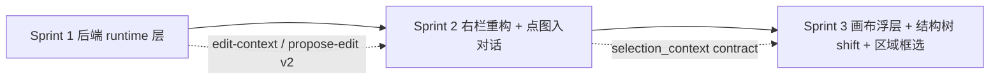

# 视觉工作台对象对话编辑 runtime 升级

## 核心痛点 → 本次升级核心改动映射

| 痛点 | 对应升级 |
|---|---|
| 点图后右栏 ①②③ 段把对话输入挤到视口外 | 右栏重构：sticky 顶部编辑上下文卡 + sticky 底部对话输入；中间段可折叠 |
| 点图后图片没有"身份"，Agent 不知道要改它 | 统一 selection_context：点图 → 同时 pin 为 img2img 底图 + 设为 primary object chip + focus 输入框 |
| 多轮编辑方向漂 | 新增 direction_summary 驱动的当前方向卡 |
| "这里/右边/主体"模糊指代无法绑定对象 | Reference Resolver + needs_clarification 路径 |

## Sprint 1：后端运行时上下文层（Batch 1）

### 1.1 新增 schema（[apps/growth_lab/schemas/visual_workspace.py](apps/growth_lab/schemas/visual_workspace.py)）
按 doc 第二章补齐：`RuntimeObjectSummary / RuntimeCopyBlock / EditIntentContext / EditTemplateContext / EditStrategyContext / CurrentVariantContext / SelectionContext / VisualStateSummary / RecentEditHistory / EditContextPack / ResolvedEditReference / ProposalV2 / ProposalStepV2`。

### 1.2 现有模型最小补字段
- `ObjectNode`：`role: str | None`, `semantic_description: str | None`, `editable_actions: list[str]`
- `ResultNode`：`slot_role: str | None`, `slot_objective: str | None`, `direction_summary: str | None`
- `_default_objects_for` 同步给每个默认对象写 `role`（如 `hero_product/before_area/after_area/title_copy/subtitle_copy/trust_badge/lifestyle_bg`）

### 1.3 新服务：[apps/growth_lab/services/edit_context_builder.py](apps/growth_lab/services/edit_context_builder.py)（新建）
- `build_edit_context_pack(node_id, variant_id=None, selection_context=None) -> EditContextPack`：从 ResultNode / ObjectNode / plan.intent / TemplateBinding.adapted_template_snapshot / 最近 session_events 拼装
- 依赖 `GrowthLabStore` 已有读接口，无需改 store

### 1.4 新服务：[apps/growth_lab/services/reference_resolver.py](apps/growth_lab/services/reference_resolver.py)（新建）
- `resolve_edit_reference(pack, user_message) -> ResolvedEditReference`
- 规则优先级：selection_context.primary_object_id → selected_region → 文字解析（"这里/那里/右边/左边/中间/主体/背景/文案/logo"映射到 object type/role）
- 置信度 <0.5 时返回 `needs_clarification=true` + `clarification_question`

### 1.5 新服务：[apps/growth_lab/services/direction_summary.py](apps/growth_lab/services/direction_summary.py)（新建）
- `build_recent_edit_history(plan_id, node_id, limit=5)` 从 `workspace_session_events` 聚合 last_user_requests/last_applied_changes/last_proposal_summaries
- `infer_direction_summary(history, node, template_ctx, strategy_ctx)` 规则优先 + LLM fallback；写回 `ResultNode.direction_summary`
- 写入时机：proposal_applied / mark_reviewed / approve / variant_done

### 1.6 路由升级（[apps/growth_lab/api/routes.py](apps/growth_lab/api/routes.py)）
- 新增 `GET /api/workspace/node/{id}/edit-context?variant_id=&primary_object_id=&selected_object_ids=`（返回 EditContextPack）
- 保留 `POST /api/workspace/node/{id}/propose-edit` 路径，升级为 v2：
  - 请求加 `selection_context`, `conversation_state`
  - 内部先 `build_edit_context_pack` → `resolve_edit_reference` → `_PROPOSE_SYSTEM_PROMPT_V2`（强制输出 `interpretation_basis / resolved_reference / preserve_rules / keep_slot_role` 字段）
  - 低置信度直接返回 clarification 响应，不出 steps
- 升级 `POST /api/workspace/node/{id}/apply-proposal` 接 `apply_mode=execute|preview_only|step_by_step|variants_only` + `selection_context_snapshot`；各 mode 动作映射到已有 `edit_variant` / `generate_for_node`
- 升级 `workspace_copilot.propose_edit` prompt，按 v2 schema 输出；LLM 失败降级仍能给基础 v2 结构

### 1.7 向后兼容
- v1 调用端（老前端未改时）仍返回旧字段（summary/target_objects/steps/risks），只是再叠加 v2 新字段
- session_events payload 增加 `selection_context` 和 `direction_summary_after`，不改表结构

---

## Sprint 2：右栏重构 + 点图自动加入对话（Batch 2 + 痛点核心）

### 2.1 右栏整体布局重构（[apps/growth_lab/templates/workspace.html](apps/growth_lab/templates/workspace.html)）
把 `.ws-right` 改成 **sticky 三明治**：

```
┌ STICKY TOP ──────────────┐
│ ① 编辑上下文卡（可折叠）  │
│ ② 当前方向卡（可折叠）    │
│ ③ 主/辅对象 chips         │
├ SCROLLABLE MIDDLE ───────┤
│ ④ 推荐动作                │
│ ⑤ Proposal v2 卡 / 澄清卡 │
│ ⑥ mini compare grid       │
│ ⑦ 节点变体列表            │
│ ⑧ 溯源折叠区（原②）       │
├ STICKY BOTTOM ───────────┤
│ 对话输入（textarea）      │
│ 操作按钮 + 当前底图缩略   │
│ 状态机按钮行              │
└──────────────────────────┘
```

- 用 `display:grid; grid-template-rows: auto 1fr auto; height:100%`
- 中间区 `overflow-y:auto`，保证 textarea 永远可见
- `.ws-right-section` 全部补 `<details>` 折叠，默认仅①③和对话展开

### 2.2 区块 1 编辑上下文卡（新建 DOM）
固定置顶，字段：当前节点 · 模板角色 · 当前版本 · 主对象 · 辅助对象 · 当前限制。
数据来自 `GET /edit-context`。

### 2.3 区块 2 当前方向卡（新建 DOM）
展示 `direction_summary` + 最近 2-3 轮编辑摘要；无方向时显示"先出一版再总结方向"。

### 2.4 区块 3 主/辅对象 chips（新建 DOM + 前端状态）
前端 state 新增：
```js
state.edit = {
  focusedObjectId: null,
  primaryObjectId: null,
  secondaryObjectIds: [],
  pinnedVariantId: null,   // 当前对话底图
  pinnedImageUrl: null,
  directionSummary: '',
}
```
chip 支持：删除 / 设为主对象 / 改为辅助 / 锁定。

### 2.5 对话输入区升级
- placeholder 随主对象 role 动态变化（hero_product/title_copy/scene 三套文案）
- 左侧 24×24 小缩略图展示 `pinnedImageUrl`，上角带 × 取消 pin
- 发送时统一带上 `selection_context`（含 `primary_object_id / secondary_object_ids / pinned_variant_id`）和 `conversation_state`
- 未 pin 且未选对象时，输入仍可用，但提示"将按整图编辑"（不强制阻塞）

### 2.6 Proposal v2 卡渲染（替换 `renderProposal`）
六段结构：理解摘要 / 解析依据 / 修改对象（locked 标灰） / 执行动作（每 step 显示 strength + reason） / 风险 / 按钮行（直接执行 / 分步执行 / 只生成预览 / 取消）。
澄清路径（`needs_clarification=true`）：渲染 `Clarification Card`，内含"去画布选对象 / 按整图处理 / 从常见对象中选择"三按钮。

### 2.7 点图自动加入对话 —— 三个入口统一（痛点核心）
新建统一函数 `pinImageForEditing(nodeId, variantId, imageUrl, { asPrimaryObjectId })`：
1. 切换 `state.selectedNodeId`（如非当前节点，`selectNode(nodeId)`）
2. 设置 `state.edit.pinnedVariantId / pinnedImageUrl`
3. 如带 `asPrimaryObjectId`，设 `primaryObjectId`；否则以"整图 scene"为 primary
4. 调 `GET /edit-context` 刷新①②③区；不重绘中间滚动区位置（保留 scroll 位置）
5. `textarea.focus()`；`scrollIntoView({block:'end'})`

三个入口接入：
- 画布节点卡上的 variant 缩略图点击：改走 `pinImageForEditing`
- 左栏"生图历史"gallery 点击（现 `openFromGallery`）：改走 `pinImageForEditing`
- 右栏"节点变体"列表项 / mini compare grid 项点击：改走 `pinImageForEditing`

### 2.8 溯源面板降级折叠
当前 ②"为什么长这样"移入中间区底部 `<details>` 折叠，默认收起，避免首屏挤压。

---

## Sprint 3：画布主/辅对象浮层 + 结构树 shift 选 + 区域框选（Batch 3）

### 3.1 画布节点对象浮层（[apps/growth_lab/templates/workspace.html](apps/growth_lab/templates/workspace.html)）
节点卡点击不再只 `selectNode`；点击落在节点内部时：
- 若 `state.edit.objectOverlayVisible[nodeId]` 打开，展开对象列表浮层（从 `ResultNode.objects` 渲染）
- 每条对象按钮行：设为主对象 / 添加为辅助 / 加入对话 / 锁定对象 / 查看说明（弹出对象 `semantic_description`）

### 3.2 结构树交互升级
左栏"结构树"tab：
- 普通点击对象节点 → 设为主对象 + 自动滚到画布节点
- shift+点击 → 追加为辅助对象
- cmd+点击 → 切换锁定

### 3.3 区域框选轻确认
画布按住 shift 拖框：
- 松开后弹小卡"检测区域可能包含：[文案区] [装饰元素] [背景局部]" + "主编辑对象 / 辅助影响对象" 两个动作
- 产生 `selection_context.selected_region = {x,y,w,h}` + `anchor_object_id`
- 发送提案时 Reference Resolver 按 region 优先解析

### 3.4 小范围后端配套
- `/edit-context` 支持 `selected_region` query 透传到 `SelectionContext`
- `reference_resolver` 增加 region-based 解析分支：按 object bbox 命中（V1 用对象的预定义方位关键词近似，无真 bbox 时降级为"区域内最近似的 object by type"）

---

## 落地顺序与验收



每个 Sprint 验收：
- S1：`curl /edit-context` 返回完整 Pack；v1 前端不动仍可跑 propose-edit（兼容）
- S2：任意画布/历史/变体列表点图 → 右栏顶部 chip 显示主对象 + 底部输入框可见可输入不被挡；发一句"右边更柔和" → Proposal 卡出六段；未选对象发"这里更自然" → 出澄清卡
- S3：画布对象浮层生效；结构树 shift 点击叠加辅助对象；框选区域出轻确认卡

## 不做 / 延后

- 真 object detection / VLM 自动识别对象（V1 仍用模板静态 objects 列表 + 方位关键词近似 region）
- direction_summary 的跨 plan 学习（只保存在当前 plan 内）
- 多人协作下的 selection_context 冲突仲裁（V1 单人）
- Proposal v2 的结构化 action_type → 图像 pipeline 的精细映射（V1 仍归并到 edit_variant / generate_for_node 两个调用，differentiate by strength 注入 prompt）

## 风险与对策

- 右栏 sticky 三明治在窄屏下挤压 → 中间区设 `min-height:120px`，按钮行超出自动换行
- propose-edit v2 LLM 失败 → 保留规则降级，至少返回基础 summary+target_objects
- selection_context 字段在多个入口被传递易不一致 → 统一 `pinImageForEditing` + `sendProposeEdit` 两个前端函数为唯一出入口