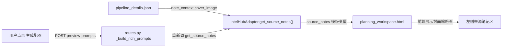
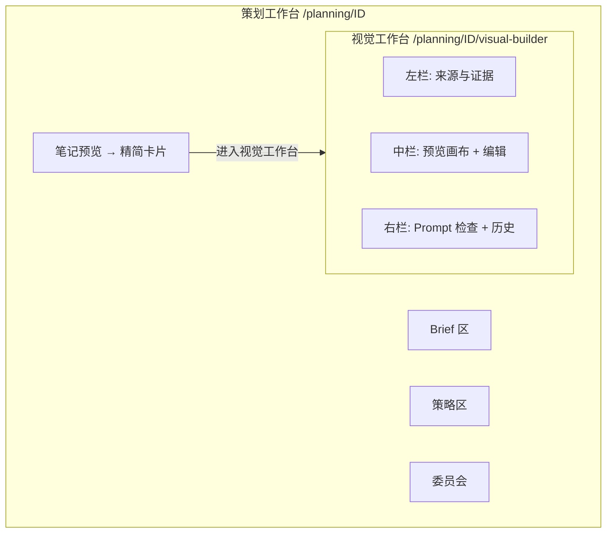

# Visual Builder 独立页面升级方案

## 一、问题诊断

### 问题 1：封面图（原始笔记 cover_image）传递断链

当前数据流：



**断点**：
- `XHSOpportunityCard` schema 无 `cover_image` 字段 -- 卡片本身不存封面
- `ContentPlanStore` (planning session) 无来源封面 URL 列 -- 策划会话不持久化封面
- 每次 `preview-prompts` / `image-gen` 都要**重新查 pipeline_details.json**，如果 `source_note_ids` 为空或 note 不在索引内则丢失
- `_build_rich_prompts` 只在 `gen_mode=ref_image` 时才去拿 cover -- `prompt_only` 模式下前端拿不到参考图展示

### 问题 2：笔记预览区功能过度拥挤且 LLM 调用不可观测

当前 `planning_workspace.html` 底部的笔记预览区承担了 **6 类操作**：

| 操作 | 调用 LLM？ | 可观测？ |
|------|------------|----------|
| 一键生成预览 | 是 (llm_router.chat) | 不可见 prompt/response |
| 重新生成 | 是 (同上) | 不可见 |
| 生成配图 | 是 (OpenRouter/DashScope 生图API) | 部分可见(Prompt Builder) |
| AI 优化提示词 | 是 (llm_router.achat) | 不可见优化前后对比 |
| 保存/复用提示词 | 否 | N/A |
| 反馈评分 | 否 | N/A |

所有这些挤在一个折叠区块内，UI 空间极为有限，Prompt Builder 只能以内联方式展开，用户无法同时看到来源素材、编辑参数和生成结果。

---

## 二、升级架构设计

### 核心思路：从"附属预览区"升级为"独立视觉工作台"



### 路由设计

- **新页面路由**: `GET /planning/{opportunity_id}/visual-builder`
- **新模板**: `visual_builder.html`（独立 Jinja2 模板）
- **复用 API**: 所有 `/content-planning/v6/...` API 端点不变，只是前端调用方从 `planning_workspace.html` 变为 `visual_builder.html`
- **复用组件**: `_preview_canvas.html` 继续 include

### 三栏布局详细设计

**左栏：来源与证据面板**（约 25% 宽度）
- 原始笔记封面大图 + 所有 image_urls（从 session 持久化的 `source_images` 读取，不再每次查 pipeline）
- Brief 摘要卡（visual_direction, cover_direction, target_user, target_scene）
- Strategy 摘要卡
- 品牌偏好提示（如果有历史 preference 数据）

**中栏：预览画布 + 操作区**（约 40% 宽度）
- 手机框预览（复用 `_preview_canvas.html`）
- 操作条：一键生成预览 / 重新生成 / 生成配图
- 模型选择器 + 模式选择器
- 原图 vs 生成图对比视图

**右栏：Prompt 检查与历史**（约 35% 宽度）
- **LLM 调用日志面板**（新增）：每次 LLM 调用（quick-draft、optimize-prompt、image-gen）的 input/output 实时可见
- Prompt Builder：结构化编辑（subject, style_tags, must_include, avoid_items）
- 质量评分条
- AI 优化按钮 + 优化前后 diff 展示
- 生成历史面板 + 反馈评分

---

## 三、封面图传递修复方案

### 在 session 中持久化来源图片

在 [plan_store.py](apps/content_planning/storage/plan_store.py) 新增 `source_images_json` 列：

```python
"source_images": "source_images_json"  # list[{"note_id": str, "cover_image": str, "image_urls": list[str]}]
```

### 写入时机

在 `planning_workspace_page`（[app.py](apps/intel_hub/api/app.py)）首次加载策划台时，如果 session 中无 `source_images`，从 `IntelHubAdapter.get_source_notes` 拉取并写入 session：

```python
if not session_data.get("source_images"):
    source_images = []
    for sn in source_notes:
        ctx = sn.get("note_context", sn) if isinstance(sn, dict) else {}
        source_images.append({
            "note_id": ctx.get("note_id", ""),
            "cover_image": ctx.get("cover_image", ""),
            "image_urls": ctx.get("image_urls", []),
        })
    flow._store.update_field(opportunity_id, "source_images", source_images)
```

### 读取方：统一从 session

- `_build_rich_prompts` 改为优先读 `session.get("source_images")`，不再每次调 `IntelHubAdapter`
- Visual Builder 页面模板直接用 session 中的 `source_images` 渲染左栏
- 两种 gen_mode 下前端都能展示参考图

---

## 四、LLM 调用可观测性方案

### 后端：返回调用详情

每个涉及 LLM 的 API 端点新增返回字段 `llm_trace`：

```python
{
    "llm_trace": {
        "model": "qwen-plus",
        "input_messages": [...],   # system + user prompt
        "output_raw": "...",       # 原始响应文本
        "tokens_used": 1234,
        "latency_ms": 2100,
        "status": "success"
    }
}
```

涉及端点：
- `POST /v6/quick-draft/{id}` -- 文案生成的 LLM 调用
- `POST /v6/image-gen/{id}/optimize-prompt` -- AI 优化的 LLM 调用
- `POST /v6/image-gen/{id}` -- 每个 slot 的生图 API 调用（via SSE 推送 trace）

### 前端：右栏 LLM 调用日志面板

- 每次 LLM 调用在右栏追加一条 trace 记录卡片
- 展开可见：发送的完整 prompt、参考图 URL、模型名、响应内容、耗时
- 折叠态显示：操作名 + 模型 + 状态 + 耗时

---

## 五、策划台笔记预览区精简

原 `planning_workspace.html` 底部的笔记预览区从"全功能区"改为"状态卡片"：

- 只保留手机框缩略预览（只读，不可编辑）
- 显示当前草稿标题、最近一次生图状态
- 一个大按钮 **"进入视觉工作台"** 跳转 `/planning/{id}/visual-builder`
- 移除 Prompt Builder、生图操作、历史面板等所有功能性 UI

---

## 六、关键文件变更清单

| 文件 | 变更类型 | 说明 |
|------|----------|------|
| `apps/intel_hub/api/templates/visual_builder.html` | 新增 | 独立视觉工作台页面模板 |
| `apps/intel_hub/api/templates/planning_workspace.html` | 修改 | 笔记预览区精简为状态卡片+跳转按钮 |
| `apps/intel_hub/api/templates/_preview_canvas.html` | 不变 | 被两个页面 include 复用 |
| `apps/intel_hub/api/app.py` | 修改 | 新增 `GET /planning/{id}/visual-builder` 路由；首加载时写 `source_images` |
| `apps/content_planning/storage/plan_store.py` | 修改 | 新增 `source_images_json` 列 |
| `apps/content_planning/api/routes.py` | 修改 | `_build_rich_prompts` 改读 session；各 LLM 端点增加 `llm_trace` 返回 |
| `apps/content_planning/services/quick_draft_generator.py` | 修改 | 返回 `llm_trace` 信息 |
| `apps/content_planning/skills/prompt_optimizer.py` | 修改 | 返回 `llm_trace` 信息 |
| `apps/content_planning/services/image_generator.py` | 修改 | 每个 slot 生图结果附带 `prompt_sent` 和 `api_trace` |

---

## 七、与 visual_builder_v2.md 的对齐说明

本次升级是 V2 方案的 **P0 落地阶段**，聚焦于：

- **结构升级**：笔记预览从嵌入区块独立为页面，为后续引入 `ImageSpec` 双层结构预留空间
- **可观测性**：从"黑箱 LLM 调用"升级为"可追溯的调用链"
- **数据通路修复**：封面图不再断链

暂不在本次范围内的 V2 目标（后续迭代）：
- Visual Extractor（VLM 视觉抽取）
- ImageSpec 双层结构
- 生成前 Readiness Score / 生成后 Alignment Score
- Brand Visual Preference Profile
- Visual Template 库
