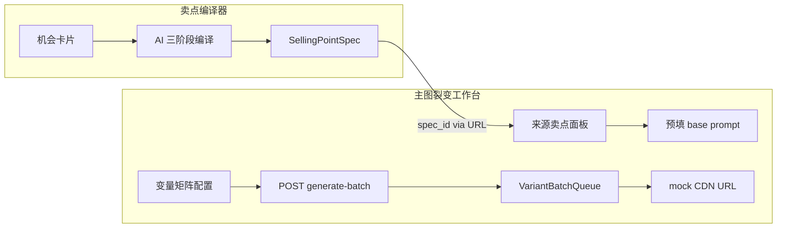

# 主图裂变工作台：设计思路与实现方案

## 一、当前架构现状

### 数据流（现状）



### 已有能力盘点

| 层 | 组件 | 状态 |
|---|---|---|
| Schema | `SellingPointSpec`（含 `shelf_expression`、`first3s_expression`） | **已有数据** |
| Schema | `MainImageVariant` / `ImageVariantSpec` / `VariantVariable` | **结构完整** |
| 编译层 | `MainImageVariantCompiler.compile_matrix()` — 卖点 x 变量 → Variant 列表 | **已实现** |
| 队列层 | `VariantBatchQueue` — ThreadPool + mock generate_fn | **仅 mock** |
| 图片生成 | `ImageGeneratorService`（OpenRouter + DashScope 双通道） | **已实现但未接线** |
| 前端 | `main_image_lab.html` — 变量配置 + 批量生成 + 版本网格 | **基本骨架有，但前后端字段不对齐** |

### 阻断点（6 个关键 Gap）

1. **前端请求体 vs 后端 Pydantic 不对齐**
   - 前端发 `variable_combos`（flat dict 列表），后端期望 `variable_matrix`（嵌套 `list[list[dict]]`）
   - 前端发 `reference_image_url`（单字符串），后端期望 `reference_image_urls`（列表）
   - **未传 `source_selling_point_id`**，导致 variant 不关联卖点

2. **图片生成只是 mock**
   - `VariantBatchQueue` 的 `generate_fn` 默认为 `_mock_generate`，返回占位 URL
   - 已有的 `ImageGeneratorService`（OpenRouter/DashScope 双通道）完全未接入

3. **变体卡片字段渲染不对齐**
   - 前端用 `v.image_url`，后端字段是 `generated_image_url`
   - 前端用 `v.variable_values`，后端字段是 `key_variables`（`VariantVariable` 对象列表）
   - `status` 映射不一致（前端 `pending/done`，后端 `draft/generating/generated`）

4. **卖点上下文传递不完整**
   - `spec_id` 仅用于展示面板和预填 prompt
   - 未传入 `generate-batch` 请求
   - `loadVariants()` 不按 `spec_id` 过滤，所有 spec 的变体混在一起

5. **变量维度配置缺乏引导**
   - 用户需要手动填写维度值，无预设推荐
   - 与卖点编译结果（人群/场景/表达）之间没有智能关联

6. **批量生成无进度反馈**
   - 前端提交后只 toast 一次，无实时进度
   - 后端 `VariantBatchQueue` 有状态追踪，但未通过 SSE/轮询暴露给前端

---

## 二、实现方案

### Phase 1: 贯通数据链路（前后端对齐 + 真实生图）

#### 1.1 修复前端请求体

修改 [main_image_lab.html](apps/growth_lab/templates/main_image_lab.html) 中 `generateBatch()`：

```javascript
body: JSON.stringify({
  source_selling_point_id: specId,       // 从 URL 读取
  variable_matrix: varCombos.map(c =>    // 转为后端期望的嵌套结构
    Object.entries(c).map(([dim, val]) =>
      ({ dimension: dim, label: dim, value: val })
    )
  ),
  base_prompt: ...,
  negative_prompt: ...,
  reference_image_urls: refUrl ? [refUrl] : [],
  platform: 'shelf',
})
```

#### 1.2 修复变体卡片字段映射

修改 `renderVariants()` 中的字段引用：
- `v.image_url` → `v.generated_image_url`
- `v.variable_values` → 从 `v.key_variables` 转换
- `STATUS_BADGE` / `STATUS_LABEL` 对齐后端 `draft/generating/generated/selected/in_test/archived`

#### 1.3 接入真实图片生成

修改 [variant_batch_queue.py](apps/growth_lab/services/variant_batch_queue.py)，将 `_mock_generate` 替换为调用 `ImageGeneratorService`：

```python
def _real_generate(variant: dict) -> str:
    from apps.content_planning.services.image_generator import (
        ImageGeneratorService, ImagePrompt,
    )
    spec = variant.get("image_variant_spec", {})
    prompt = ImagePrompt(
        slot_id=variant.get("variant_id", ""),
        prompt=spec.get("base_prompt", ""),
        negative_prompt=spec.get("negative_prompt", ""),
        size=spec.get("size", "1024*1024"),
        ref_image_url=(spec.get("reference_image_urls") or [""])[0],
    )
    svc = ImageGeneratorService()
    result = svc.generate_single(prompt, opportunity_id=variant.get("source_opportunity_id", ""))
    if result.status == "completed":
        return result.image_url
    raise RuntimeError(result.error or "图片生成失败")
```

在 [routes.py](apps/growth_lab/api/routes.py) 的 `generate_variant_batch` 中传入 `generate_fn=_real_generate`。

#### 1.4 按 spec_id 过滤变体

修改 `loadVariants()` 在有 `spec_id` 时带查询参数：

```javascript
const url = specId
  ? `/growth-lab/api/lab/variants?selling_point_id=${specId}`
  : '/growth-lab/api/lab/variants';
```

### Phase 2: 智能引导（让用户丝滑操作）

#### 2.1 从卖点自动推荐变量维度

在 `loadSpecContext()` 成功后，根据 `shelf_expression` 和 `target_scenarios` 自动预填推荐的变量组合：

- `target_people` → 推荐 `model_face` 维度值
- `target_scenarios` → 推荐 `scene_background` 维度值
- `shelf_expression.visual_direction` → 推荐 `color_style` 维度值
- `shelf_expression.tone` → 推荐 `stimulation_level` 维度值

在 UI 上以"推荐组合"卡片展示，用户一键添加。

#### 2.2 优化编译器 → 主图工作台的跳转体验

在 `compiler.html` 的编译完成弹窗中，"一键填充"之后，增加**醒目的入口**直接跳转：

```
[编译结果弹窗]
  ├── 一键填充到表单 ← 已有
  └── 立即进入主图裂变 → ← 新增，直接带 spec_id 跳转
```

#### 2.3 批量生成进度条

前端提交后，用轮询或 SSE 展示进度：
- 利用已有 `GET /api/lab/batch/{batch_id}/status` 端点
- 前端每 2 秒轮询，更新进度条和已完成的卡片（图片即时显示）

### Phase 3: 生成质量提升（prompt 工程优化）

#### 3.1 增强 prompt 组装

当前 `MainImageVariantCompiler._build_base_prompt` 仅拼接文本。可增强为：
- 引入 `shelf_expression` 的 `headline` + `visual_direction` + `tone` 的结构化映射
- 自动翻译关键中文卖点为英文（多数图片模型对英文 prompt 效果更好）
- 负向 prompt 根据品类自动填充常见避免项

#### 3.2 参考图支持

从编译器带过来的原始小红书笔记封面图可作为参考图自动填入，利用 DashScope 的 `wanx2.1-imageedit` 做风格迁移。

---

## 三、推荐实施优先级

Phase 1 是**必须先做的**，否则整个链路是断的：前端发的数据后端解析不了，图片只是 mock。

Phase 2 是**体验层**，做完后用户从编译器到出图只需 2-3 次点击。

Phase 3 是**质量层**，提升出图效果。

---

## 四、关键文件清单

| 文件 | 改动 |
|---|---|
| [main_image_lab.html](apps/growth_lab/templates/main_image_lab.html) | 修复请求体、字段映射、进度轮询、推荐变量 |
| [variant_batch_queue.py](apps/growth_lab/services/variant_batch_queue.py) | 接入 ImageGeneratorService |
| [routes.py](apps/growth_lab/api/routes.py) | generate-batch 传入 generate_fn |
| [main_image_variant_compiler.py](apps/growth_lab/services/main_image_variant_compiler.py) | prompt 增强 |
| [compiler.html](apps/growth_lab/templates/compiler.html) | 编译完成弹窗增加直达入口 |
