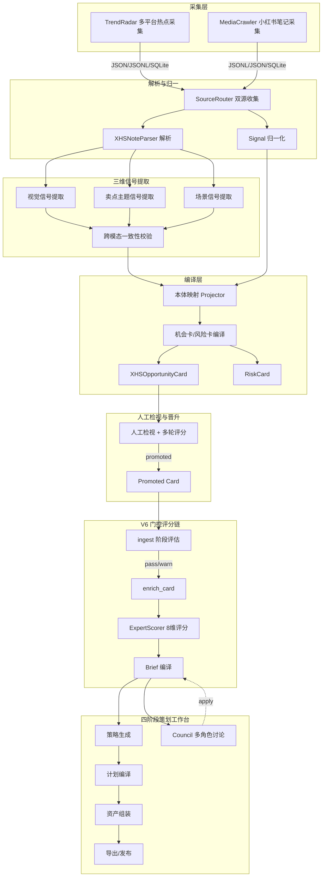

# 本体大脑情报中枢 — 当前产品功能 PRD (As-Is)

> 版本：V0.8+ (截至 2026-04-16)
> 定位：AI-native 机会驱动的内容策划编译与执行操作系统

---

## 一、产品定位与核心理念

本产品不是通用 BI 仪表盘或通用任务管理器，而是一个**机会驱动、生命周期导向**的内容经营操作系统。

**三层架构设计哲学**：

- **Layer A (Hermes 风格 Agent 基座)**：解决「Agent 记不住、不成长」——跨会话记忆、技能化沉淀、自进化循环
- **Layer B (DeerFlow 风格执行编排)**：解决「复杂任务跑不稳」——门控流水线、子代理并行、沙箱隔离、超时降级
- **Layer C (自有产品层)**：核心壁垒——对象化的策划编译系统，围绕 `OpportunityCard -> Brief -> Strategy -> Plan -> AssetBundle` 业务对象链

**六层产品能力**：

| 能力层 | 说明 | 落地形态 |
|--------|------|----------|
| Context OS | 对象上下文 + 来源 + 历史 + 案例 | `RequestContextBundle`, 记忆块 |
| Stage OS | 就绪度、完整度、阻塞项、下一步 | readiness, health-check, `GateResult` |
| Decision OS | 结构化分歧求解 | Council 多角色讨论 + reconcile + apply |
| Action OS | promote / archive / generate / lock | `ActionSpec`, `SkillRegistry` |
| Compiler OS | Brief -> Strategy -> Plan -> Asset 编译 | `BriefCompiler`, `OpportunityToPlanFlow` |
| Collaboration OS | AI 与人共创 | Visual Builder, Plan Board, inline edit |

---

## 二、目标用户

| 角色 | 核心关注 |
|------|----------|
| CEO / 产品负责人 | 看机会卡、风险卡、策划链全局进展 |
| 产品研发总监 | 架构决策、赛道与竞品分析 |
| 增长总监 | 转化链路、平台机制、数据导向优化 |
| 视觉总监 | 视觉方向、图片执行、资产质量 |
| 情报运营 | watchlist 维护、卡片 review、反馈闭环 |
| B2B 客户 workspace | 品牌级机会筛选、内容审批、用量计量 |

---

## 三、端到端数据链路



---

## 四、功能模块详解

### 模块 1：情报采集与信号编译

**F1.1 多源采集**

- **TrendRadar 路径**：支持 zhihu、douyin、bilibili、tieba、toutiao、weibo 等默认平台，通过 keyword filter 采集热点/新闻/RSS，输出 JSON/JSONL/SQLite
- **MediaCrawler 路径**：独立小红书笔记采集（基于 Playwright 登录态），输出到 `data/xhs/`
- **采集任务管理**：`FileJobQueue` 排队、`CrawlJob` 状态机（queued/running/completed/failed）、重试机制、`SessionService` 账号会话池管理、`AlertManager` 告警持久化
- **定时调度**：`SchedulerDaemon` 读 `crawl_schedule.yaml` 按日触发采集任务

对应页面/API：
- `GET /crawl-status` — 抓取任务状态
- `POST /crawl-jobs` — 创建抓取任务
- `GET /crawl-jobs` / `GET /crawl-jobs/{job_id}` — 任务列表与详情
- `POST /crawl-jobs/{job_id}/retry` — 重试

---

**F1.2 信号归一与编译**

- **双源路由**：`SourceRouter` 统一消费 TrendRadar 和 MediaCrawler 输出
- **归一化**：原始数据 -> `Signal` + `EvidenceRef`，保留 best-effort 字段（title, summary, source_url, platform, metrics, author 等）
- **本体投影**：基于 `watchlists.yaml` + `ontology_mapping.yaml` 做 canonical entity projection、alias 归一、topic tagging
- **编译**：打分(`scoring.yaml`) + 规则 dedupe(`dedupe.yaml`: 同实体/主题/72h时间窗/标题token overlap) -> `OpportunityCard` / `RiskCard`，保留 `trigger_signals` + `evidence_refs` + `dedupe_key`

对应页面：
- `GET /signals` — 信号列表（支持 entity/topic/platform/review_status 筛选）
- `GET /opportunities` — 机会卡列表
- `GET /risks` — 风险卡列表
- `GET /watchlists` — 监控列表
- `GET /` — 首页仪表盘（今日信号/机会/风险总量与摘要）

---

**F1.3 小红书三维结构化流水线**

对小红书笔记做深度结构化提取：
- `XHSNoteRaw` -> `XHSParsedNote`（标题/正文/标签归一化 + 互动摘要）
- **三维信号**：视觉信号(`VisualSignals`)、卖点主题信号(`SellingThemeSignals`)、场景信号(`SceneSignals`)
- **跨模态一致性校验**：`cross_modal_validator` 检测三维信号间的矛盾与增补
- **本体映射**：`XHSOntologyMapping` 产出 category/scene/style/need/risk/audience/visual_pattern/content_pattern/value_proposition refs
- **机会卡编译**：`compile_xhs_opportunities` -> `XHSOpportunityCard`（含 opportunity_type: visual/demand/product/content/scene）

对应页面/API：
- `GET /notes` / `GET /notes/{note_id}` — 原始笔记列表与详情
- `GET /xhs-opportunities` — 小红书机会卡列表（支持 status/type/quality 筛选）
- `GET /xhs-opportunities/{opportunity_id}` — 机会卡详情

---

### 模块 2：人工检视与晋升

**F2.1 机会卡检视**

- 多人多轮检视：`OpportunityReview`（质量评分 1-10、是否可执行、证据充分度、备注）
- 聚合指标自动计算：平均质量分、可执行率、证据充分率、综合评分
- 晋升规则：`review_count >= 阈值` + `composite_review_score >= 阈值` -> `promoted`
- 状态机：`pending_review -> reviewed -> promoted / rejected`

对应 API：
- `POST /xhs-opportunities/{id}/reviews` — 提交检视
- `GET /xhs-opportunities/{id}/reviews` — 检视记录
- `GET /xhs-opportunities/review-summary` — 检视汇总统计
- `POST /opportunities/{id}/review` / `POST /risks/{id}/review` — 通用卡片 review

---

### 模块 3：V6 门控评分链

**F3.1 三阶段门控流水线**（`NoteToCardFlow`）

```
ingest 评估 -> [pass/warn/block] -> enrich_card -> card 评估 -> [pass/warn/block] -> ExpertScorer -> scorecard 评估 -> [evaluate/initiate | observe/ignore]
```

- **GateResult**：status(pass/warn/block) + StageEvaluation + suggestions
- 阈值：`overall_score < 0.25` -> block；`< 0.45` -> warn
- scorecard recommendation：`ignore/observe/evaluate/initiate`，只有 evaluate/initiate 才继续
- 错误映射：`OpportunityNotPromotedError` -> 403；`StageApplyConflictError` -> 409

**F3.2 ExpertScorer 8维评分**

外置配置 `scorecard_weights.yaml`，8个维度：
- content_value, audience_fit, visual_quality, demand_strength, differentiation, commercial_viability, platform_nativeness, risk_score(inverse)
- 输出 `ExpertScorecard`（总分 + 推荐级别 + 解释）

对应 API（均 `/content-planning/v6/` 前缀）：
- `POST /v6/ingest-eval/{id}` — ingest 评估
- `POST /v6/enrich-card/{id}` — 卡片富化
- `POST /v6/score/{id}` — 打分
- `GET /v6/scorecard/{id}` — 读取评分卡
- `POST /v6/compile-brief/{id}` — 编译 Brief
- `POST /v6/run-pipeline/{id}` — 一键全链路
- `GET /v6/pipeline-status/{id}` — 管线状态

---

### 模块 4：四阶段内容策划工作台

这是产品的核心，围绕 `OpportunityCard -> Brief -> Strategy -> Plan -> AssetBundle` 的对象链展开四个工作台。

**F4.1 Opportunity Workspace（机会工作台）**

- 机会卡列表 + 侧边详情面板
- 评分卡面板（`_scorecard_panel.html`）
- 就绪度检查（readiness）：证据、review 共识、历史相似度 -> `ActionSpec`
- 健康检查（health-check）：Brief/Strategy/Plan/Asset 完整性 -> score + is_healthy + next_best_action

页面：`GET /opportunity-workspace`

---

**F4.2 Brief Workspace（策划 Brief 工作台）**

- `BriefCompiler`：从 `XHSOpportunityCard` + Scorecard 编译 `OpportunityBrief`
  - 目标受众、目标场景、内容目标、视觉方向、标题方向、生产就绪状态
- 人工编辑 Brief：`PUT /content-planning/briefs/{id}`
- Council 讨论 Brief：多角色并行讨论 -> 共识 -> 可选 apply
- Brief apply 后触发下游 stale（strategy, plan, titles, body, image_briefs, asset_bundle）

页面：`GET /content-planning/brief/{opportunity_id}`（`content_brief.html`）

---

**F4.3 Strategy Workspace（策略工作台）**

- `RewriteStrategyGenerator`：LLM 生成 + 规则兜底
  - positioning_statement, hook_strategy, title_strategy, body_strategy, image_strategy
- 模板匹配：Brief -> `TemplateMatchResult`（风格锚点）
- Strategy v2 评分口径：strategic_coherence, differentiation, platform_nativeness, conversion_relevance, brand_guardrail_fit
- Council 讨论策略：可 apply 到 Strategy 对象
- Strategy apply 规则：Brief stale 时禁止 apply；成功后标记 plan/titles/body/image_briefs/asset_bundle stale

页面：`GET /content-planning/strategy/{opportunity_id}`（`content_strategy.html`）
API：`POST .../generate-strategy`、`POST .../match-templates`

---

**F4.4 Plan Workspace（计划编译工作台）**

- `NewNotePlanCompiler`：Brief + Strategy + Template -> `NewNotePlan`
  - TitlePlan（候选标题列表）
  - BodyPlan（正文大纲 + 段落）
  - ImagePlan（图位规划 + 每槽 visual brief）
- 独立生成器：
  - `TitleGenerator`：标题多候选生成
  - `BodyGenerator`：正文草稿生成
  - `ImageBriefGenerator`：按槽位图片执行 brief
- Plan v1 评分：structural_completeness, title_body_alignment, image_slot_alignment, execution_readiness, human_handoff_readiness
- 一键编译：`POST .../compile-note-plan` 串联全链路（Brief -> Strategy -> Plan -> 标题/正文/图位生成）

页面：`GET /content-planning/plan/{opportunity_id}`（`content_plan.html`）

---

**F4.5 Asset Workspace（资产工作台）**

- `AssetAssembler`：标题/正文/图 brief 生成结果 -> `AssetBundle`（titles, body, images, variants, export_package）
- `AssetExporter`：导出 JSON / Markdown 运营文档 / 图片执行包
- `PublishFormatter`：Brief + Strategy + AssetBundle -> `PublishReadyPackage`
- `VariantGenerator`：从 AssetBundle 派生变体（按 tone 等轴）
- Asset v1 评分：headline_quality, body_persuasiveness, visual_instruction_specificity, brand_compliance, production_readiness
- 品牌 guardrail 检查：禁用词、必提点、风险词 -> brand_fit_score

页面：`GET /content-planning/assets/{opportunity_id}`（`content_assets.html`）
API：`GET .../asset-bundle/{id}`、`GET .../asset-bundle/{id}/export`

---

**F4.6 策划台聚合页**

- 四阶段进度条（`_progress_bar.html`：brief/strategy/plan/assets）
- 品牌上下文条（`_brand_context_bar.html`）
- 协同侧栏（`_collab_sidebar.html`）
- 编译报告（`_compilation_report.html`）
- 笔记预览画布（`_preview_canvas.html`）
- Agent 管线面板（`_agent_pipeline_panel.html`）
- Council 讨论 UI（`_council_ui.html`）

页面：`GET /planning/{opportunity_id}`（`planning_workspace.html`）

---

### 模块 5：Visual Builder（视觉工作台）

**独立三栏布局页面**：

- **左栏**：来源笔记缩略图（最多5条，含封面+多图）、Brief 摘要（视觉方向/封面/受众/场景/目标）、策略摘要
- **中栏**：一键预览 / 重新生成、生图模式（参考图+提示词 / 纯提示词）与模型选择、预览区（手机模拟）、对比区
- **右栏**：Prompt Builder（动态槽位编辑）、质量条、生成历史面板

**生图能力**：
- **双模式**：`ref_image`（参考图+提示词）/ `prompt_only`（纯文生图）
- **多提供商 Fallback**：DashScope 通义万相（主） -> OpenRouter/Gemini（备），DashScope 内部还有参考图模式 -> 纯文 -> 备用模型的链式降级
- **Prompt 融合管线**（`PromptComposer`）：6层优先级（ImageBrief > Plan > Strategy > Brief > Draft > Template）+ 用户历史偏好
- **Prompt Inspector**：预览/编辑最终 prompt + 参考图 + 来源追溯（颜色编码）
- **AI Prompt 优化**：`POST .../optimize-prompt` 自动优化提示词
- **生成历史**：多轮对比，每轮含 timestamp/provider/mode/编辑标记/成功率/可展开 prompt 详情

页面：`GET /planning/{opportunity_id}/visual-builder`（`visual_builder.html`）

---

### 模块 6：Council 多角色 AI 协同

**5 个 SOUL 角色**：
| 角色 | 核心定位 |
|------|----------|
| brand_guardian | 品牌一致性与调性合规 |
| growth_strategist | 增长转化与平台机制 |
| creative_director | 创意叙事与差异化 |
| risk_assessor | 合规、舆情与不确定性 |
| lead_synthesizer | 综合共识与结构化提案 |

**讨论机制**：
- 按阶段（brief/strategy/plan/asset）自动选角色
- `ThreadPoolExecutor` 并行 4 专家意见
- 两轮制：第一轮独立判断 -> 可选第二轮修正/反驳
- `lead_synthesizer` 合成 JSON 共识（agreements / disagreements / proposed_updates / recommended_next_steps）
- `reconcile_council_decision_type` + `compute_applyability`：决定共识能否自动 apply
- SSE 实时事件推送（10类：session_started, participant_joined, opinion_received, synthesis_started, proposal_ready, session_completed 等）

对应 API：
- `POST /content-planning/discuss/{id}` — 通用讨论
- `POST /content-planning/stages/{stage}/{id}/discussions` — 分阶段讨论
- `GET /content-planning/discussions/{id}` — 讨论详情
- `GET /content-planning/proposals/{id}` — 提案详情
- `POST /content-planning/proposals/{id}/apply` — 应用提案
- `POST /content-planning/proposals/{id}/reject` — 拒绝提案

---

### 模块 7：Agent 编排与执行

**F7.1 Agent Pipeline（DAG 图执行）**

- `PlanGraph`：DAG 定义，含 opportunity/planning/creation/asset 四个子图
- `GraphExecutor`：异步执行、中间件链（GuardrailMiddleware, SummarizationMiddleware, MemoryMiddleware, LifecycleMiddleware, PersistMiddleware）、checkpoint SQLite
- `AgentPipelineRunner`：一键跑 Agent 图，支持 skip、从节点重跑、cancel

**F7.2 Agent 角色矩阵**

| Agent | 职责 |
|-------|------|
| LeadAgent | 总调度：pipeline/interactive 双模式，意图路由 |
| TrendAnalystAgent | 趋势/机会分析 |
| BriefSynthesizerAgent | Brief 编译 |
| TemplatePlannerAgent | 模板匹配策划 |
| StrategyDirectorAgent | 策略生成 |
| PlanCompilerAgent | 计划编译 |
| VisualDirectorAgent | 视觉规划 |
| AssetProducerAgent | 资产组装/导出 |
| JudgeAgent | 多版本对比裁判 |
| AIInspector | 选中块分析与建议 |
| HealthChecker | 策划对象健康度 |
| OpportunityReadinessChecker | 晋升就绪度 |
| StrategyBlockAnalyzer | 策略块结构化分析 |

**F7.3 Skill Registry 技能化管理**

- `SkillDefinition`：executable_steps + workflow_steps
- `execute_skill`：按步调用 `ToolRegistry`，`$ctx.*` 参数解析
- 内置技能包含 `full_pipeline`（多步工具链 + evaluate_stage）

**F7.4 Agent Memory（项目级记忆）**

- SQLite + FTS5 全文检索
- `council_memory_block`：按 opportunity_id + role + question 检索相关历史
- `store_project_consensus`：项目级共识持久化
- `inject_context`：自动上下文注入，角色加权
- `nudge` / `process_nudge_response`：主动提示

API：
- `POST /content-planning/run-agent/{id}` — 运行 Agent
- `POST /content-planning/chat/{id}` — 对话
- `POST /content-planning/{id}/agent-pipeline` — 启动 Agent 管线
- `GET /content-planning/{id}/agent-pipeline/status` — 管线状态
- `POST /content-planning/{id}/agent-pipeline/rerun` — 从节点重跑
- `GET /content-planning/agents` — Agent 目录
- `GET /content-planning/skills` — 技能目录
- `GET /content-planning/memory/{id}` — 记忆上下文
- `GET /content-planning/graph/{id}` — 计划图

---

### 模块 8：B2B 试点平台

**F8.1 多租户骨架**

- `Organization -> Workspace -> BrandProfile -> Campaign`
- `WorkspaceMembership`：user/role/api_token
- `Connector`：平台连接配置

**F8.2 品牌队列与审批**

- `OpportunityQueueEntry`：promoted 机会进入品牌级队列
- `ApprovalRecord`：内容对象审批（pending_review/approved/changes_requested/rejected）
- 租户 header 绑定：`X-Workspace-Id` / `X-User-Id` / `X-Api-Token` / `X-Brand-Id` / `X-Campaign-Id`

**F8.3 品牌护栏**

- `BrandProfile`：品牌名、定位、tone_of_voice、产品线、禁用词、竞品引用、内容目标
- `GuardrailChecker`：静态检查禁用词/必提点/风险词 -> brand_fit_score

**F8.4 用量计量与反馈**

- `UsageEvent`：生成/导出操作记账
- `PublishResult`：发布结果回写
- `FeedbackProcessor`：统一反馈 -> 模式提取 -> 模板效果记录
- `PatternExtractor`：从反馈提取 WinningPattern / FailedPattern

API：
- `POST /b2b/bootstrap` — 初始化 org/workspace/brand/campaign
- `POST /b2b/workspaces/{id}/brands` / `campaigns` / `memberships` / `connectors`
- `POST /b2b/workspaces/{id}/opportunities/{id}/queue`
- `GET /b2b/workspaces/{id}/usage` / `approvals` / `snapshot` / `feedback` / `pipeline` / `timeline`

页面：
- `GET /workspace` — 工作区入口
- `GET /brand-config/{brand_id}` — 品牌配置
- `GET /feedback` — 反馈与模式
- `GET /review-approval` — 审批列表
- `GET /opportunity-pipeline` — 机会管线看板

---

### 模块 9：可观测性与运维

**F9.1 SSE 实时事件**

- `EventBus`：subscribe/publish/publish_sync（跨线程）
- SSE handler：历史 ring buffer（最近50条），连接时先发最后20条，心跳15s
- Council 10类事件 + 生图进度事件

**F9.2 LLM Trace**

所有 LLM 操作返回结构化 `llm_trace`：operation, model, input_messages, output_raw, latency_ms, status(success/error/degraded/parse_error)
- Visual Builder 底部浮动日志面板实时渲染

**F9.3 协同时间线**

- `GET /content-planning/timeline/{id}` — 会话消息 + 事件总线聚合

---

### 模块 10：7种 Harness 工程模式

| 模式 | 核心机制 | 主要代码 |
|------|----------|----------|
| LLM 调用 Harness | timeout(90s) + fallback chain(openai,dashscope,anthropic) + degraded response | `llm_router.py` |
| 门控管线 Harness | GateResult(pass/warn/block) + 阶段评估 + 异常HTTP映射 | `note_to_card_flow.py` |
| 并行隔离 Harness | ThreadPoolExecutor + 单路失败不拖死 | `discussion.py`, `opportunity_to_plan_flow.py` |
| 多提供商 Fallback | prompt净化 + 链式降级 + deadline + 上游fallback | `image_generator.py` |
| 上下文组装 Harness | RequestContextBundle 一次组装全链路复用 | `base.py`, `context_assembler.py` |
| 可观测性 Harness | EventBus + SSE + llm_trace + health-check | `event_bus.py`, `sse_handler.py` |
| 配置驱动护栏 | YAML 阈值 + lineage 追溯 + 双通道评估 | `scorecard_weights.yaml`, `PlanLineage` |

---

## 五、页面全量索引（21个独立页面）

| 页面 | 路由 | 模板 | 用途 |
|------|------|------|------|
| 首页仪表盘 | `GET /` | `dashboard.html` | 今日信号/机会/风险总量与摘要 |
| 信号列表 | `GET /signals` | `collection.html` | 信号浏览与筛选 |
| 机会卡列表 | `GET /opportunities` | `collection.html` | 通用机会卡 |
| 风险卡列表 | `GET /risks` | `collection.html` | 风险卡 |
| 监控列表 | `GET /watchlists` | `collection.html` | watchlist 配置 |
| 原始笔记 | `GET /notes` | `notes.html` | 小红书原始笔记 |
| 笔记详情 | `GET /notes/{id}` | `note_detail.html` | 单条笔记详情 |
| RSS Tech | `GET /rss/tech` | `rss_feed.html` | 科技 RSS |
| RSS News | `GET /rss/news` | `rss_feed.html` | 新闻 RSS |
| XHS 机会卡列表 | `GET /xhs-opportunities` | `xhs_opportunities.html` | 小红书机会卡筛选 |
| XHS 机会卡详情 | `GET /xhs-opportunities/{id}` | `xhs_opportunity_detail.html` | 机会卡详情+检视 |
| 策略模板 | `GET /strategy-templates` | `strategy_templates.html` | 模板库+匹配示例 |
| Brief 工作台 | `GET /content-planning/brief/{id}` | `content_brief.html` | Brief 编辑+Council |
| 策略工作台 | `GET /content-planning/strategy/{id}` | `content_strategy.html` | 策略编辑 |
| 计划工作台 | `GET /content-planning/plan/{id}` | `content_plan.html` | Plan 编辑 |
| 资产工作台 | `GET /content-planning/assets/{id}` | `content_assets.html` | 资产导出 |
| 策划台聚合 | `GET /planning/{id}` | `planning_workspace.html` | 四阶段聚合页 |
| 视觉工作台 | `GET /planning/{id}/visual-builder` | `visual_builder.html` | 三栏视觉生成 |
| 机会台 | `GET /opportunity-workspace` | `opportunity_workspace.html` | 机会列表+侧边 |
| 工作区入口 | `GET /workspace` | `workspace_home.html` | B2B 工作区首页 |
| 资产入口 | `GET /asset-workspace` | `asset_workspace_list.html` | 资产列表 |
| 品牌配置 | `GET /brand-config/{brand_id}` | `brand_config.html` | 品牌与护栏 |
| 反馈看板 | `GET /feedback` | `content_feedback.html` | 反馈与模式 |
| 机会管线看板 | `GET /opportunity-pipeline` | `opportunity_pipeline.html` | 管线全局视图 |
| 审批列表 | `GET /review-approval` | `review_approval.html` | 审批工作流 |

---

## 六、API 数量总览

| 类别 | 路由数量 | 说明 |
|------|----------|------|
| Intel Hub 核心 | ~20 条 | signals/opportunities/risks/watchlists/notes/RSS/crawl |
| B2B 平台 | ~15 条 | bootstrap/brands/campaigns/memberships/queue/usage/approvals |
| 内容策划 V5 | ~12 条 | compile/quality/publish/auto-promote/feedback/patterns |
| 内容策划 V6 | ~12 条 | ingest-eval/enrich/score/brief/pipeline/quick-draft/image-gen |
| Agent 编排 | ~25 条 | run-agent/chat/discuss/proposals/evaluate/baseline/compare/pipeline |
| 协同与治理 | ~15 条 | lock/unlock/versions/health-check/readiness/inspect/judge |
| **总计** | **~150 条** | |

---

## 七、存储方案

| 存储 | 用途 |
|------|------|
| `data/intel_hub.sqlite` | 信号/卡片/watchlist/review 主存储 |
| SQLite（content_planning） | 策划会话/Agent记忆/checkpoint/评分/讨论/提案 |
| `data/raw/latest_raw_signals.jsonl` | 调试快照 |
| `data/generated_images/` | 生成图片静态文件 |
| `config/*.yaml` | watchlists/ontology_mapping/scoring/dedupe/runtime/scorecard_weights/prompts |
| `agents/souls/*/SOUL.md` | 角色人格定义 |

---

## 八、已知局限

1. canonicalization 仍是规则匹配，不处理跨语言语义相似度
2. dedupe 依赖标题 token overlap，对超短/超长标题有限制
3. MediaCrawler 需手动维护 Playwright 登录态，无自动恢复
4. 采集与 intel_hub 通过文件系统传递，无实时流
5. 全部使用 SQLite，未迁移到 Postgres/对象存储/分布式 worker
6. auth 为 header token + role，仅用于验证 workspace 隔离
7. Review 只更新卡片，不回写到 signal/evidence 下游
8. Self-Evolution Loop 尚未实现（技能/prompt 版本自动更新）
9. Plan Board（Creation Workspace 共创画布）未实现
10. Graph Executor 仍为顺序管线，未升级为 LangGraph-style DAG

---

## 九、技术报告提出的下一步方向

| 方向 | 内容 | 对应层 |
|------|------|--------|
| Visual DSL | PromptComposer 升级为结构化 ImageSpec + 双层表示（内部真相层 + 模型渲染层） | Layer C |
| Self-Evolution | 发布反馈 -> skill/prompt 版本更新 -> 路由策略更新 | Layer A |
| Plan Board | Creation Workspace 对象化共创画布 | Layer C |
| B2B 多租户 | workspace_id / brand_id / campaign_id 完整隔离 | Layer C |
| Graph Executor | 从顺序管线升级为 LangGraph-style DAG | Layer B |
| Sandbox Provisioner | 生图/导出等重任务走独立 sandbox pod | Layer B |

