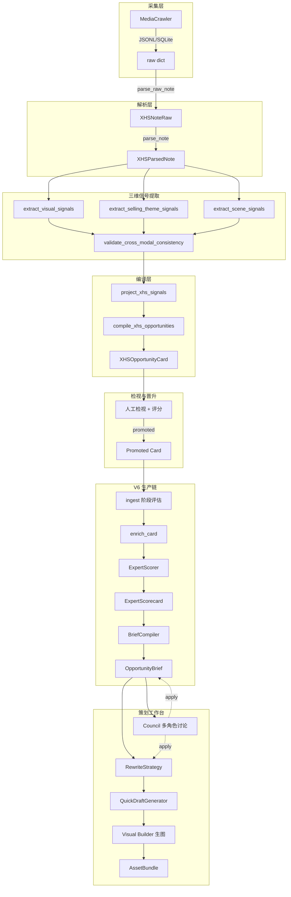

# 小红书内容生产链技术报告

## 报告定位

这份技术报告面向内部技术评审和产品复盘，讲清楚三件事：
- 从原始小红书笔记到内容策划台的完整数据与编排链路
- 我们借鉴了 Hermes-Agent 和 DeerFlow 的哪些设计思想
- 为什么要借鉴，以及如何在自己的产品层落地

## 报告结构（共 8 章）

### 第 1 章：一句话定位

> 我们不是"在页面里塞 Agent 功能"，而是：**Hermes-style 记忆/技能/自进化基座 + DeerFlow-style 长链路编排 harness + 自有的对象化策划编译层**。

引用来源：[architech_deerflow_hermes_V4.md](docs/architech_deerflow_hermes_V4.md) 第 7-18 行。

---

### 第 2 章：端到端数据链路

以 mermaid 流程图展示完整链路：



每个节点对应的代码路径：

- **MediaCrawler**: `data/xhs/` 落盘，`mediacrawler_loader.load_mediacrawler_records()`
- **parse_raw_note / parse_note**: [apps/intel_hub/parsing/xhs_note_parser.py](apps/intel_hub/parsing/xhs_note_parser.py)
- **三维提取 + cross_modal**: [apps/intel_hub/extraction/](apps/intel_hub/extraction/) 下 `visual_signals.py`, `selling_theme_signals.py`, `scene_signals.py`, `cross_modal_validator.py`
- **project + compile**: [apps/intel_hub/projection/xhs_signal_projector.py](apps/intel_hub/projection/xhs_signal_projector.py), [apps/intel_hub/compiler/opportunity_compiler.py](apps/intel_hub/compiler/opportunity_compiler.py)
- **V6 门控流水线**: [apps/content_planning/services/note_to_card_flow.py](apps/content_planning/services/note_to_card_flow.py)
- **BriefCompiler**: [apps/content_planning/services/brief_compiler.py](apps/content_planning/services/brief_compiler.py)
- **Council**: [apps/content_planning/agents/discussion.py](apps/content_planning/agents/discussion.py)
- **QuickDraft + VisualBuilder**: [apps/content_planning/services/quick_draft_generator.py](apps/content_planning/services/quick_draft_generator.py), [apps/intel_hub/api/templates/visual_builder.html](apps/intel_hub/api/templates/visual_builder.html)

---

### 第 3 章：为什么借鉴 Hermes + DeerFlow

#### 3.1 问题诊断：两类短板

| 短板类别 | 表现 | 对应能力缺口 |
|---------|------|-------------|
| "记不住、不成长" | 跨会话记忆断裂；策划偏好每次重来；skill 无法沉淀 | Hermes 强项 |
| "跑不稳、串行慢" | 多阶段任务不稳定；子任务难拆；无沙箱执行 | DeerFlow 强项 |

#### 3.2 为什么不只选一个

- **Hermes-Agent** 定位：built-in learning loop、skills、persistent knowledge、cross-session user model（Agent 基座人格与成长层）
- **DeerFlow** 定位：super-agent harness、sub-agents、sandboxes、LangGraph-based workflow、thread-isolated environments（长链路任务执行层）
- 两者互补，缺一不可：Hermes 回答"会不会越来越懂"，DeerFlow 回答"能不能跑完跑稳"

引用来源：D-020 设计决策 + [architech_deerflow_hermes_V4.md](docs/architech_deerflow_hermes_V4.md) 第 23-66 行

---

### 第 4 章：三层架构与落地方式

```
Layer A: Agent Base (Hermes 风格)
  - Project Memory (品牌/项目/机会级持久记忆)
  - Skill Registry (高频动作 skill 化)
  - Self-Evolution Loop (反馈驱动 skill/prompt 进化)

Layer B: Execution Harness (DeerFlow 风格)
  - Workflow Graph (多阶段门控编排)
  - Subagent Delegation (Council 多角色并行)
  - Sandbox & Tool Execution (生图/导出等隔离执行)

Layer C: Workspace OS (自有产品层)
  - 对象化策划编译: Brief / Strategy / Plan / Asset
  - 六层产品能力: Context / Stage / Decision / Action / Compiler / Collaboration
```

#### 4.1 adapter-first 落地原则（D-020）

关键设计决策：业务代码**只依赖本地适配层**，不直接耦合第三方框架内部 API。

- `third_party/hermes-agent/` 作为 git submodule 占位
- 实际借用 Hermes 的是 **SOUL 扫描与截断机制**，实现在 [soul_context_hermes.py](apps/content_planning/agents/soul_context_hermes.py)
- `apps/content_planning/adapters/*` 是唯一合法接入边界

---

### 第 5 章：Hermes 借鉴的具体落地

#### 5.1 SOUL 系统

- 5 个角色 SOUL.md（`brand_guardian`, `growth_strategist`, `creative_director`, `risk_assessor`, `lead_synthesizer`），每个定义核心立场、思维框架、关注重点、评判标准、风格
- [SoulLoader](apps/content_planning/agents/soul_loader.py) 从文件系统加载，经 `scan_context_content`（注入检测）+ `truncate_content`（头尾截断）后缓存
- SOUL 作为 system 消息第一段注入 LLM 调用

#### 5.2 安全扫描（Hermes-style）

`scan_context_content` 实现 10 种 prompt injection 模式检测 + 10 种不可见 Unicode 字符检测，阻止恶意 SOUL 内容加载。这直接借鉴自 Hermes Agent 的 `agent/prompt_builder.py`。

#### 5.3 项目级记忆

[AgentMemory](apps/content_planning/agents/memory.py) 实现：
- SQLite + FTS5 全文检索
- `council_memory_block`: 按 opportunity_id + role + question 检索相关历史
- `store_project_consensus`: 项目级共识持久化
- `inject_context`: 自动上下文注入

#### 5.4 技能化沉淀

[SkillRegistry](apps/content_planning/skills/) 管理可调用技能：
- `prompt_optimizer` — AI 优化图片 prompt
- `compose_image_prompts` — 多源融合结构化 prompt（[prompt_composer.py](apps/content_planning/services/prompt_composer.py)）
- 融合优先级：ImageBriefs > Plan > Strategy > Brief > Draft > Match

---

### 第 6 章：DeerFlow Harness 借鉴的具体落地

#### 6.1 多阶段门控流水线

[NoteToCardFlow](apps/content_planning/services/note_to_card_flow.py) 实现 DeerFlow 风格的门控编排：
- `ingest` 评估 -> `enrich_card` -> `card` 评估 -> `ExpertScorer.score` -> `scorecard` 评估
- 每个阶段可 **block**（门控失败则终止）
- `/v6/run-pipeline` 一键串联，内部按阶段顺序执行

#### 6.2 Council 多角色并行（Sub-agent Delegation）

[DiscussionOrchestrator](apps/content_planning/agents/discussion.py) 实现：
- `STAGE_DISCUSSION_ROLES` 按阶段选角色（`brief`, `strategy`, `plan`, `asset` 各有不同角色组合）
- `ThreadPoolExecutor` 并行收集专家意见
- 可选第二轮（专家可修正/反驳/补充）
- `lead_synthesizer` 最终合成共识（JSON 结构化输出）
- `reconcile_council_decision_type` / `compute_applyability` 决定是否可自动 apply

#### 6.3 顺序可写 rollout（D-021）

借鉴 DeerFlow 的线程级隔离思路：
- Brief 首先开放 apply
- Strategy / Plan / Asset 逐步开放
- 每个阶段开放前需前一阶段通过持久化 / partial apply / stale propagation / comparison gate

---

### 第 7 章：自有产品层 — 对象化策划编译系统

> "真正的产品壁垒仍然是你们自己的对象化策划编译系统"

核心业务对象链：

- `XHSOpportunityCard` -- 机会判断锚点
- `ExpertScorecard` -- 8 维评分 + recommendation
- `OpportunityBrief` -- 统一策划指引（受众/场景/动机/证据/约束 + V6 production 字段）
- `RewriteStrategy` -- 可执行策略（hook/title/body/image 策略）
- `NewNotePlan` -- 结构化执行方案
- `AssetBundle` -- 最终可交付资产包

六层产品能力在四个 Workspace 的映射：
- Context OS / Stage OS / Decision OS / Action OS / Compiler OS / Collaboration OS

---

### 第 8 章：成果与下一步

#### 已完成

- 端到端链路可运行：原始笔记 -> 机会卡 -> 评分 -> Brief -> Council 讨论 -> 快草稿 -> 生图预览
- SOUL + Hermes 安全扫描 + 项目记忆 + Council 并行 + LLM 可观测
- Visual Builder 独立页三栏布局 + 浮动日志面板
- 性能控制层（D-026）：Session-first / Fast-Deep / 并行 Council / 超时降级

#### 下一步

- PromptComposer -> Visual DSL（`docs/visual_builder_v2.md` 愿景）
- Self-Evolution Loop：publish feedback -> skill/prompt 版本更新
- Plan Board / Visual Planning Canvas（Creation Workspace）
- B2B 多租户隔离（workspace_id / brand_id / campaign_id）

## 输出格式

报告以 Markdown 文件输出到 `docs/tech_report_xhs_pipeline.md`，包含：
- 完整 mermaid 架构图
- 代码路径索引表
- 设计决策引用（D-020, D-021, D-026 等）
- SOUL 系统设计说明
- 各模块职责摘要
