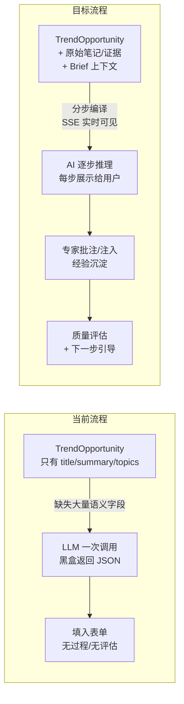
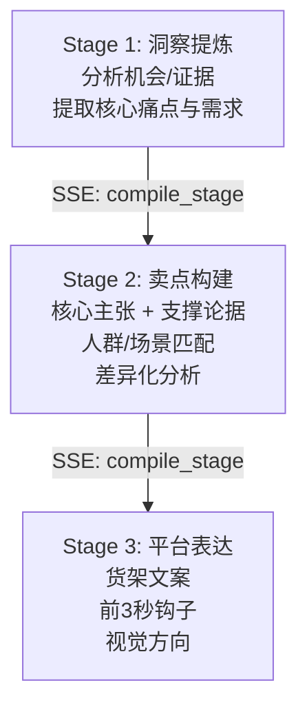

# 卖点编译器体验升级计划

## 问题全景



---

## 改造 1：丰富编译上下文（解决「黑盒参考不足」）

**根因**：`opportunity_adapter.py` 丢弃了 `XHSOpportunityCard` 上的大量语义字段（`pain_point`, `desire`, `hook`, `selling_points`, `why_now`, `content_angle` 等），编译器只能看到 `title + summary + topics`。

**方案**：

- 在 `TrendOpportunity` schema 中新增 `rich_context: dict` 字段，adapter 映射时把所有语义字段打包存入
- 编译接口改为：先读 `TrendOpportunity`，再尝试通过 `source_opportunity_id` 从 `XHSReviewStore` 拉取原始 `XHSOpportunityCard` 的完整字段；如有对应 `OpportunityBrief` 也一并拉取
- `_build_user_content` 大幅扩充：
  - 原始笔记证据摘要（`evidence_refs` -> 可展示的证据文本）
  - 已有策划方向（Brief 的 `planning_direction`, `core_claim`, `proof_points`）
  - 卡片洞察（`pain_point`, `desire`, `hook`, `why_now`）
- **前端**：左栏机会卡增加「展开详情」，显示 `pain_point`, `selling_points`, `evidence_refs`, `why_now` 等，让用户在选择时能看到完整上下文

**涉及文件**：
- [apps/growth_lab/schemas/trend_opportunity.py](apps/growth_lab/schemas/trend_opportunity.py) — 新增 `rich_context`
- [apps/growth_lab/adapters/opportunity_adapter.py](apps/growth_lab/adapters/opportunity_adapter.py) — 打包语义字段
- [apps/growth_lab/services/selling_point_compiler.py](apps/growth_lab/services/selling_point_compiler.py) — 扩充 `_build_user_content`
- [apps/growth_lab/api/routes.py](apps/growth_lab/api/routes.py) — compile 接口增加上下文组装
- [apps/growth_lab/templates/compiler.html](apps/growth_lab/templates/compiler.html) — 左栏卡片详情展开

---

## 改造 2：编译过程可观测（解决「AI 黑盒」）

**方案**：将单次 LLM 调用拆成 **3 个语义阶段**，每阶段通过 SSE 实时推送到前端，借鉴 Council 的 `thinking dots + snippet card` 模式。

### 三阶段编译流程



- Stage 1「洞察提炼」：LLM 分析所有输入材料，输出 `insight_summary`（用户可见的「AI 正在分析这些信号...」）
- Stage 2「卖点构建」：基于洞察构建 `core_claim` + `supporting_claims` + `target_people` + `target_scenarios` + `differentiation_notes`
- Stage 3「平台表达」：生成 `shelf_expression` + `first3s_expression`，附带 `reasoning`（为什么这样表达）

**前端展示**：中栏上方新增「编译过程」折叠面板，每阶段一个卡片：
- 进行中：角色图标 + thinking dots 动画 + 阶段名
- 完成后：展示该阶段的 `reasoning`（1-2 句话解释 AI 的逻辑）+ 产出摘要
- 参考 Council UI 的 `_appendThinkingDot` / `_appendAgentCard` 模式

**技术实现**：
- compile 接口改为 SSE streaming 端点 `GET /growth-lab/api/compiler/compile-stream`
- 后端每阶段完成后 `yield` 一个 SSE event（`compile_stage`），最终 `yield compile_complete`
- 使用 `llm_router.achat()` 替代同步 `chat_json()`，三次 LLM 调用串行

**涉及文件**：
- [apps/growth_lab/services/selling_point_compiler.py](apps/growth_lab/services/selling_point_compiler.py) — 拆成三阶段 + async generator
- [apps/growth_lab/api/routes.py](apps/growth_lab/api/routes.py) — 新增 SSE 端点
- [apps/growth_lab/templates/compiler.html](apps/growth_lab/templates/compiler.html) — 编译过程面板

---

## 改造 3：平台表达参考系统（解决「货架/前3秒无参考」）

**方案**：
- 右栏从纯文本展示升级为 **结构化卡片**，每个平台表达拆解为：`headline` / `sub_copy` / `visual_direction` / `tone` 独立展示（当前 `shelf_expression` 是嵌套对象，前端直接 `.textContent` 会显示 `[object Object]`，这也是一个现存 bug）
- 每个平台表达块下方增加「参考案例」区域：从 `PatternTemplate` 和 `AssetPerformanceCard` 中拉取同类型高表现案例
- 货架表达参考：展示类目下的爆款标题模式（从 Asset Graph 中拉取 `template_type=main_image` 的模板）
- 前3秒参考：展示高表现钩子模式（从 `HookPattern` / `PatternTemplate` 中拉取）

**涉及文件**：
- [apps/growth_lab/templates/compiler.html](apps/growth_lab/templates/compiler.html) — 右栏结构化展示 + 参考区
- [apps/growth_lab/api/routes.py](apps/growth_lab/api/routes.py) — 新增 `GET /api/compiler/references` 参考数据接口

---

## 改造 4：专家参与升级（解决「专家无法注入经验」）

**方案**：在编译流程中增加「专家批注层」，核心是让专家经验既能影响当前编译，也能沉淀为 AI 后续编译的参考。

### 交互设计

- 中栏每个字段（core_claim / supporting / people / scenarios）旁增加「专家批注」按钮
- 点击展开批注面板：textarea + 标签选择（洞察补充 / 方向纠偏 / 风险提示 / 经验模板）
- 批注会被：
  1. **实时注入**当前编译结果旁（用户可见）
  2. **持久化**为 `ExpertAnnotation` 对象，关联到 `spec_id`
  3. **未来编译时**：同类场景/品类的历史批注作为 LLM 上下文注入

### Schema

```python
class ExpertAnnotation(BaseModel):
    annotation_id: str
    spec_id: str
    field_name: str  # core_claim / supporting_claims / ...
    annotation_type: Literal["insight", "correction", "risk", "template"]
    content: str
    annotator: str
    created_at: datetime
```

### 沉淀路径

- 批注写入 `growth_lab.sqlite` 新表 `expert_annotations`
- 后续编译时，`_build_user_content` 查询同品牌/品类下的历史批注，作为「专家经验参考」段落注入 LLM prompt

**涉及文件**：
- [apps/growth_lab/schemas/selling_point_spec.py](apps/growth_lab/schemas/selling_point_spec.py) — 新增 `ExpertAnnotation`
- [apps/growth_lab/storage/growth_lab_store.py](apps/growth_lab/storage/growth_lab_store.py) — 新增 `expert_annotations` 表
- [apps/growth_lab/services/selling_point_compiler.py](apps/growth_lab/services/selling_point_compiler.py) — 注入历史批注
- [apps/growth_lab/api/routes.py](apps/growth_lab/api/routes.py) — 批注 CRUD 接口
- [apps/growth_lab/templates/compiler.html](apps/growth_lab/templates/compiler.html) — 批注 UI

---

## 改造 5：编译质量评估 + 下一步引导（解决「完成后无评估无衔接」）

**方案**：编译完成后自动生成质量评估卡片，并引导用户进入下一步。

### 评估维度（借鉴 `ExpertScorecard` 8 维 + `StageEvaluation` 模式）

- **卖点清晰度**：core_claim 是否具体、有差异化（规则 + LLM 判断）
- **人群精准度**：target_people 是否够细（非「所有人」）
- **场景可感知度**：target_scenarios 是否有具体画面感
- **支撑充分度**：supporting_claims 数量 + 与 core_claim 的相关性
- **可执行度**：是否已有足够信息进入主图/前3秒工作台
- **风险提示**：differentiation_notes 是否有竞品风险

### 前端展示

- 编译完成后在中栏底部弹出「编译质量报告」卡片
- 每维度：评分条 + 一句话说明 + 改进建议
- 底部「下一步」引导按钮：
  - 「进入主图工作台」→ `/growth-lab/lab?spec_id=xxx`（带参数跳转）
  - 「进入前3秒工作台」→ `/growth-lab/first3s?spec_id=xxx`
  - 「继续优化卖点」（留在当前页）

### 评估实现

- 新建 `SellingPointEvaluator` 服务，规则打分为主，可选 LLM 辅助判断
- compile-stream 的最后一个 SSE event 包含 `evaluation` 字段

**涉及文件**：
- 新建 [apps/growth_lab/services/selling_point_evaluator.py](apps/growth_lab/services/selling_point_evaluator.py)
- [apps/growth_lab/api/routes.py](apps/growth_lab/api/routes.py) — 评估集成到 compile 流程
- [apps/growth_lab/templates/compiler.html](apps/growth_lab/templates/compiler.html) — 评估卡片 + 下一步按钮

---

## 改造 6：修复现存 bug

在实施以上改造的过程中，一并修复：

- 右栏 `shelf_expression` / `first3s_expression` 为嵌套对象时显示 `[object Object]` — 改为结构化渲染
- `compileSpec()` 未传 `workspace_id` / `brand_id` — 从页面上下文传入
- 规则兜底未生成 `first3s_expression` — 补齐

---

## 实施优先级

| 顺序 | 改造 | 价值 | 工作量 |
|------|------|------|--------|
| 1 | 改造 6: 修复现存 bug | 基础可用性 | 小 |
| 2 | 改造 1: 丰富编译上下文 | 消除最大黑盒感 | 中 |
| 3 | 改造 2: 编译过程可观测 | 用户信任度 | 中 |
| 4 | 改造 3: 平台表达参考 | 降低编辑成本 | 小 |
| 5 | 改造 5: 质量评估 + 下一步 | 闭环体验 | 中 |
| 6 | 改造 4: 专家参与升级 | 长期价值最大 | 中偏大 |
