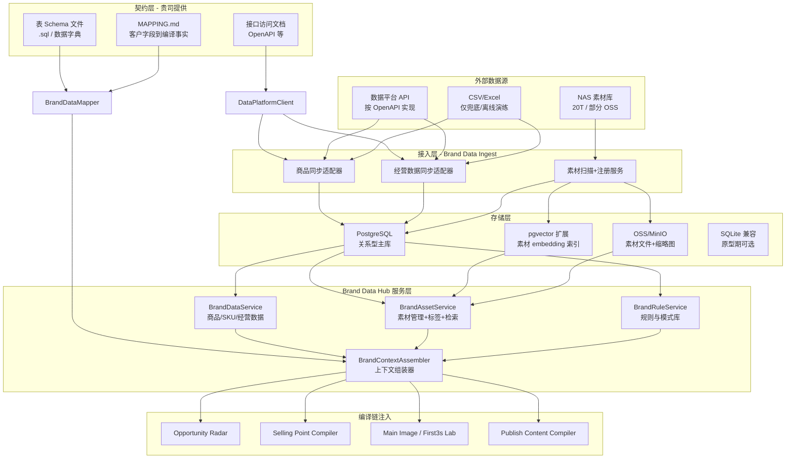
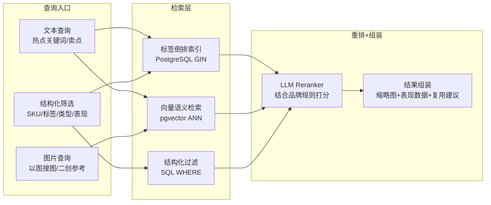

# 品牌资产接入完整技术方案

## 0. 现状与差距总结

当前系统中与品牌数据相关的基础设施：

- **已有**: `brand_id`/`workspace_id` 贯穿全链路；`BrandProfile`/`BrandProductLine`/`BrandVoice`/`AudienceProfile` 存在于 B2B 平台 schema 但未接入 Growth Lab 编译链；`sku_id` 字段已存在于 `main_image_variants`/`test_tasks` 但仅为标签
- **缺失**: 无与贵司数据平台契约对齐的接入层；无 `BrandContextAssembler`；无素材语义检索；Growth Lab 内无「按客户表结构」的只读/镜像存储策略
- **存储现状**: 全部 SQLite（`data/growth_lab.sqlite` + `data/b2b_platform.sqlite`）；图片在 `data/source_images/` + `data/generated_images/`；无 OSS 集成；无向量库

## 0.5 客户侧 Schema 与接口文档（唯一事实来源）

**原则**: 商品库、商品经营数据、店铺经营数据、素材库等**表结构定义与接口形态以贵司提供的文件与文档为准**；本系统只做契约消费、映射、缓存与编译链注入，**不在计划内重复定义业务表字段清单**（避免与贵司主数据分叉）。

### 0.5.1 贵司需提供的交付物（建议格式）

| 交付物 | 建议形式 | 用途 |
|--------|----------|------|
| 商品库表 DDL / ER 说明 | `.sql`、`.md` 附表说明、或数据字典 Excel | 代码生成/校验、本地镜像库对齐、联调对照 |
| 商品经营数据表 DDL | 同上 | 聚合查询、与 SKU/店铺/日期窗口 join |
| 店铺经营数据表 DDL | 同上 | 店铺维度筛选、与链接/平台对齐 |
| 素材库表 DDL + 文件存储约定 | DDL + NAS 路径规则 + OSS 字段说明 | 检索、预览 URL 拼装、二创引用 |
| 接口访问文档 | OpenAPI 3.x（首选）、或 Postman Collection、或 Markdown 含 Base URL、认证、分页、错误码、示例请求响应 | `DataPlatformClient` 实现与集成测试 |

版本约定：契约变更走**版本号或日期戳**（如 `contracts/2026-04-20/`），本系统配置中引用固定版本，避免静默破坏。

### 0.5.2 在本仓库中的落位（融入方式）

建议新增**只读契约目录**（名称可调整，实施时写入 `docs/IMPLEMENT.md`）：

- [docs/brand_data_platform/README.md](docs/brand_data_platform/README.md) — 索引：链接到各 DDL、OpenAPI、变更记录
- `docs/brand_data_platform/schemas/sql/` — 贵司提供的各表 `.sql`（或经许可的脱敏副本）
- `docs/brand_data_platform/api/openapi.yaml` — 或由 URL 指向贵司文档门户（README 中写 canonical link）
- `docs/brand_data_platform/MAPPING.md` — **客户字段 → 编译链内部 ViewModel** 对照表（本系统唯一需要「手写维护」的契约旁文档）

可选：`config/brand_data_platform.yaml` — `base_url`、`auth_ref`（环境变量名）、`contract_version`、`default_page_size`、各资源 path 覆盖（当 OpenAPI 与线上 path 有网关前缀差异时）。

### 0.5.3 系统内三层对象（避免重复造「业务主数据」）

1. **Contract / RawRow**: 与贵司 API 或镜像库行结构一致，类型上可为 `dict[str, Any]` 或从 OpenAPI 生成的 TypedDict（若引入 codegen）。
2. **BrandDataMapper**: 将 RawRow 转为稳定的 **`BrandCompileFacts`**（Pydantic），仅包含编译链需要的子集字段（命名由本系统统一，值来自映射表）。
3. **BrandContextAssembler**: 输入 `brand_id` + 当前编译阶段 + 热点/卖点关键词，调用 Client 或 SQL，输出 `BrandContext` 供 Radar / Compiler / Lab / Publish 使用。

PRD 中的 `ProductRecord` / `SKURecord` / `BrandAsset` 等**作为语义对象保留**；**物理列名、主键、分区、枚举取值以贵司 DDL 与文档为准**，通过 `MAPPING.md` 映射到 `BrandCompileFacts`。

## 1. 整体架构



## 2. 数据与模型策略（契约优先，不重复定义业务表）

本节**不再列举**商品库 / 商品经营 / 店铺经营 / 素材库各表的字段清单；**以贵司提供的 schema 文件与接口文档为唯一权威**。本系统侧只约定三类产物。

### 2.1 契约落库（仓库内）

- **DDL / 数据字典**: 放入 `docs/brand_data_platform/schemas/sql/`（或贵司指定子目录），README 中注明表名、主键、分区/分表策略（若有）、与 `brand_id`/店铺/平台的关联键。
- **接口文档**: `docs/brand_data_platform/api/openapi.yaml` 或 README 外链；需明确认证方式（API Key / OAuth2 / mTLS）、分页（cursor / offset）、速率限制、幂等键、错误响应结构。
- **变更记录**: 同目录 `CHANGELOG.md` 或按版本子目录，便于 Sprint 对齐。

### 2.2 本系统自建类型（仅编译与产品层）

新增路径建议（实施时按 AGENTS.md 更新 `docs/IMPLEMENT.md`）:

- [apps/growth_lab/schemas/brand_compile_facts.py](apps/growth_lab/schemas/brand_compile_facts.py) — **`BrandCompileFacts`**、**`BrandContext`**：字段集合由 `MAPPING.md` 驱动，是 Compiler/Lab 唯一依赖的稳定形状；**不复制贵司全表**，只保留「热点匹配 + 卖点 + 素材推荐 + 规则检查」所需子集。
- [apps/growth_lab/services/brand_data_mapper.py](apps/growth_lab/services/brand_data_mapper.py) — `map_product_row` / `map_sku_row` / `map_store_perf_row` / `map_asset_row` 等，**单元测试用贵司文档中的示例 JSON 作为 fixture**。

`brand-assets-linking-1.md` 中的 ProductRecord / SKURecord / BrandAsset 等名称，在实现上对应 **语义角色**；物理实现可以是 **API 返回的 dict** 或 **镜像库中的行**，经 Mapper 进入 `BrandCompileFacts`。

### 2.3 数据落位：直连 API vs 本地镜像

| 模式 | 适用 | 说明 |
|------|------|------|
| **联邦查询** | 数据平台 SLA 好、查询接口完备 | `DataPlatformClient` 按 OpenAPI 拉取；本系统仅存短 TTL 缓存（Redis 可选）与审计日志 |
| **镜像库** | 复杂聚合、向量检索、离线演练 | 在 **PostgreSQL** 中建库，表结构 **与贵司 DDL 对齐**（或由 ETL 写入贵司规定的 staging 表）；同步任务按文档分页拉取，写入镜像表 |
| **混合** | 3-5 年历史 + 实时 | 热数据联邦 + 冷数据镜像；`BrandContextAssembler` 按时间窗口路由 |

**PostgreSQL 动因**（与上一版计划一致，但与「谁定义表」解耦）: 百万级经营明细 + 多维度聚合 + `pgvector`；SQLite 仅适合契约联调与小样本 fixture。

### 2.4 素材库与检索扩展列（仅本系统扩展，不篡改贵司主表语义）

若贵司素材主表**不含**向量与自动标签字段：

- **方案 A**: 在镜像库中增加**扩展表** `brand_asset_search_extension(asset_id PK FK, embedding vector, auto_tags jsonb, thumb_oss_url, …)`，与贵司素材表 `asset_id` 对齐。
- **方案 B**: 贵司主表增加列（需贵司数仓/平台配合）— 由契约文件更新驱动本系统 Mapper。

NAS/OSS 路径、hash、预览 URL 规则一律以贵司素材表 + 存储说明为准；本系统扫描器只负责**发现文件 → 回填扩展表或调用贵司登记 API**（若贵司提供「素材注册」接口）。

### 2.5 品牌规则与模式（本系统可主存）

`BrandRule` / `WinningPattern` / `FailedPattern` 若暂无贵司表定义，可继续放在 `growth_lab.sqlite` 或 PG 独立 schema；若贵司后续提供规则表 DDL，则改为**读贵司表 + 可选本地覆盖**（`MAPPING.md` 注明优先级）。

## 3. 素材检索方案（核心技术挑战）

### 3.1 问题定义

20T NAS 里的素材需要支持:
- 基于热点关键词找到匹配素材（语义检索）
- 基于品牌规则过滤不合规素材（规则检索）
- 基于已有爆款素材找相似的做二创（相似度检索）
- 基于商品 SKU 找到关联素材（结构化检索）

### 3.2 混合检索架构



### 3.3 素材入库流水线

```
NAS 扫描器（增量）
    -> 文件去重（SHA256 hash）
    -> 缩略图生成（图片 resize / 视频抽帧）
    -> 上传 OSS（原图 + 缩略图）
    -> CLIP embedding 提取（批量 GPU 或 API）
    -> 自动标签（LLM：场景/风格/产品类型/情绪）
    -> 写入 PostgreSQL（镜像侧表结构遵循贵司 DDL；向量列见 2.4 扩展表）
    -> 索引就绪
```

**关于 20T NAS 的处理策略:**
- 不全量迁移，只迁移元数据 + 缩略图 + embedding
- 原图保持 NAS 存储，按需拉取到 OSS（懒加载）
- 高频使用的素材（被编译器引用过的）自动预热到 OSS
- 首批优先处理「高表现素材」+ 「最近1年素材」，预计 2-5T

### 3.4 "爆款素材二创"能力

这是最关键的体验点。技术链路:

```
用户选择一个爆款素材
    -> CLIP embedding 相似度检索 top-K 候选
    -> 结合商品特性+当前热点 LLM rerank
    -> 返回"二创推荐"：
        - 相似素材列表（可直接引用）
        - 二创建议（换商品/换场景/换文案方向）
        - 关联的 WinningPattern（这个风格为什么好）
```

## 4. 数据平台 API 对接设计（严格对齐接口文档）

### 4.1 契约驱动的 Client（先于适配器）

新增路径: [apps/growth_lab/adapters/brand_data_platform_client.py](apps/growth_lab/adapters/brand_data_platform_client.py)（名称可调整）

- **输入**: `config/brand_data_platform.yaml` + 环境变量（密钥、Base URL）。
- **行为**: 按 `docs/brand_data_platform/api/openapi.yaml`（或等价文档）实现 **operationId 或 path+method 一一对应** 的封装；处理分页、重试、429、鉴权刷新。
- **输出**: `dict` / `list[dict]`（原始响应），**不做业务字段重命名**（重命名只在 `BrandDataMapper`）。

**联调与 CI**: 使用文档中的 **example response** 或脱敏 fixture JSON 作为 contract test；禁止手写与文档不一致的字段假设。

### 4.2 适配器 / 同步任务（调用 Client + 写镜像或缓存）

新增路径: [apps/growth_lab/adapters/brand_data_adapter.py](apps/growth_lab/adapters/brand_data_adapter.py)

接口形态**不固定**为下列方法名——以 OpenAPI 中的资源为准；下列仅示意职责边界：

- 商品主档 / SKU 列表 / 商品经营明细 / **店铺经营**明细 / 素材元数据 / 素材表现 —— 各对应文档中的 endpoint。
- `since` / `date_from` / `date_to` / `store_id` / `platform` 等查询参数名**与文档一致**。

实现类:

- **`DataPlatformAPIAdapter`**: 生产环境，封装 `BrandDataPlatformClient`。
- **`FixtureAdapter`**: 离线开发，从 `docs/brand_data_platform/fixtures/*.json` 读入，无网络。
- **`CSVImportAdapter`**（可选）: 仅当契约中允许「文件批量导入」或与贵司离线交付对齐时使用；列名须与 DDL/字典一致，导入后仍经同一套 `BrandDataMapper`。

### 4.3 同步策略（3-5年历史数据）

- **首次全量**: 按月份分批拉取，避免一次性打爆内存（1000 SKU * 1800天 ~= 180万条，每批 10000 条）
- **增量同步**: 每日凌晨拉取前一天数据（`since` 参数）
- **手动触发**: Brand Data Hub 页面上的"立即同步"按钮
- **数据校验**: 每批写入后统计行数与平台侧对账

## 5. BrandContextAssembler -- 编译链的统一注入点

新增路径: [apps/growth_lab/services/brand_context_assembler.py](apps/growth_lab/services/brand_context_assembler.py)

```python
class BrandContextAssembler:
    """为各编译器组装品牌上下文。"""

    async def assemble(
        self,
        brand_id: str,
        stage: str,  # opportunity/selling_point/variant/publish
        *,
        product_id: str = "",
        sku_id: str = "",
        target_scenarios: list[str] = None,
        target_people: list[str] = None,
        hot_keywords: list[str] = None,
    ) -> BrandContext:
        """返回结构化品牌上下文。"""
```

**BrandContext 输出结构:**

```python
class BrandContext(BaseModel):
    top_products: list[dict]        # 最相关的商品（含经营表现摘要）
    top_assets: list[dict]          # 最匹配的素材（含缩略图+表现）
    winning_patterns: list[dict]    # 相关赢家模式
    failed_patterns: list[dict]     # 需规避的失败模式
    brand_rules: list[dict]         # 适用的品牌规则
    performance_baseline: dict      # 品牌历史基线（CTR/CVR 中位数）
    verified_claims: list[str]      # 历史高效卖点
    risk_claims: list[str]          # 历史高退款卖点
```

**注入方式**: 各编译器的 `_build_user_content` 方法新增 `## 品牌上下文` 区块，由 Assembler 生成结构化文本传入 LLM prompt。

## 6. 存储层渐进策略

### Phase 0（契约先行，1-3 天）

- 在仓库中创建 `docs/brand_data_platform/` 目录结构，**纳入贵司提供的 DDL + OpenAPI + MAPPING.md**（由双方共同维护）。
- 实现 `BrandDataPlatformClient`（可对 fixture）、`BrandDataMapper`、`BrandCompileFacts`、`BrandContextAssembler` 骨架。
- **不在 SQLite 中复制一整套贵司商品/经营主表**（避免与契约分叉）；若需本地演示，使用 **fixture JSON** 或 **极小样本** 表，列名与 DDL 一致。
- 规则/模式若无贵司表：可暂存 `growth_lab.sqlite`（与现网一致）。

验收: 用文档中的真实响应样例跑通「Mapper → Assembler → SellingPoint/Publish 注入」。

### Phase 1（1-2 周）

- 按 OpenAPI 接通生产 `DataPlatformAPIAdapter`；增量与分批策略按文档能力设计。
- 若需聚合性能：部署 **PostgreSQL**，镜像库执行 **贵司提供的 DDL**（或贵司 DBA 给出的只读从库连接串，则本系统不写镜像、只读联邦）。
- 素材检索扩展表 + `pgvector`（见 2.4）；索引策略与维度和数据量由贵司表规模评估后定。

### Phase 2（2-4 周）

- NAS 扫描、缩略图、OSS、CLIP embedding、自动标签、混合检索 API（与第 3 节一致）。
- Growth Lab 核心对象表（`selling_point_specs` 等）仍在 SQLite 或逐步迁 PG，**与贵司品牌主数据表解耦**。

## 7. 前端页面（Brand Data Hub）

新增路由: `/growth-lab/brand-hub`

- 左栏: 资产类型切换（商品/SKU/经营表现/素材/规则/模式）
- 中栏: 列表/搜索结果（支持多维筛选）
- 右栏: 详情 + 被引用记录 + 推荐动作
- 核心动作: 导入数据 / 同步数据平台 / 素材标签管理 / 标记模式

Brand Context Inspector 作为右侧面板嵌入 Compiler/Lab 页面。

## 8. 实施路线（建议）

### Sprint 0（契约与映射，约 2-4 天）

- 贵司将 **DDL + OpenAPI + 示例响应** 放入 `docs/brand_data_platform/`，双方确认 `MAPPING.md` 首版（商品 / SKU / 店铺经营 / 商品经营 / 素材关键字段 → `BrandCompileFacts`）。
- 实现 `BrandDataPlatformClient`（fixture 模式可先行）、`BrandDataMapper`、`BrandCompileFacts`、`BrandContextAssembler` 最小闭环。
- `SellingPointCompiler` + `PublishContentCompiler`（及可选 Radar）注入 `BrandContext` 文本块。

最小可验证: **不连生产网** 即可用 fixture 跑通编译链；连生产后仅换 Client 配置。

### Sprint 1（生产 API + Hub + Inspector，约 1-2 周）

- 按 OpenAPI 实现生产 `DataPlatformAPIAdapter`；商品、SKU、**店铺经营**、商品经营、素材元数据等 endpoint 与文档一致。
- 全量/增量同步策略按文档能力实现；必要时上线 **PG 镜像**（执行贵司 DDL）或对接只读从库。
- Brand Data Hub 只读列表页（字段由契约决定）+ Compiler 侧 Brand Context Inspector。

### Sprint 2（素材与检索，约 2-3 周）

- 扩展表 + `pgvector`、NAS/OSS 流水线、混合检索 API、Lab 素材面板。

### Sprint 3（约 2 周）

- 爆款二创、模式沉淀、测试回流、Inspector 完整版（仍通过 Mapper 消费贵司表现字段）。

## 9. 交付清单：数据输入格式 与 API 接口约定

> 目标：让贵司一次性按清单交付后，本系统 **24 小时内可跑通 Sprint 0**（fixture 模式 → 编译链注入），**生产联调 1 周内完成**。

### 9.1 仓库目录约定（贵司材料的"落地位置"）

建议采用以下结构，双方共同维护：

```
docs/brand_data_platform/
├── README.md                          # 索引 + 版本 + 变更摘要
├── CHANGELOG.md                       # 契约版本记录
├── v2026-04-20/                       # 每次较大变更用日期戳快照
│   ├── schemas/
│   │   ├── product_catalog.sql        # 商品库 DDL
│   │   ├── sku.sql                    # SKU DDL（若独立表）
│   │   ├── product_performance.sql    # 商品经营数据 DDL
│   │   ├── store_performance.sql      # 店铺经营数据 DDL
│   │   ├── asset_library.sql          # 素材库 DDL
│   │   └── data_dictionary.xlsx       # 或 .md：字段级语义说明
│   ├── api/
│   │   ├── openapi.yaml               # 接口 OpenAPI 3.x（首选）
│   │   ├── authentication.md          # 鉴权细节
│   │   └── fixtures/                  # 示例响应，按 operationId 命名
│   │       ├── listProducts.json
│   │       ├── listSkus.json
│   │       ├── listStorePerformance.json
│   │       ├── listProductPerformance.json
│   │       └── listAssets.json
│   ├── enums/
│   │   ├── platform_codes.yaml        # 平台编码表
│   │   ├── lifecycle_stages.yaml      # 生命周期枚举
│   │   └── asset_types.yaml           # 素材类型枚举
│   └── storage/
│       ├── nas_path_rules.md          # NAS 路径规范
│       └── oss_conventions.md         # OSS bucket / key / 预览 URL 规则
└── MAPPING.md                         # 贵司字段 → BrandCompileFacts 映射表（双方签字）
```

### 9.2 Schema 文件交付规范

#### 9.2.1 格式要求

- **首选 `.sql` DDL**（PostgreSQL 方言或带注释说明源方言），每张表独立文件
- **辅以数据字典**：`.xlsx` 或 `.md` 表格，至少包含：`字段名 | 类型 | 是否可空 | 单位 | 枚举值 | 业务含义 | 示例值`
- 若为 Hive/Doris/ClickHouse，请在 README 注明并附 DDL 等价的 PG 语句（或标记"不可直接建镜像库，需走联邦 API"）

#### 9.2.2 每张表的最小信息集

| 必须明确 | 说明 |
|----------|------|
| 主键 / 唯一键 | 本系统以此做增量同步与 upsert |
| 与 `brand_id` 的关联键 | 多品牌隔离基础 |
| 时间字段 | `created_at` / `updated_at` / `date_window` 的精度（秒/日/周/月）、时区 |
| 金额/百分比单位 | 分 vs 元、0-1 vs 0-100 |
| 枚举字段 | 取值清单 + 每个值的业务含义（如 `platform='tb'` 含义） |
| 外键关系 | 商品 ↔ SKU ↔ 店铺 ↔ 素材之间的连接键 |
| 数据粒度 | 商品经营"日/店铺/SKU"？"日/店铺/商品"？ |
| 分区/分表规则 | 按月/按品牌/按平台等，决定本系统同步任务如何切片 |
| 历史范围 | 从哪一天开始有数据、数据质量何时稳定 |

#### 9.2.3 本系统编译链"必需字段"（Mapper 消费端最小集）

贵司表若有**以下等价字段**即可，具体列名以贵司为准，通过 `MAPPING.md` 对齐。缺失字段会降级对应能力（见右列）。

**商品库必需字段**

| 语义 | 用途 | 缺失的影响 |
|------|------|------------|
| 商品唯一 ID | 关联一切 | 必需 |
| 商品名称 | 展示 + LLM 上下文 | 必需 |
| 品牌 ID | 多品牌隔离 | 必需 |
| 品类 / 产品线 | 匹配热点 + 聚合 | 必需 |
| 核心特性 / 卖点描述 | 注入卖点编译 | 缺失 → 卖点编译降为泛化模式 |
| 差异化说明 / 竞品对照 | 差异化卖点 | 缺失 → 无对比话术 |
| 目标人群 / 场景标签 | 场景匹配 | 缺失 → 无法做热点-商品匹配 |
| 价格 / 价格带 | 合规 + 文案调性 | 可选 |
| 上架日期 / 生命周期阶段 | 优先级排序 | 可选 |
| 状态 | 过滤下架 | 必需 |

**SKU 必需字段**（若 SKU 独立于 SPU 管理）

| 语义 | 用途 |
|------|------|
| SKU 唯一 ID | 关联素材与经营数据 |
| 所属商品 ID | 与 SPU 关联 |
| 规格属性 KV | 颜色/尺寸/材质等 |
| 当前售价 | 合规 |
| 可售状态 | 过滤缺货 |

**商品经营数据必需字段**

| 语义 | 用途 | 缺失的影响 |
|------|------|------------|
| 日期窗口 | 聚合 | 必需 |
| 商品 ID / SKU ID | 关联 | 必需 |
| 平台编码 | 多平台筛选 | 必需 |
| 店铺 ID | 店铺维度 | 必需 |
| 曝光 / 点击 / CTR | 素材评分 | 至少二选一（CTR 可算） |
| 订单 / GMV / CVR | 转化评分 | 至少二选一 |
| 退款率 | 识别高退款"风险卖点" | 缺失 → 失败模式无法归纳 |
| 收藏率 / 加购率 | 承接指标 | 可选 |

**店铺经营数据必需字段**

| 语义 | 用途 |
|------|------|
| 日期窗口 | 聚合 |
| 店铺 ID + 平台编码 | 关联 |
| 店铺 GMV / UV / 访客数 | 基线 |
| 店铺类目归属 | 赛道定位 |
| 店铺品牌归属 | 多品牌隔离 |

**素材库必需字段**

| 语义 | 用途 | 缺失的影响 |
|------|------|------------|
| 素材唯一 ID | 关联 | 必需 |
| 素材类型 | 主图/片段/视频等 | 必需 |
| 品牌 ID | 隔离 | 必需 |
| 关联商品 / SKU ID | 定向检索 | 缺失 → 只能做纯语义检索 |
| 文件访问地址 | NAS 路径 或 OSS URL | **二者至少一个** |
| 缩略图 URL | 列表展示 | 缺失 → 本系统自行生成 |
| 文件 Hash 或 size+mtime | 去重与增量 | 必需 |
| 宽高 / 时长 | UI 与切片 | 可选 |
| 已有标签 | 检索召回 | 可选（本系统可补充自动标签） |
| 已验证表现（是否爆款） | 二创 | 可选 |

**创意/素材表现数据（可选但强烈建议）**

| 语义 | 用途 |
|------|------|
| creative_id / 素材 ID | 关联素材 |
| 素材类型 | 主图/前3秒/长视频 |
| 平台 + 店铺 + 商品 + SKU | 关联 |
| 曝光 / 点击 / CTR / CVR | 评分 |
| 视频完播率（3s/8s/15s） | 前3秒质量 |
| 疲劳度 / 衰减 | 判断是否需要二创 |

---

### 9.3 API 接口约定（OpenAPI 细节要求）

#### 9.3.1 整体规范

- **版本化**: URL 中带版本号（如 `/v1/products`）或 Header `X-API-Version`，本系统配置中显式声明目标版本。
- **鉴权**: 明确以下三项之一
  - API Key in Header: `X-API-Key: <key>`
  - OAuth 2.0 Client Credentials
  - mTLS（需提供证书颁发流程）
- **环境分离**: 提供 `staging` / `production` 两套 Base URL 与独立凭证。
- **时区**: 所有时间戳明确 ISO 8601 + 时区（推荐 UTC 或统一 Asia/Shanghai）。
- **字符编码**: UTF-8，中文字段不转码。

#### 9.3.2 分页约定

必须二选一，并在 OpenAPI 中用统一 schema：

**Cursor-based（推荐，适合百万级）**

```json
{
  "data": [...],
  "pagination": {
    "next_cursor": "eyJpZCI6MTIzfQ==",
    "has_more": true,
    "total_estimate": 180000
  }
}
```

**Offset-based**

```json
{
  "data": [...],
  "pagination": {
    "page": 1,
    "page_size": 100,
    "total": 180000,
    "total_pages": 1800
  }
}
```

#### 9.3.3 筛选与增量参数约定

每个 list 端点须支持：

- `brand_id` (必填)
- `since` / `updated_after` (ISO 8601)：增量拉取
- `date_from` / `date_to`：时间窗口
- `platform` / `store_id` / `product_id` / `sku_id`（按资源适用）
- `page_size` 或 `limit`：上限建议 ≥ 1000

#### 9.3.4 错误响应规范

统一 schema，HTTP 状态码 + 业务错误码：

```json
{
  "error": {
    "code": "RATE_LIMITED",
    "message": "请求过于频繁，请稍后重试",
    "request_id": "req_abc123",
    "retry_after_seconds": 60
  }
}
```

常见错误码需在文档枚举：`UNAUTHORIZED` / `FORBIDDEN` / `NOT_FOUND` / `VALIDATION_ERROR` / `RATE_LIMITED` / `INTERNAL_ERROR`。

#### 9.3.5 速率限制

- 明确单账号 QPS 上限、每日总量上限
- 响应 Header 返回：`X-RateLimit-Limit` / `X-RateLimit-Remaining` / `X-RateLimit-Reset`
- 突发窗口策略（如 burst = 2x sustained for 10s）

#### 9.3.6 幂等性

写接口（若有）必须支持 `Idempotency-Key` Header，24h 内重复请求返回同一结果。

#### 9.3.7 必需的 endpoint 清单（最小集）

按语义分组；具体 path/method 以贵司 OpenAPI 为准：

| operationId 建议 | 方法 | 语义 |
|------------------|------|------|
| `listProducts` | GET | 商品主档分页查询 |
| `getProduct` | GET | 商品详情 |
| `listSkus` | GET | SKU 分页查询 |
| `listStores` | GET | 店铺列表（含品牌归属、平台、类目） |
| `listStorePerformance` | GET | 店铺经营数据（日/周/月） |
| `listProductPerformance` | GET | 商品经营数据（日+平台+店铺+SKU 粒度） |
| `listCreativePerformance` | GET | 素材/创意表现（可选） |
| `listAssets` | GET | 素材元数据分页 |
| `getAsset` | GET | 素材详情（含访问 URL） |
| `resolveAssetUrl` | GET/POST | 获取临时签名访问 URL（若走 OSS 私有桶） |
| `upsertAssetExtensions` | PUT/POST | **回写** 本系统产出的扩展字段（embedding / 自动标签 / 二创关联），见 §9.4.3 |
| `batchUpsertAssetExtensions` | POST | 批量回写（≥1000 条/次，用于首次全量 embedding 落库） |

#### 9.3.8 示例响应（fixture）要求

每个 list 端点至少提供 **3 条真实脱敏样本**放入 `api/fixtures/*.json`，本系统据此：
- 写 Mapper 单元测试
- 在 Sprint 0 离线跑通编译链（无需生产网）
- 自动生成 OpenAPI contract test

---

### 9.4 素材存储与访问约定

#### 9.4.1 NAS 路径规则

提供 `nas_path_rules.md`，包含：

- NAS 挂载根路径（本系统运行所在机器能访问的本地/挂载路径）
- 目录层级规则（如 `{brand}/{year}/{product_id}/{asset_type}/{filename}`）
- 文件命名规范
- 是否有只读从节点（避免扫描影响生产写入）
- 大文件（>100MB 视频）的特殊位置

#### 9.4.2 OSS 访问约定

- bucket 名称与 region
- object key 规则（是否保留原 NAS 相对路径）
- 访问凭证（AK/SK 或 STS Token 获取接口）
- 私有桶的签名 URL 有效期
- CDN 加速域名（若有）
- 缩略图规则：由贵司预生成，还是本系统侧生成后回传？

#### 9.4.3 素材扩展字段回写接口（必需）

> 已确认：本系统产出的扩展数据允许回写贵司素材库，因此以下接口属于 **§9.3.7 必需 endpoint** 的扩展条目，不是可选项。

**单条回写 `upsertAssetExtensions`**

```
PUT /assets/{asset_id}/extensions
Content-Type: application/json
Idempotency-Key: <uuid>

{
  "embedding": {
    "model": "clip-vit-large-patch14",
    "dim": 768,
    "vector": [0.012, -0.034, ...]
  },
  "auto_tags": [
    {"tag": "极简风格", "score": 0.92, "source": "auto_v1"},
    {"tag": "白底", "score": 0.88, "source": "auto_v1"}
  ],
  "reuse_links": [
    {"source_asset_id": "ast_abc", "relation": "derived_from", "project_id": "p_123"}
  ],
  "quality_signals": {
    "aesthetic_score": 0.81,
    "has_text_overlay": true,
    "has_real_person": false
  },
  "generated_by": "growth_lab",
  "generated_at": "2026-04-20T03:12:00Z"
}
```

**批量回写 `batchUpsertAssetExtensions`**

用于首次存量数据 embedding 全量落库（预计十万～百万级）：

```
POST /assets/extensions:batch
{
  "items": [ { "asset_id": "...", "embedding": {...}, ... }, ... ]
}
```

响应须返回逐条结果（成功/失败 + 错误码），便于本系统断点续传。

**贵司素材库需支持的扩展字段（建议 DDL 字段）**

| 字段 | 类型 | 说明 |
|------|------|------|
| `embedding_vector` | VECTOR(768) 或 BYTEA + 索引表 | CLIP 向量 |
| `embedding_model` | VARCHAR(64) | 模型标识，用于版本化 |
| `auto_tags` | JSONB | 自动标签数组 |
| `reuse_links` | JSONB 或独立关联表 | 二创派生关系 |
| `quality_signals` | JSONB | 美学分/真人检测等 |
| `ext_updated_at` | TIMESTAMPTZ | 扩展字段更新时间 |
| `ext_updated_by` | VARCHAR(64) | 回写系统标识（如 `growth_lab`） |

**约束与策略**

- **幂等**: 以 `asset_id + embedding_model` 为幂等键，重复写同模型版本覆盖；不同模型版本并存
- **权限隔离**: 扩展字段写入账号单独授权，禁止写入素材主档字段（`file_url`、`type`、`brand_id` 等）
- **写入配额**: 贵司明确 QPS 与每日总量；本系统侧加入令牌桶
- **冲突策略**: 贵司侧若有人工标签，应与 `auto_tags` 分列存储（如 `manual_tags` vs `auto_tags`），本系统不覆盖人工标签
- **删除**: 提供 `DELETE /assets/{asset_id}/extensions?model=clip-vit-large-patch14` 用于模型升级时清理旧向量

**若短期内贵司素材库 DDL 无法扩展**: 过渡方案是本系统在自己的 PG 中建 `asset_extensions` 表（FK 到 `asset_id`），待贵司素材库扩容后再做数据搬迁；但这是**过渡态**，不是最终目标。

---

### 9.5 枚举与编码表

单独 YAML 文件交付，便于双方对齐：

**`enums/platform_codes.yaml`**
```yaml
tb: 淘宝
tm: 天猫
pdd: 拼多多
jd: 京东
xhs: 小红书
dy: 抖音
```

**`enums/lifecycle_stages.yaml`**
```yaml
new: 新品
growth: 成长期
mature: 成熟期
decline: 衰退期
discontinued: 已下架
```

**`enums/asset_types.yaml`**
```yaml
main_image: 主图
detail_image: 详情图
video_clip: 视频片段
short_video: 短视频（前3秒）
long_video: 长视频
model_photo: 模特图
lifestyle: 场景图
```

---

### 9.6 联调环境与安全

| 项 | 内容 |
|----|------|
| 测试 Base URL | `https://api-staging.brand.com/v1`（示例） |
| 测试凭证 | 独立于生产的 API Key / OAuth Client |
| 测试数据量 | 建议覆盖 ≥ 1 个完整品牌、100+ SKU、近 30 天经营数据、1000+ 素材 |
| 白名单 | 本系统出口 IP 是否需加白名单？ |
| 数据脱敏 | fixture 中金额是否可打码？真实订单号是否必须替换？ |
| 合规 | 是否需签署数据使用协议、NDA？ |

---

### 9.7 MAPPING.md 模板（双方共同维护）

这是**本系统唯一需要手工维护的契约文档**，形如：

```markdown
## 商品库 → BrandCompileFacts.product

| 贵司字段 | 类型 | 本系统字段 | 变换 | 备注 |
|----------|------|------------|------|------|
| item_code | VARCHAR(32) | product_id | 原样 | 主键 |
| item_name_cn | VARCHAR(255) | product_name | 原样 | |
| cat_l2_name | VARCHAR(64) | category | 原样 | 贵司 L2 类目 |
| feature_desc | TEXT | core_features | split("\n") | 按换行拆为 list |
| price_cents | INT | price | /100 | 分转元 |
| life_stage | ENUM | lifecycle_stage | enum 映射见 `enums/lifecycle_stages.yaml` | |

## 商品经营数据 → BrandCompileFacts.product_performance

| 贵司字段 | 本系统字段 | 变换 |
|----------|------------|------|
| stat_date | date_window | 原样 |
| gmv_fen | gmv | /100 |
| ctr_pct | ctr | /100（0-100 转 0-1） |
| ...
```

`MAPPING.md` 的每次变更都需要在 `CHANGELOG.md` 中登记并同步 Mapper 测试。

---

### 9.8 交付里程碑

| 里程碑 | 贵司交付物 | 本系统响应 |
|--------|-----------|-----------|
| M0（启动） | README + 表清单 + 首版 OpenAPI 草稿 | 创建仓库目录骨架 |
| M1（约 3 天） | 全部 DDL + 数据字典 + 枚举 + fixture | 完成 `BrandCompileFacts` + Mapper + 单元测试 |
| M2（约 5 天） | 测试环境 API 可用 + 测试凭证 | 完成 `BrandDataPlatformClient` + contract test |
| M3（约 10 天） | 生产环境 API 就绪 + NAS/OSS 访问方式确认 | Sprint 1 完成（Brand Hub + Inspector 上线） |
| M3.5 | 素材库扩展字段 DDL 完成 + `upsertAssetExtensions` 回写接口上线 | 本系统开始批量回写 embedding / 自动标签 |
| M4（约 30 天） | 历史 3-5 年数据回溯同步完成 + 存量素材回写完成 | 镜像库 + 素材检索链路就绪（混合召回） |

---

**一句话总结（升级后）**: 品牌主数据与经营数据以贵司 **schema 文件 + 接口文档** 为契约；本系统通过 **Client + Mapper + Assembler** 融入 Growth Lab 编译链，并在 PG/向量扩展上解决规模与检索问题，**不在仓库内平行维护一套「自造商品库表结构」**。贵司按 §9 清单交付后，Sprint 0 可在 24h 内跑通 fixture，生产联调在 1 周内完成。
