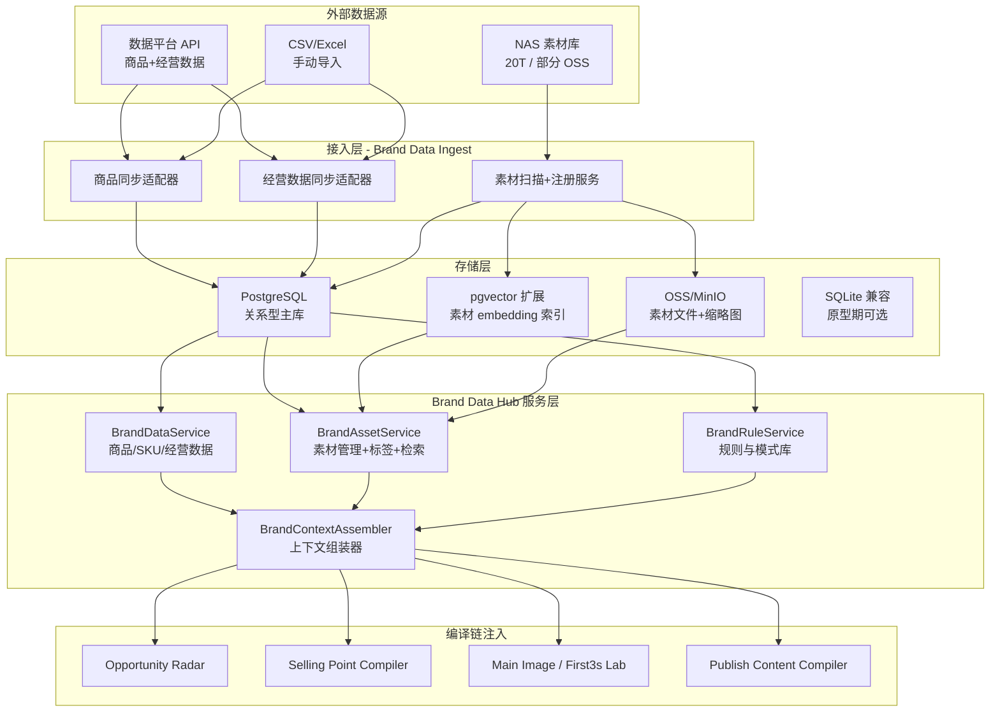
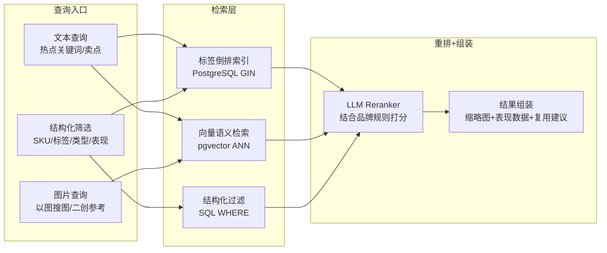

# 品牌资产接入完整技术方案

## 0. 现状与差距总结

当前系统中与品牌数据相关的基础设施：

- **已有**: `brand_id`/`workspace_id` 贯穿全链路；`BrandProfile`/`BrandProductLine`/`BrandVoice`/`AudienceProfile` 存在于 B2B 平台 schema 但未接入 Growth Lab 编译链；`sku_id` 字段已存在于 `main_image_variants`/`test_tasks` 但仅为标签
- **缺失**: 无 ProductRecord/SKURecord 主数据表；无经营数据表（performance）；无素材资产表（BrandAsset）；无品牌规则表（BrandRule）；无 `BrandContextAssembler` 上下文组装层；无素材检索能力（embedding/向量/标签索引均无实现）
- **存储现状**: 全部 SQLite（`data/growth_lab.sqlite` + `data/b2b_platform.sqlite`）；图片在 `data/source_images/` + `data/generated_images/`；无 OSS 集成；无向量库

## 1. 整体架构



## 2. 数据模型设计

### 2.1 商品库（对接数据平台 API）

新增路径: [apps/growth_lab/schemas/brand_catalog.py](apps/growth_lab/schemas/brand_catalog.py)

**ProductRecord** -- 1000+ SKU 量级，按 brand_id 隔离

| 字段 | 类型 | 说明 |
|------|------|------|
| product_id | str | 主键，对齐数据平台 product_id |
| brand_id | str | FK -> BrandProfile |
| product_name | str | 产品名 |
| category | str | 品类 |
| product_line | str | 产品线，对齐 BrandProductLine |
| launch_date | str | 上市日期 |
| lifecycle_stage | enum | new/growth/mature/decline/discontinued |
| core_features | list[str] | 核心特性（材质/工艺/功能） |
| differentiation | str | 差异化描述 |
| tags | list[str] | 业务标签 |
| external_id | str | 数据平台原始 ID（用于增量同步） |

**SKURecord**

| 字段 | 类型 | 说明 |
|------|------|------|
| sku_id | str | 主键 |
| product_id | str | FK -> ProductRecord |
| brand_id | str | 冗余，加速查询 |
| sku_name | str | 如"深灰色/120x80cm" |
| price | float | 当前售价 |
| price_band | str | 价格带标签 |
| attributes | dict | 规格属性 KV（颜色/尺寸/材质等） |
| scenario_tags | list[str] | 使用场景标签 |
| function_tags | list[str] | 功能标签 |
| availability_status | enum | active/low_stock/discontinued |

### 2.2 经营数据（对接数据平台 API，3-5年历史）

**ProductPerformanceRecord** -- 预计百万行量级（1000 SKU * 365天 * 3年 * 多平台）

| 字段 | 类型 | 说明 |
|------|------|------|
| record_id | str | 主键 |
| brand_id | str | 分区键 |
| platform | str | 淘宝/拼多多/京东/小红书 |
| store_id | str | 店铺 |
| product_id | str | FK -> ProductRecord |
| sku_id | str | FK -> SKURecord |
| date_window | str | 日期/周/月 |
| impressions | int | 曝光 |
| clicks | int | 点击 |
| ctr | float | |
| orders | int | 成交 |
| cvr | float | |
| gmv | float | 成交金额 |
| refund_rate | float | |
| save_rate | float | 收藏率 |
| add_to_cart_rate | float | 加购率 |

**CreativePerformanceRecord** -- 素材版本表现

| 字段 | 类型 | 说明 |
|------|------|------|
| record_id | str | 主键 |
| brand_id | str | |
| creative_id | str | 关联素材或内部 variant_id |
| creative_type | enum | main_image/first3s/long_video |
| platform | str | |
| product_id | str | |
| sku_id | str | |
| date_window | str | |
| impressions/clicks/ctr/cvr | ... | 同上 |
| retention_3s/8s/15s | float | 视频完播率 |
| fatigue_score | float | 衰减指数 |

**关键技术决策: 为什么需要升级到 PostgreSQL**

SQLite 对这个量级的数据有明确的限制:
- 百万行 performance 记录 + 复杂聚合查询（按 SKU/平台/时间窗口 GROUP BY）会严重影响响应时间
- 多进程写入冲突（uvicorn workers + 后台同步任务）
- 无法支持 pgvector 向量检索

建议采用 PostgreSQL + pgvector，原型阶段可继续用 SQLite 跑通链路，但存储层抽象需从第一天就支持切换。

### 2.3 素材资产（NAS + OSS 混合）

**BrandAsset** -- 素材元数据表

| 字段 | 类型 | 说明 |
|------|------|------|
| asset_id | str | 主键 |
| brand_id | str | |
| asset_type | enum | main_image/video_clip/model_photo/detail_image/viral_video |
| source_path | str | NAS 原始路径 |
| oss_url | str | OSS 地址（如已上传） |
| thumbnail_url | str | 缩略图地址 |
| file_hash | str | 用于去重（SHA256 前 16 位） |
| file_size_bytes | int | |
| width/height | int | 图片尺寸 |
| duration_seconds | float | 视频时长 |
| linked_product_ids | list[str] | 关联商品 |
| linked_sku_ids | list[str] | 关联 SKU |
| linked_selling_points | list[str] | 关联卖点文本 |
| tags | list[str] | 标签（自动+人工） |
| quality_score | float | 质量评分 |
| reuse_score | float | 复用价值评分 |
| embedding | vector(512) | CLIP embedding（pgvector 列） |

### 2.4 品牌规则与模式

**BrandRule**

| 字段 | 类型 | 说明 |
|------|------|------|
| rule_id | str | 主键 |
| brand_id | str | |
| rule_type | enum | tone/forbidden_word/risk_word/must_mention/platform_rule/sop |
| applies_to | list[str] | 适用场景 |
| rule_content | str | 规则正文 |
| priority | int | 优先级 |

**WinningPattern / FailedPattern** -- 沿用 PRD 定义，关联 asset_ids + product_ids + metrics

## 3. 素材检索方案（核心技术挑战）

### 3.1 问题定义

20T NAS 里的素材需要支持:
- 基于热点关键词找到匹配素材（语义检索）
- 基于品牌规则过滤不合规素材（规则检索）
- 基于已有爆款素材找相似的做二创（相似度检索）
- 基于商品 SKU 找到关联素材（结构化检索）

### 3.2 混合检索架构



### 3.3 素材入库流水线

```
NAS 扫描器（增量）
    -> 文件去重（SHA256 hash）
    -> 缩略图生成（图片 resize / 视频抽帧）
    -> 上传 OSS（原图 + 缩略图）
    -> CLIP embedding 提取（批量 GPU 或 API）
    -> 自动标签（LLM：场景/风格/产品类型/情绪）
    -> 写入 PostgreSQL（元数据 + embedding）
    -> 索引就绪
```

**关于 20T NAS 的处理策略:**
- 不全量迁移，只迁移元数据 + 缩略图 + embedding
- 原图保持 NAS 存储，按需拉取到 OSS（懒加载）
- 高频使用的素材（被编译器引用过的）自动预热到 OSS
- 首批优先处理「高表现素材」+ 「最近1年素材」，预计 2-5T

### 3.4 "爆款素材二创"能力

这是最关键的体验点。技术链路:

```
用户选择一个爆款素材
    -> CLIP embedding 相似度检索 top-K 候选
    -> 结合商品特性+当前热点 LLM rerank
    -> 返回"二创推荐"：
        - 相似素材列表（可直接引用）
        - 二创建议（换商品/换场景/换文案方向）
        - 关联的 WinningPattern（这个风格为什么好）
```

## 4. 数据平台 API 对接设计

### 4.1 适配器模式

新增路径: [apps/growth_lab/adapters/brand_data_adapter.py](apps/growth_lab/adapters/brand_data_adapter.py)

```python
class BrandDataAdapter(ABC):
    """品牌数据平台适配器抽象接口。"""

    @abstractmethod
    async def sync_products(self, brand_id: str, since: str = "") -> list[dict]:
        """拉取商品主档，since 为增量时间戳。"""

    @abstractmethod
    async def sync_skus(self, brand_id: str, since: str = "") -> list[dict]:
        """拉取 SKU 列表。"""

    @abstractmethod
    async def sync_performance(
        self, brand_id: str, date_from: str, date_to: str,
        granularity: str = "daily",
    ) -> list[dict]:
        """拉取经营数据。"""

    @abstractmethod
    async def sync_creative_performance(
        self, brand_id: str, date_from: str, date_to: str,
    ) -> list[dict]:
        """拉取素材版本表现数据。"""
```

实现两个具体适配器:
- `DataPlatformAPIAdapter` -- 对接你们的数据平台 HTTP API
- `CSVImportAdapter` -- 从 CSV/Excel 批量导入（原型期 + 兜底）

### 4.2 同步策略（3-5年历史数据）

- **首次全量**: 按月份分批拉取，避免一次性打爆内存（1000 SKU * 1800天 ~= 180万条，每批 10000 条）
- **增量同步**: 每日凌晨拉取前一天数据（`since` 参数）
- **手动触发**: Brand Data Hub 页面上的"立即同步"按钮
- **数据校验**: 每批写入后统计行数与平台侧对账

## 5. BrandContextAssembler -- 编译链的统一注入点

新增路径: [apps/growth_lab/services/brand_context_assembler.py](apps/growth_lab/services/brand_context_assembler.py)

```python
class BrandContextAssembler:
    """为各编译器组装品牌上下文。"""

    async def assemble(
        self,
        brand_id: str,
        stage: str,  # opportunity/selling_point/variant/publish
        *,
        product_id: str = "",
        sku_id: str = "",
        target_scenarios: list[str] = None,
        target_people: list[str] = None,
        hot_keywords: list[str] = None,
    ) -> BrandContext:
        """返回结构化品牌上下文。"""
```

**BrandContext 输出结构:**

```python
class BrandContext(BaseModel):
    top_products: list[dict]        # 最相关的商品（含经营表现摘要）
    top_assets: list[dict]          # 最匹配的素材（含缩略图+表现）
    winning_patterns: list[dict]    # 相关赢家模式
    failed_patterns: list[dict]     # 需规避的失败模式
    brand_rules: list[dict]         # 适用的品牌规则
    performance_baseline: dict      # 品牌历史基线（CTR/CVR 中位数）
    verified_claims: list[str]      # 历史高效卖点
    risk_claims: list[str]          # 历史高退款卖点
```

**注入方式**: 各编译器的 `_build_user_content` 方法新增 `## 品牌上下文` 区块，由 Assembler 生成结构化文本传入 LLM prompt。

## 6. 存储层渐进策略

### Phase 0（立即可做，1-2天）

继续用 SQLite，在 `data/growth_lab.sqlite` 中新增 brand_catalog 相关表:
- `products` / `skus` / `product_performance` / `creative_performance`
- `brand_assets` (不含 embedding 列)
- `brand_rules` / `winning_patterns` / `failed_patterns`

用 JSON 列存储灵活字段（沿用现有 `payload_json` 模式）。
CSV 导入立即可用，编译链注入立即可跑通。

### Phase 1（1-2周）

PostgreSQL + pgvector 部署:
- 迁移所有 brand_catalog 表到 PG
- 素材表增加 `embedding vector(512)` 列
- 向量索引: `CREATE INDEX ON brand_assets USING ivfflat (embedding vector_cosine_ops) WITH (lists = 100)`
- Growth Lab 的 `GrowthLabStore` 保持 SQLite 不动（渐进迁移）

### Phase 2（2-4周）

NAS 素材扫描服务上线:
- 增量扫描 + CLIP embedding + 自动标签
- 缩略图生成 + OSS 上传
- 混合检索 API 就绪

## 7. 前端页面（Brand Data Hub）

新增路由: `/growth-lab/brand-hub`

- 左栏: 资产类型切换（商品/SKU/经营表现/素材/规则/模式）
- 中栏: 列表/搜索结果（支持多维筛选）
- 右栏: 详情 + 被引用记录 + 推荐动作
- 核心动作: 导入数据 / 同步数据平台 / 素材标签管理 / 标记模式

Brand Context Inspector 作为右侧面板嵌入 Compiler/Lab 页面。

## 8. 实施路线（建议）

### Sprint 0（2-3天）: 数据模型 + CSV 导入 + 编译链注入

- 定义 schema (ProductRecord/SKURecord/Performance/BrandAsset/BrandRule)
- SQLite 存储层
- CSV 导入 API
- BrandContextAssembler 基础版（只查商品+规则）
- SellingPointCompiler + PublishContentCompiler 注入产品上下文

最小可验证: 导入商品 CSV 后，卖点编译和发布内容能看到产品特性的影响。

### Sprint 1（1-2周）: 数据平台 API 对接 + Brand Data Hub 页面

- DataPlatformAPIAdapter 实现
- 经营数据全量+增量同步
- Brand Data Hub 基础页面
- Brand Context Inspector 嵌入 Compiler 页面

### Sprint 2（2-3周）: PostgreSQL 迁移 + 素材检索

- PG + pgvector 部署
- NAS 扫描服务 + CLIP embedding
- 混合检索 API
- 素材面板嵌入 Lab 页面

### Sprint 3（2周）: 爆款二创 + 模式沉淀

- 以图搜图 / 相似素材推荐
- WinningPattern/FailedPattern 自动归纳
- 测试结果回流更新模式库
- Brand Context Inspector 完整版
