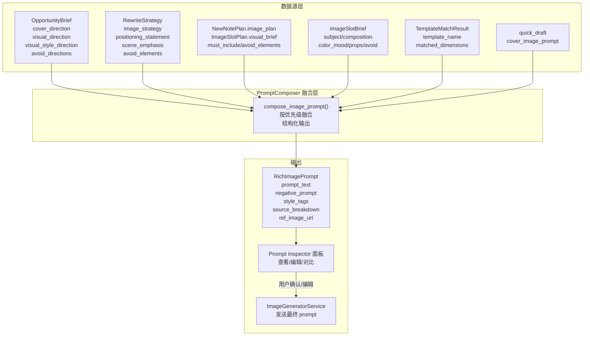

# 生图提示词可观测性 + 质量升级方案

## 问题诊断

当前 `extract_image_prompts_from_draft()` 的 prompt 来源极其单薄：

```
quick_draft["cover_image_prompt"]  →  通常 50 字以内
brief.visual_direction             →  兜底，一句话
brief.image_plan                   →  list[dict]，但代码期望 .image_slots 对象，实际不会命中
```

而策划工作台里已有的丰富数据**完全未参与**：

- `strategy.image_strategy` -- 图片策略方向（list[str]）
- `strategy.positioning_statement` / `scene_emphasis` / `avoid_elements`
- `plan.image_plan`（`MainImagePlan`）-- 每个槽位的 `visual_brief` / `must_include_elements` / `avoid_elements`
- `image_briefs`（`ImageSlotBrief`）-- 构图、配色、道具、规避项
- `match_result` -- 匹配模板名 + 风格锚点

## 架构设计




## Phase 1: Prompt Inspector -- 可观测性

**目标**：用户点击"生成配图"后，先看到即将发送的 prompt + 参考图，可编辑后再确认发送。

### 1.1 新增 API：`POST /v6/image-gen/{id}/preview-prompts`

文件：[routes.py](apps/content_planning/api/routes.py)

- 接受 `gen_mode` + `provider`
- 调用 prompt 融合逻辑，返回 `RichImagePrompt[]`（见 1.3）
- **不触发生图**，仅返回将要发送的内容
- 返回结构包含每条 prompt 的 `source_breakdown`（哪些字段贡献了哪些内容）

### 1.2 前端 Prompt Inspector 弹窗

文件：[planning_workspace.html](apps/intel_hub/api/templates/planning_workspace.html)

- 点击"生成配图"按钮 → 先弹出 Inspector 面板（而非直接发送）
- Inspector 内容：
  - 每个 slot 一行卡片：`slot_id` | 参考图缩略图 | prompt 文本（可编辑 textarea）| negative prompt | 来源标签（Brief / Strategy / Plan...）
  - 底部："确认生成" 按钮 → 带编辑后的 prompts 调用 `POST /v6/image-gen/{id}`
  - "取消" 按钮
- 参考图模式时，缩略图旁标注"参考图来源：原始笔记封面"

### 1.3 `RichImagePrompt` 模型

文件：[image_generator.py](apps/content_planning/services/image_generator.py)

```python
class PromptSource(BaseModel):
    field: str          # e.g. "strategy.image_strategy"
    content: str        # 该字段贡献的文本片段
    priority: int       # 融合优先级

class RichImagePrompt(BaseModel):
    slot_id: str
    prompt_text: str           # 融合后的完整正向 prompt
    negative_prompt: str       # 融合后的负向 prompt
    style_tags: list[str]      # 风格标签（来自 visual_style_direction + template）
    ref_image_url: str = ""
    sources: list[PromptSource]  # 可追溯的来源分解
    size: str = "1024*1024"
```

## Phase 2: PromptComposer -- 智能融合

**目标**：从策划全链路数据中，按优先级萃取高价值信息，构建结构化富 prompt。

### 2.1 新建 `prompt_composer.py`

文件：`apps/content_planning/services/prompt_composer.py`（新建）

核心函数：

```python
def compose_image_prompts(
    draft: dict,
    brief: OpportunityBrief | None,
    strategy: RewriteStrategy | None,
    note_plan: NewNotePlan | None,
    image_briefs: list[ImageSlotBrief] | None,
    match_result: dict | None,
    ref_image_urls: list[str] | None = None,
) -> list[RichImagePrompt]:
```

**融合优先级（高 → 低）**：

1. **image_briefs** (`ImageSlotBrief`) -- 已是 LLM 生成的逐槽精细指令，最接近最终 prompt
  - `subject` + `composition` + `props` → 正向 prompt 主体
  - `color_mood` → 色调标签
  - `avoid_items` → negative prompt
2. **plan.image_plan** (`ImageSlotPlan`) -- 有结构化的 `visual_brief`
  - `visual_brief` → 补充画面描述
  - `must_include_elements` → 必含元素
  - `avoid_elements` → negative prompt 补充
3. **strategy** (`RewriteStrategy`) -- 全局策略方向
  - `image_strategy` → 全局风格约束
  - `positioning_statement` → 品牌定位锚点
  - `scene_emphasis` → 场景强调
  - `avoid_elements` → 全局规避
4. **brief** -- 方向性指引
  - `visual_style_direction` → 风格标签
  - `cover_direction` / `visual_direction` → 兜底描述
  - `avoid_directions` / `constraints` → negative prompt
5. **draft** -- 基础 prompt
  - `cover_image_prompt` → 最基础的一句话描述
6. **match_result** -- 风格锚点
  - `template_name` → 风格参考标签

**融合规则**：

- 正向 prompt = 拼接（去重、控制总长度 200 字以内）
- Negative prompt = 合并所有 avoid 系列字段
- 每段文本标注来源（field path），写入 `sources`
- 若某层数据不存在，跳过该层（渐进降级）

### 2.2 替换 `extract_image_prompts_from_draft`

文件：[image_generator.py](apps/content_planning/services/image_generator.py)

- 保留 `extract_image_prompts_from_draft` 作为轻量兜底
- 新增 `compose_image_prompts` 作为主路径
- API 端点改为先尝试 `compose_image_prompts`，数据不足时降级到旧函数

### 2.3 API 端点改造

文件：[routes.py](apps/content_planning/api/routes.py)

`POST /v6/image-gen/{id}` 和 `POST /v6/image-gen/{id}/preview-prompts` 共用同一逻辑：

- 从 `plan_store.load_session()` 读取 `brief` / `strategy` / `plan` / `image_briefs` / `match_result` / `quick_draft`
- 调用 `compose_image_prompts(...)` 生成 `RichImagePrompt[]`
- preview-prompts 直接返回；image-gen 转换为 `ImagePrompt[]` 发送

`POST /v6/image-gen/{id}` 增加可选 body 字段 `edited_prompts`：

- 若用户在 Inspector 中编辑了 prompt，前端传回编辑后的 prompt 文本
- 后端用编辑后的文本覆盖融合结果

## Phase 3: 调优闭环

### 3.1 生成日志持久化

文件：[plan_store.py](apps/content_planning/storage/plan_store.py)

- `generated_images_json` 扩展：每条结果记录 `final_prompt`（实际发送的 prompt）、`sources`、`provider`、`gen_mode`、`user_edited: bool`
- 支持多轮生成历史（数组追加而非覆盖）

### 3.2 A/B 对比视图

文件：[planning_workspace.html](apps/intel_hub/api/templates/planning_workspace.html)

- 生成历史面板：显示每次生成的 prompt + 结果图 + 来源标签
- 支持对比两次生成结果（同 slot 并排展示）
- 用户可标记"满意/不满意"，反馈存入 session

### 3.3 Prompt 模板（可选增强）

- 预定义几套 prompt 模板（小红书封面风格、产品展示、场景氛围等）
- 用户可选模板 + 策划数据自动填充

## 改动范围


| 文件                                                     | 改动类型                                  |
| ------------------------------------------------------ | ------------------------------------- |
| `apps/content_planning/services/prompt_composer.py`    | 新建                                    |
| `apps/content_planning/services/image_generator.py`    | 新增 RichImagePrompt 模型，保留旧函数           |
| `apps/content_planning/api/routes.py`                  | 新增 preview-prompts 端点，改造 image-gen 端点 |
| `apps/content_planning/storage/plan_store.py`          | 扩展 generated_images 结构                |
| `apps/intel_hub/api/templates/planning_workspace.html` | 新增 Prompt Inspector 弹窗 + 生成历史         |


## 不动的文件

- `quick_draft_generator.py`：保持现有行为不变
- `_preview_canvas.html`：图片渲染逻辑不变
- 其他 schema 文件：只读取，不修改

