# 小红书一键发布 — 升级计划

## 背景分析

### 当前链路缺口

前3秒工作台生成视频后，只能「创建测试任务」（内部记录），没有真正发布到小红书的能力。需要新增一条从生成视频到平台发布的完整路径。

### 小红书创作者中心发布页特征

目标页面：`https://creator.xiaohongshu.com/publish/publish?from=menu&target=video`

关键交互特征（基于社区经验和 DOM 分析）：
- 基于 Vue 框架，`v-model` 绑定，`send_keys` 往往无法触发响应式更新，需要使用 Playwright `type()` 逐字符输入或 `dispatchEvent`
- 视频上传：定位 `input[type="file"]` 隐藏元素，调用 `set_input_files()` 上传本地文件
- 封面：默认自动截取首帧，可不设置
- 标题：`div[contenteditable="true"]` 或 `input` 元素
- 正文：`div[contenteditable="true"]` 编辑器区域
- 话题标签：必须输入 `#` 后等待下拉菜单渲染（约 2s），再点击选项，直接输入文本不生效
- 发布按钮：`button` 标签，点击后需等待上传完成
- 保存接口含 `x-sign` 签名，无法绕过浏览器直接调用 API，必须通过浏览器模拟

### 已有基础设施

- `third_party/MediaCrawler/` 已有 `playwright==1.45.0` 依赖 + 小红书登录态管理（QR码/Cookie/手机号）+ `storage_state` 持久化
- [publish_formatter.py](apps/content_planning/services/publish_formatter.py) 已有 `XHSPublishFormatter`，可格式化标题/正文/话题标签
- [PublishReadyPackage](apps/content_planning/schemas/compilation_report.py) schema 已定义标题、正文、hashtags、topic_tags 等字段
- `First3sVariant` 已有 `generated_video_url`、`hook_script`（含 opening_line / supporting_line / cta_line）等字段

---

## 架构设计

```mermaid
flowchart LR
  subgraph frontend [前端 first3s_lab.html]
    genDone["视频生成完成"] --> publishBtn["一键发布按钮"]
    publishBtn --> publishModal["发布配置弹窗"]
    publishModal --> submitPublish["POST /api/first3s/publish"]
  end

  subgraph backend [后端 routes.py]
    submitPublish --> publishService["XHSPublishService"]
  end

  subgraph browser [Playwright 浏览器层]
    publishService --> ensureLogin["确保登录态"]
    ensureLogin --> navPublish["导航到发布页"]
    navPublish --> uploadVideo["上传视频文件"]
    uploadVideo --> fillTitle["填写标题"]
    fillTitle --> fillBody["填写正文"]
    fillBody --> addTopics["添加话题标签"]
    addTopics --> clickPublish["点击发布"]
    clickPublish --> waitResult["等待发布结果"]
  end
```



---

## 改动文件清单

| 文件 | 操作 | 说明 |
|------|------|------|
| [apps/growth_lab/services/xhs_publisher.py](apps/growth_lab/services/xhs_publisher.py) | **新建** | Playwright 自动化发布核心服务 |
| [apps/growth_lab/api/routes.py](apps/growth_lab/api/routes.py) | 修改 | 新增 `POST /api/first3s/publish` 和 `GET /api/first3s/publish-status/{job_id}` |
| [apps/growth_lab/templates/first3s_lab.html](apps/growth_lab/templates/first3s_lab.html) | 修改 | 视频预览区增加「一键发布」按钮 + 发布配置弹窗 |
| `pyproject.toml` | 修改 | 主项目添加 `playwright` 依赖 |

---

## 详细设计

### 1. XHSPublishService（核心）

新建 [apps/growth_lab/services/xhs_publisher.py](apps/growth_lab/services/xhs_publisher.py)

**登录态管理策略**：

采用三级方案，优先复用已有登录态：
1. 复用 MediaCrawler 的 `storage_state`（`sessions/xhs_state.json`），如果存在且未过期则直接加载
2. 如果 `storage_state` 无效，从 `.env` 读取 `XHS_COOKIE_STR` 注入
3. 如果都无效，返回错误提示用户先通过 MediaCrawler 登录一次

**浏览器发布流程**（精准选择器定位）：

```python
class XHSPublishService:
    PUBLISH_URL = "https://creator.xiaohongshu.com/publish/publish?from=menu&target=video"

    async def publish_video(self, video_path, title, body, topics, on_progress=None):
        """完整发布流程"""
        # 1. 启动浏览器 + 加载登录态
        # 2. 导航到发布页
        # 3. 等待页面加载完成
        # 4. 上传视频（input[type="file"] + set_input_files）
        # 5. 等待视频处理完成（轮询上传进度）
        # 6. 填写标题（定位 contenteditable 或 input 元素，逐字符 type）
        # 7. 填写正文（定位编辑器 contenteditable 区域）
        # 8. 添加话题标签（输入 # + 等待下拉 + 点击选项）
        # 9. 点击发布按钮
        # 10. 等待发布结果确认
```

**关键选择器策略**：

由于小红书页面 DOM 可能变动，采用多层 fallback 选择器：
- 视频上传：`input[type="file"]`（隐藏的 file input）
- 标题输入：`[placeholder*="标题"]` / `input.title-input` / `div.title [contenteditable]`
- 正文编辑：`div.ql-editor[contenteditable]` / `div[contenteditable="true"]`（Quill 编辑器）
- 话题标签：输入 `#` 后等待 `.topic-list` / `.mention-list` 下拉菜单
- 发布按钮：`button:has-text("发布")` / `.publish-btn`

**内容生成**：

利用钩子脚本字段自动组装发布内容：
- **标题**：取 `hook_script.opening_line` 截断到 20 字
- **正文**：opening_line + supporting_line + cta_line，加表情符号
- **话题**：从卖点规格的 target_scenarios / core_claim 提取关键词

### 2. 后端路由

在 [routes.py](apps/growth_lab/api/routes.py) 新增：

- `POST /api/first3s/publish` — 接收 `{variant_id, title, body, topics}`，启动异步发布任务
- `GET /api/first3s/publish-status/{job_id}` — 前端轮询发布状态

发布是异步任务（Playwright 操作耗时），采用与视频生成相同的 submit + poll 模式。

### 3. 前端升级

在 [first3s_lab.html](apps/growth_lab/templates/first3s_lab.html) 右栏视频预览区新增：

- 「一键发布到小红书」按钮（视频生成完成后显示）
- 点击后弹出发布配置弹窗：
  - 标题（自动填充，可编辑）
  - 正文（自动填充，可编辑）
  - 话题标签（自动推荐，可增删）
  - 「确认发布」按钮
- 发布中：进度提示（正在上传 / 正在填充 / 正在发布 / 发布成功）
- 发布成功后显示笔记链接

### 4. 依赖安装

主项目 `pyproject.toml` 添加 `playwright` 依赖（当前仅 `third_party/MediaCrawler` 安装了），并运行 `playwright install chromium` 安装浏览器。

---

## 风险与注意事项

- **DOM 选择器可能过时**：小红书前端经常更新，选择器需要做 fallback 层级和运行时截图调试
- **登录态有效期**：`storage_state` 通常 24-48h 有效，过期后需重新登录
- **发布频率限制**：小红书对频繁发布有风控，建议控制发布间隔
- **调试模式**：第一轮建议 `headless=False`（有头模式），方便观察和调试选择器，稳定后再切换无头模式
- **话题标签上限**：单篇笔记最多 10 个话题标签

## 开发顺序

先后端核心服务 -> 路由 -> 前端 UI -> 联调测试（有头模式）
