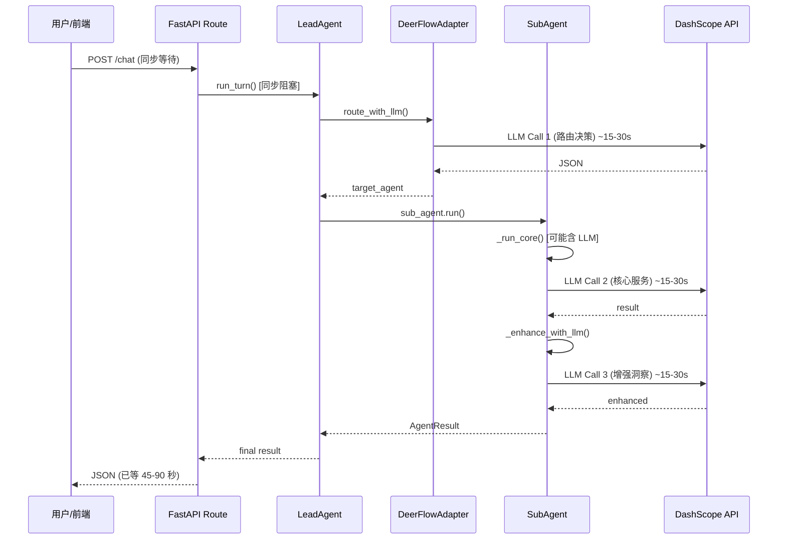

# 系统性能与 Agent 交互透明度诊断报告

---

## 一、核心问题：LLM 调用次数的串行放大

### 1.1 单次用户操作的实际 LLM 调用链路

以用户在 Brief 页发送一条对话为例（`POST /chat/{opportunity_id}`）：




**单次对话：最少 2 次、最多 3 次串行 LLM 调用。**

### 1.2 多 Agent 讨论更严重

`POST /discuss/{opportunity_id}` 在 brief 阶段：


| 步骤                     | LLM 调用    | 预估耗时     |
| ---------------------- | --------- | -------- |
| Agent 1 (趋势分析师) 发言     | 1 次       | ~20s     |
| Agent 2 (Brief 编译师) 发言 | 1 次       | ~20s     |
| Agent 3 (策略总监) 发言      | 1 次       | ~20s     |
| 综合共识                   | 1 次       | ~15s     |
| **合计**                 | **4 次串行** | **~75s** |


### 1.3 端到端评价更极端

`POST /evaluate/{opportunity_id}` 评 5 个阶段：

`[stage_evaluator.py](apps/content_planning/evaluation/stage_evaluator.py)` 第 105 和 121 行，每个阶段调了 **2 次 LLM**（第二次完全冗余，仅为取 `model_used`）：

```105:122:apps/content_planning/evaluation/stage_evaluator.py
        result = llm_router.chat_json(messages, temperature=0.2, max_tokens=1500)
        // ... 解析分数 ...
        resp = llm_router.chat(messages, temperature=0.2, max_tokens=1500)  // 冗余！
        model_used = resp.model
```

5 阶段 x 2 次 = **10 次串行 LLM 调用**，预估 **3-5 分钟**。

---

## 二、根因分类

### A. LLM 调用效率问题


| 问题                | 位置                                                          | 影响                            |
| ----------------- | ----------------------------------------------------------- | ----------------------------- |
| **评估器冗余双调**       | `stage_evaluator.py:121`                                    | 每阶段多 1 次无用 LLM 调用，5 阶段浪费 ~75s |
| **全串行无并行**        | `discussion.py` 逐个 Agent 顺序 chat                            | 3 个 Agent 串行等 ~60s，并行可降至 ~20s |
| **路由 + 增强双段 LLM** | `lead_agent._route_llm()` + `sub_agent._enhance_with_llm()` | 每次交互多 1-2 次 LLM 往返            |
| **无超时保护**         | `llm_client.py` 的 `Generation.call()` 无 timeout 参数          | DashScope 慢或卡住时无限等待           |
| **无结果缓存**         | `llm_router.py`                                             | 相同 prompt 重复调用不复用             |


### B. 前端透明度问题


| 问题                        | 位置                                                      | 影响                             |
| ------------------------- | ------------------------------------------------------- | ------------------------------ |
| **只有"Agent 思考中..."**      | `content_brief.html` JS                                 | 用户不知道当前在做什么、还要等多久              |
| **SSE 不推中间过程**            | `sse_handler.py` 事件级推送                                  | 对话和 Agent 运行期间前端无实时更新          |
| **discuss 事件未订阅**         | `content_brief.html` 只监听 `agent_result`/`chat_response` | `discussion_message` 事件前端完全不消费 |
| **active_agent_role 未使用** | `session_manager.py` 有字段但从不赋值                           | 无法展示"当前哪个 Agent 在处理"           |
| **HTTP 响应无 streaming**    | 所有端点均一次性返回 JSON                                         | 长请求期间前端只能干等                    |
| **对话消息可能重复**              | `sendChat` fetch 回调 + SSE 同时写时间线                        | 同一条 Agent 回复出现两次               |


### C. 架构层面


| 问题                    | 说明                                                                    |
| --------------------- | --------------------------------------------------------------------- |
| **async 名不副实**        | 路由声明 `async def` 但内部调同步 `agent.run()`，阻塞事件循环                          |
| **无 background task** | 长操作（discuss/evaluate）未用 FastAPI BackgroundTasks 或 `asyncio.to_thread` |
| **无请求超时中间件**          | app 未配置全局 timeout，依赖 uvicorn 默认（通常无限）                                 |


---

## 三、各操作的 LLM 调用次数汇总


| 用户操作               | 串行 LLM 次数         | 预估耗时     |
| ------------------ | ----------------- | -------- |
| 单次 Chat（有消息）       | 2-3 次             | 30-90s   |
| 单次 Run Agent       | 1-2 次             | 15-60s   |
| Discuss (brief 阶段) | 4 次               | 60-120s  |
| Evaluate (5 阶段)    | **10 次**（含 5 次冗余） | 150-300s |
| Baseline + Compare | 10+10 = **20 次**  | 5-10 min |


---

## 四、建议优化方向（按投入产出排序）

1. **去掉评估器冗余调用** — `stage_evaluator.py:121` 的第二次 `chat` 可直接从第一次 `chat_json` 的 router response 取 model_used，**立省 50% 评估时间**
2. **为 DashScope 加超时** — `Generation.call(timeout=30)` 防止无限挂起
3. **讨论 Agent 意见并行化** — 3 个 Agent 互不依赖可 `asyncio.gather`
4. **前端接入 discussion_message SSE** — 讨论过程中实时显示每个 Agent 发言
5. **增加步骤级进度 SSE** — "正在路由..." → "趋势分析师思考中..." → "综合结论中..."
6. **同步 Agent 调用包 `asyncio.to_thread`** — 不阻塞事件循环
7. **LLM 结果缓存** — 相同 prompt hash 短期缓存（适合 evaluate 重复跑）
8. **可选跳过 LLM enhance** — 提供 `fast_mode` 参数跳过增强，快速返回规则结果

