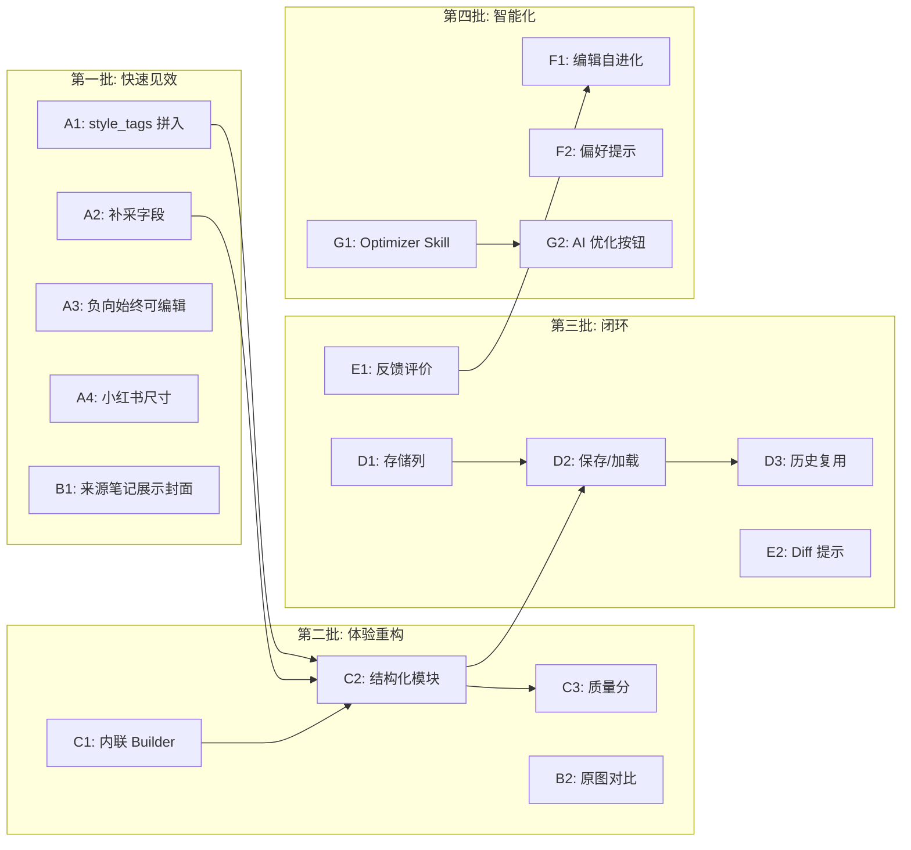

# 生图体验升级 V2 实施计划

## Phase A: 快速修复 -- 补齐已有但未用的数据

当前 `compose_image_prompts` 收集了 `style_tags` 但 `to_image_prompt()` 丢弃了它们；`text_overlay`、`target_user`/`target_scene` 完全未采集；负向 prompt 无法从零编辑。

### A1. style_tags 拼入实际 prompt

文件：[image_generator.py](apps/content_planning/services/image_generator.py)

`RichImagePrompt.to_image_prompt()` 当前只传 `prompt_text`，修改为将 `style_tags` 追加到 prompt 末尾：

```python
def to_image_prompt(self) -> "ImagePrompt":
    full_prompt = self.prompt_text
    if self.style_tags:
        full_prompt += "，风格：" + "、".join(self.style_tags)
    return ImagePrompt(
        slot_id=self.slot_id,
        prompt=full_prompt,
        ...
    )
```

### A2. 补采 text_overlay + target_user + target_scene

文件：[prompt_composer.py](apps/content_planning/services/prompt_composer.py)

- `_collect_from_image_briefs`：增加 `text_overlay` 采集（`add_positive(f"图上文字：{text_overlay}", "image_briefs.text_overlay", 1)`）
- `_collect_from_brief`：增加 `target_user` + `target_scene` 采集（作为场景约束，priority 4）
- 同时采集 `content_goal`（brief 字段）作为正向 prompt 上下文

### A3. 负向 prompt 始终可编辑

文件：[planning_workspace.html](apps/intel_hub/api/templates/planning_workspace.html)

当前 `renderInspectorSlots` 只在 `p.negative_prompt` 非空时渲染 textarea。改为始终渲染，空时 placeholder 提示"输入规避项，如：模糊、暗色调、低质量"。

### A4. 小红书标准尺寸

文件：[prompt_composer.py](apps/content_planning/services/prompt_composer.py)

封面 slot 默认 size 改为 `"1024*1365"`（3:4 竖图），内容 slot 保持 `"1024*1024"`。

---

## Phase B: 原图展示 + 生成对比

### B1. 来源笔记展示原始封面图

文件：[planning_workspace.html](apps/intel_hub/api/templates/planning_workspace.html) 约 252-267 行

当前只渲染 `nc.get('title')`。改为：

```html




{{ nc.get('title', '') or '来源笔记 #' ~ loop.index }}
```

### B2. 生成完成后原图 vs 生成图并排对比

文件：[planning_workspace.html](apps/intel_hub/api/templates/planning_workspace.html)

利用已有的 `previewCanvas.renderVariantCompare(variants, containerId)`（[_preview_canvas.html](apps/intel_hub/api/templates/_preview_canvas.html) 约 302-321 行）：

- 在预览区新增 `<div id="note-compare-view" style="display:none;"></div>`
- SSE `image_gen_complete` 后，构造两个 variant：
  - Variant A（原图）：用 `source_notes[0].note_context` 的 cover_image + title + body
  - Variant B（生成）：用 `currentDraft` 的数据 + 生成的 images
- 调用 `previewCanvas.renderVariantCompare([variantA, variantB], 'note-compare-view')`
- 添加切换按钮："单图预览" / "原图对比"

---

## Phase C: 结构化 Prompt Builder（替代弹窗）

### C1. 从遮罩弹窗改为内联面板

文件：[planning_workspace.html](apps/intel_hub/api/templates/planning_workspace.html)

删除 `#prompt-inspector-overlay` 遮罩弹窗，改为在笔记预览区下方展开的 **内联折叠面板** `#prompt-builder-panel`：

- 位置：`#note-preview-section` 内，紧接 `#note-preview-actions` 之后
- 展开时用户仍能看到上方的手机预览 + 左栏 Brief/策略等上下文
- 收起时只显示"编辑提示词"一行

### C2. 结构化模块编辑

每个 slot 拆成 5 个独立可编辑模块（非一整块 textarea）：

```
┌─────────────────────────────────────────┐
│ 封面图                            [重置] │
│ ┌─ 主体描述 ──────────────────────────┐ │
│ │ [textarea] 来自: 图片指令.subject   │ │
│ ├─ 风格/色调 ──────────────────────────┤ │
│ │ [tags 可删除/添加] 暖色调 / 自然光  │ │
│ ├─ 必含元素 ──────────────────────────┤ │
│ │ [chips] 茶杯 / 桌布 / +添加        │ │
│ ├─ 规避项 ────────────────────────────┤ │
│ │ [chips] 模糊 / 暗色调 / +添加      │ │
│ ├─ 参考图 ────────────────────────────┤ │
│ │ [120x120 缩略图] 点击放大           │ │
│ └─────────────────────────────────────┘ │
│              [确认生成]  [取消]          │
└─────────────────────────────────────────┘
```

后端改造：`RichImagePrompt` 增加结构化字段 `subject`、`style_tags`（已有）、`must_include: list[str]`、`avoid_items: list[str]`，`prompt_text` 变为 compose 时自动拼接的只读计算字段。

前端提交 `edited_prompts` 时传回结构化数据（subject/style_tags/must_include/avoid_items），后端在 `to_image_prompt()` 中按模板重新组装 prompt 文本。

### C3. Prompt 质量分实时预估

在 Builder 面板底部显示质量分指示条：

- 覆盖维度：主体描述(0-30) + 风格明确(0-20) + 必含元素(0-15) + 规避项(0-15) + 参考图(0-10) + 场景(0-10) = 100
- 纯前端计算：根据各模块是否非空 + 长度打分
- 修改时实时更新，颜色渐变（红→黄→绿）

---

## Phase D: Prompt 保存与复用

### D1. 新增 `saved_prompts_json` 存储列

文件：[plan_store.py](apps/content_planning/storage/plan_store.py)

- `_FIELD_TO_COLUMN` 新增 `"saved_prompts": "saved_prompts_json"`
- `_JSON_COLUMNS` 新增 `"saved_prompts_json"`
- `_initialize` 增加 `ALTER TABLE planning_sessions ADD COLUMN saved_prompts_json TEXT`

### D2. 保存按钮 + Inspector 加载逻辑

文件：[planning_workspace.html](apps/intel_hub/api/templates/planning_workspace.html)

- Prompt Builder 面板增加"保存提示词"按钮
- 保存时 POST `/v6/image-gen/{id}/save-prompts`，将当前结构化 prompt 存入 `saved_prompts_json`
- 下次打开 Builder 时：若 `saved_prompts` 存在且非空 → 优先加载保存的版本；否则走 `compose_image_prompts` 融合

文件：[routes.py](apps/content_planning/api/routes.py)

- 新增 `POST /v6/image-gen/{id}/save-prompts`：写入 session
- `POST /v6/image-gen/{id}/preview-prompts` 改造：先查 `saved_prompts`，有则返回（标记 `source: "saved"`）；无则走融合

### D3. 历史 prompt 一键复用

文件：[planning_workspace.html](apps/intel_hub/api/templates/planning_workspace.html)

生成历史面板中每轮记录增加"复用此提示词"按钮 → 将该轮 `prompt_log` 加载到 Builder 面板。

---

## Phase E: 质量信号 + 反馈闭环

### E1. 生成结果评价

文件：[planning_workspace.html](apps/intel_hub/api/templates/planning_workspace.html)

每张生成图旁增加三按钮：满意 / 一般 / 不满意。点击后 POST `/v6/image-gen/{id}/feedback`，存入该轮 `gen_record` 中。

文件：[routes.py](apps/content_planning/api/routes.py)

- 新增 `POST /v6/image-gen/{id}/feedback`，body: `{task_id, slot_id, rating}`
- 更新 `generated_images` 历史中对应轮次/slot 的 `rating` 字段

### E2. Prompt 修改 diff 提示

文件：[planning_workspace.html](apps/intel_hub/api/templates/planning_workspace.html)

当用户在 Builder 中修改 prompt 后点击"确认生成"时：

- 前端对比原始融合值与编辑后值
- 在提交前显示简要 diff 提示："你增加了场景描述 (+2句)，删除了 1 条规避项"
- 纯前端文本 diff，不需后端

---

## Phase F: 基于用户编辑的自进化

### F1. 编辑模式提取

文件：[prompt_composer.py](apps/content_planning/services/prompt_composer.py)

新增函数 `apply_user_preferences(slots, history)`：

- 输入：当前融合的 slots + `generated_images` 历史
- 逻辑：遍历历史中 `user_edited=True` 且 `rating="good"` 的轮次
  - 提取用户添加的正向片段 → 加入当前 slot（priority 0.5，最高优先）
  - 提取用户删除的片段 → 加入当前 slot 的 negative
  - 提取用户新增的 style_tags → 合并
- 在 `compose_image_prompts` 最后、返回前调用

### F2. 偏好提示

文件：[planning_workspace.html](apps/intel_hub/api/templates/planning_workspace.html)

Builder 面板顶部：若检测到用户偏好已应用，显示提示："基于你的 N 次编辑偏好，已自动调整提示词"，可点击查看具体应用了哪些偏好。

---

## Phase G: Skill 驱动的 Prompt 优化（可选增强）

### G1. 注册 PromptOptimizer Skill

文件：新建 `apps/content_planning/skills/prompt_optimizer.py`

利用已有的 `SkillRegistry`（[skill_registry.py](apps/content_planning/agents/skill_registry.py)）：

- 注册一个 `prompt_optimizer` skill
- 输入：结构化 prompt（subject/style/must_include/avoid/ref_image_url）
- 执行：调用 LLM（通过 `llm_router`）对 prompt 做优化重写
- 输出：优化后的结构化 prompt + 优化说明

### G2. Builder 面板"AI 优化"按钮

文件：[planning_workspace.html](apps/intel_hub/api/templates/planning_workspace.html)

- Prompt Builder 增加"AI 优化提示词"按钮
- 点击后 POST 当前结构化 prompt 到 `/v6/image-gen/{id}/optimize-prompt`
- 后端调用 `skill_registry.execute_skill("prompt_optimizer", context)` 
- 返回优化结果，前端在 Builder 中展示 diff + 一键应用

---

## 实施优先级与依赖关系




## 改动文件总览

- `apps/content_planning/services/image_generator.py` -- A1: to_image_prompt 改造
- `apps/content_planning/services/prompt_composer.py` -- A2/A4/F1: 补采字段 + 尺寸 + 自进化
- `apps/content_planning/storage/plan_store.py` -- D1: 新增 saved_prompts_json
- `apps/content_planning/api/routes.py` -- D2/E1/G2: 新增 save-prompts/feedback/optimize-prompt 端点
- `apps/intel_hub/api/templates/planning_workspace.html` -- A3/B1/B2/C1/C2/C3/D2/D3/E1/E2/F2/G2: 前端全面重构
- `apps/content_planning/skills/prompt_optimizer.py` -- G1: 新建 Skill（可选）

