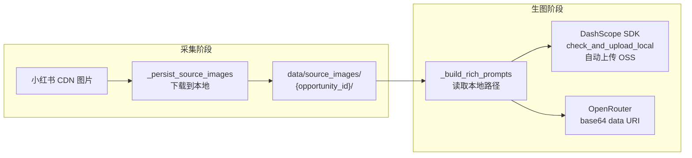

# 视觉工作台生图链路诊断与修复

## 诊断结论

通过分析终端日志、后端代码和前端调用链路，确认以下根因：

### 根因 1: DashScope `_generate_dashscope` 中的 `rsp.get()` 调用崩溃

在 [`image_generator.py`](apps/content_planning/services/image_generator.py) 第 385 行：

```python
logger.warning("DashScope imageedit failed (%s), falling back to text-only", rsp.get("message", ""))
```

DashScope SDK 的 `ImageSynthesis.async_call()` 返回的是 `GenerationResponse` 对象，**不是 dict**，没有 `.get()` 方法。当 `wanx2.1-imageedit` 返回非 200 时，这行抛出 `AttributeError`，导致:
- 文本模式降级分支（第 386-393 行）永远无法执行
- 第 416 行的备用模型降级分支同样存在此 bug

### 根因 2: 参考图 URL 无法被 DashScope 服务端访问

默认模式 `ref_image + dashscope` 使用 `wanx2.1-imageedit` 并传入 `base_image_url`。这些 URL 来自小红书 CDN（`http://sns-webpic-qc.xhscdn.com/...`），DashScope 服务端无法抓取（Referer/UA 限制），导致返回非 200 -> 触发根因 1 崩溃。

**但是**：DashScope SDK 的 `check_and_upload_local` 函数**原生支持本地文件路径**。传入本地路径时，SDK 自动通过 `OssUtils.upload` 上传到阿里云 OSS，再用 OSS URL 调用 API。因此正确做法是：**在采集阶段就把图片下载到本地**。

### 根因 3: 生图过程在 LLM 日志面板中不可见

- `_on_progress` 回调只发送基础 `image_gen_progress` SSE 事件
- 前端 `image_gen_progress` 监听器**不调用 `addTrace()`**
- `addTrace()` 仅在 `image_gen_complete` 中对有 `prompt_sent` 的结果调用
- DashScope 的关键日志在 `logger.info` 级别，被默认配置过滤

---

## 修复计划

### Phase 1: 修复后端崩溃 bug

**文件**: [`apps/content_planning/services/image_generator.py`](apps/content_planning/services/image_generator.py)

- 修复 2 处 `rsp.get()` 为 `getattr(rsp, 'message', str(rsp))`（第 385 行、第 416 行）
- DashScope 关键路径改用 `logger.warning`（task 提交、polling timeout、task FAILED）
- DashScope polling timeout 增加明确的 WARNING 日志

### Phase 2: 采集阶段下载图片到本地

**文件**: [`apps/intel_hub/api/app.py`](apps/intel_hub/api/app.py) 的 `_persist_source_images`

当前 `_persist_source_images` 只存储远程 URL：

```python
imgs.append({
    "note_id": ...,
    "cover_image": nc.get("cover_image", ""),  # 远程 CDN URL
    "image_urls": nc.get("image_urls", []),     # 远程 CDN URL 列表
})
```

改为：

1. 创建本地目录 `data/source_images/{opportunity_id}/`
2. 对每个 `cover_image` 和 `image_urls` 中的 URL，用 `urllib.request.urlretrieve` 下载到本地
3. 文件命名: `cover_{note_id}.jpg`, `img_{note_id}_{idx}.jpg`
4. 存储到 `source_images` 的字段改为**本地文件路径**（绝对路径，如 `/path/to/data/source_images/{opp_id}/cover_xxx.jpg`）
5. 同时保留原始 URL 到 `original_cover_url` / `original_image_urls` 字段（用于前端展示原图对比）
6. 如果下载失败（网络或 CDN 限制），保留远程 URL 作为降级

```
data/source_images/
  9f82cee1a56742a0/
    cover_abc123.jpg
    img_abc123_0.jpg
    img_abc123_1.jpg
  22a9e9c5e3b440e8/
    cover_def456.jpg
    ...
```

**文件**: [`apps/intel_hub/api/app.py`](apps/intel_hub/api/app.py) 的 `create_app`

增加静态目录挂载，让前端也能预览本地图片：

```python
_source_images_dir = Path(...) / "data" / "source_images"
_source_images_dir.mkdir(parents=True, exist_ok=True)
app.mount("/source-images", StaticFiles(directory=str(_source_images_dir)), name="source_images")
```

### Phase 3: image_generator 适配本地路径

**文件**: [`apps/content_planning/services/image_generator.py`](apps/content_planning/services/image_generator.py)

- **DashScope**: `base_image_url` 传入本地文件路径（不以 `http` 开头），SDK 的 `check_and_upload_local` 会自动检测并上传到 OSS -- **无需额外处理**
- **OpenRouter**: 检测 `ref_image_url` 是否为本地路径（不以 `http` 开头），如果是则读取文件内容，转为 `data:image/jpeg;base64,...` 格式传入 multimodal content

**文件**: [`apps/content_planning/api/routes.py`](apps/content_planning/api/routes.py) 的 `_build_rich_prompts`

`ref_image_urls` 来源是 `session["source_images"]`。Phase 2 之后，这里存的已经是本地路径。验证此路径正确传递到 `compose_image_prompts` -> `RichImagePrompt.ref_image_url` -> `ImagePrompt.ref_image_url`。

### Phase 4: 增强可观测性

**后端** -- [`routes.py`](apps/content_planning/api/routes.py):
- `_on_progress` 回调增加 trace 字段: `prompt_sent`, `ref_image_sent`, `provider`, `model`, `detail`（降级原因等）

**前端** -- [`visual_builder.html`](apps/intel_hub/api/templates/visual_builder.html):
- `image_gen_progress` SSE 监听器中，对每个 progress 事件调用 `addTrace()`
- trace 对象: `{ operation: "image_gen (" + slot_id + ")", status, provider, prompt_sent, ref_image_sent, detail }`

### Phase 5: 端到端验证

- 模式 A: `dashscope + ref_image` -- 本地路径 -> SDK 自动上传 OSS -> imageedit 调用
- 模式 B: `dashscope + prompt_only` -- 纯文本 -> wanx2.1-t2i-turbo
- 模式 C: `openrouter + ref_image` -- 本地路径 -> base64 data URI -> multimodal
- 模式 D: `auto` -- fallback 链完整性
- 日志面板: 每张图生成过程实时可追踪

---

## 数据流（修复后）



## 关键修改文件

- [`apps/content_planning/services/image_generator.py`](apps/content_planning/services/image_generator.py) -- 修复 rsp.get() bug, 增加日志, 适配本地路径 (OpenRouter base64)
- [`apps/intel_hub/api/app.py`](apps/intel_hub/api/app.py) -- `_persist_source_images` 增加下载逻辑, 增加 `/source-images` 静态挂载
- [`apps/content_planning/api/routes.py`](apps/content_planning/api/routes.py) -- `_on_progress` 增加 trace 数据
- [`apps/intel_hub/api/templates/visual_builder.html`](apps/intel_hub/api/templates/visual_builder.html) -- SSE progress 事件增加 addTrace()
