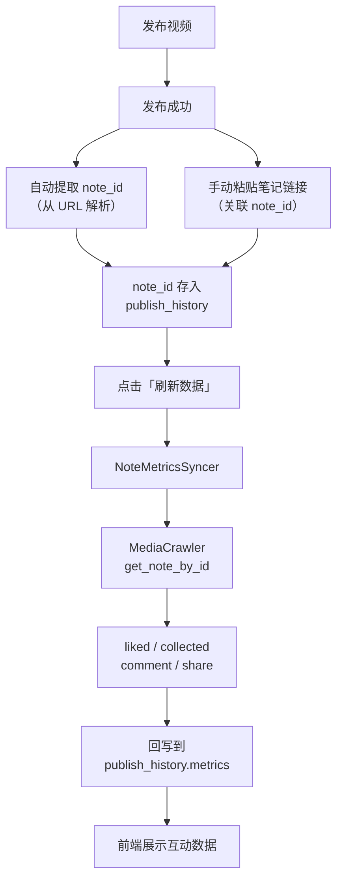

# 笔记关联与数据回写

## 现状分析

当前发布成功后，`publish_history` 记录的结构为：

```python
{
    "job_id": "...",
    "title": "...",
    "note_url": "https://creator.xiaohongshu.com/...",  # 可能是发布成功页 URL，非笔记页
    "published_at": "2026-04-16T..."
}
```

问题：
- `note_url` 拿到的是发布成功页的 URL，不一定包含真正的笔记 ID
- 没有 `note_id` 字段，无法用 MediaCrawler 的 `get_note_by_id` 回采数据
- 发布后小红书有审核期，审核通过后笔记才有公开 URL 和互动数据

## 设计方案

### 数据结构

在 [first3s_variant.py](apps/growth_lab/schemas/first3s_variant.py) 的 `publish_history` 条目中扩展字段：

```python
{
    "job_id": str,
    "title": str,
    "note_url": str,              # 发布时返回的 URL
    "note_id": str,               # 小红书笔记 ID（手动填 or 自动提取）
    "published_at": str,
    "review_status": str,         # pending / approved / rejected
    "last_synced_at": str,        # 最近一次数据回采时间
    "metrics": {                  # 回采的互动数据
        "liked_count": int,
        "collected_count": int,
        "comment_count": int,
        "share_count": int,
    }
}
```

无需新建 Schema 类或数据库表，直接在现有 `publish_history: list[dict]` 中扩展即可保持简洁。

### 后端 API（3 个新增端点）

均在 [routes.py](apps/growth_lab/api/routes.py) 中添加：

1. **`PATCH /api/first3s/variants/{variant_id}/publish-history/{job_id}`**
   - 用途：手动绑定 note_id（用户从小红书创作者后台复制笔记链接或 ID）
   - 请求体：`{ "note_id": "...", "note_url": "..." }`
   - 逻辑：在 `publish_history` 中找到对应 `job_id` 的条目，写入 `note_id`

2. **`POST /api/first3s/sync-note-metrics`**
   - 用途：对指定 variant 的所有已关联 `note_id` 的发布记录，批量回采最新互动数据
   - 请求体：`{ "variant_id": "..." }`
   - 逻辑：调用 MediaCrawler 的 XHS Client `get_note_by_id` 获取笔记数据，提取互动指标写回 `publish_history[i].metrics`

3. **`GET /api/first3s/variants/{variant_id}/publish-history`**
   - 用途：查询某 variant 的完整发布历史（含互动数据）
   - 返回：`{ "items": [...], "total": int }`

### 笔记数据回采服务

新建 [services/note_metrics_syncer.py](apps/growth_lab/services/note_metrics_syncer.py)：

- 复用 MediaCrawler 的 `XiaoHongShuClient.get_note_by_id` 能力
- 输入：`note_id` 列表
- 输出：每个 note 的 `{ liked_count, collected_count, comment_count, share_count }`
- 利用现有的 `storage_state` 登录态（与发布共用同一个会话）
- 采用 API 级别调用（非 Playwright 浏览器），效率高

```
NoteMetricsSyncer
  |-- 读取 xhs_state.json 中的 cookie
  |-- 构造 httpx client (复用 MediaCrawler 签名逻辑)
  |-- 调用 /api/sns/web/v1/feed 获取笔记详情
  |-- 提取 interact_info 中的指标
  |-- 返回 metrics dict
```

### 前端交互

在 [first3s_lab.html](apps/growth_lab/templates/first3s_lab.html) 中：

**A. 发布成功页增加"关联笔记"入口**

在 `showPublishResult('published', ...)` 后显示一个输入框：
- 提示用户粘贴笔记链接或 note_id
- 从链接中自动提取 note_id（格式：`/explore/{note_id}` 或 `/{note_id}`）
- 点击"关联"调用 PATCH API

**B. Hook 卡片的发布历史区域**

已发布的 hook 卡片点击后，在右侧面板底部显示发布历史列表：
- 每条记录显示：标题、发布时间、审核状态、互动数据
- 未关联的记录显示"待关联"按钮
- 已关联的显示"刷新数据"按钮

**C. 自动提取 note_id**

发布成功后，如果 `note_url` 中包含 `/explore/` 路径，自动提取 note_id 并写入 `publish_history`（无需用户手动填写）。

### 数据流图


