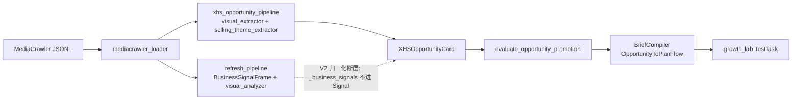
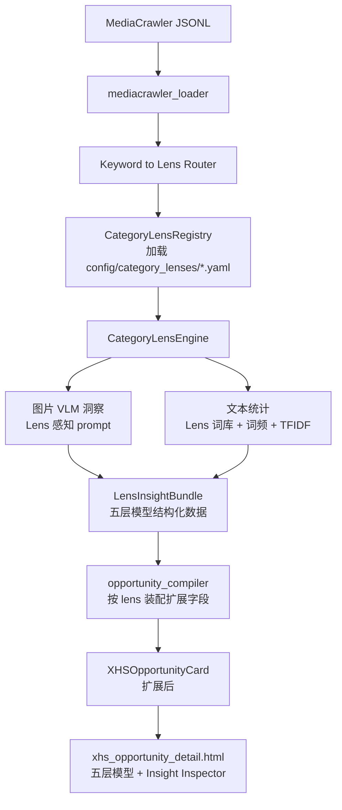

## 一、现状诊断（来自只读排查）

### 1.1 端到端链路现状



两条 pipeline 能力重叠、prompt/词表均偏桌布；V2 归一化断层让 VLM 抽取结果进不到主链路。

### 1.2 关键缺口（精简）

- 没有运行时 `CategoryLens` 对象；笔记页的「分类」就是原始 `source_keyword` 字符串（`apps/intel_hub/api/app.py` 第 1003–1040 行）。
- `config/categories/tablecloth.yaml` 只给 content-planning 的 prompt 注入用，**不驱动** intel_hub 的抽取/打分/卡生成。
- `XHSOpportunityCard`（`apps/intel_hub/schemas/opportunity.py` 第 13–74 行）与目标结构的差距：
  - 无 `category` / `lens_id` / `lens_version`
  - 无 `xhs_signal: {hot_keywords, note_patterns, comment_signals}` 三块
  - 无 `target_people: {primary, user_state[], emotional_need[]}`
  - 无 `product_direction: {product_type, key_features[], price_band, color_options[]}` 成套块
  - 无 `content_direction: {hook[], must_shoot[], avoid[]}`
  - 无五维 `evidence_score: {heat, pain, trust_gap, product_fit, execution, total}`
  - 无 `recommended_action: {decision, next_steps[]}`
- VLM 链路：
  - `apps/intel_hub/extractor/visual_analyzer.py` 第 21 行固定 `qwen-vl-max`，`_SYSTEM_PROMPT` 第 23–36 行示例词全是桌布；无 category 分支。
  - `run_pipeline` 默认 `enable_vision=False`（`apps/intel_hub/workflow/refresh_pipeline.py` 第 77–80 行）；`collector_worker.py` 第 210–213 行未传参。
  - **V2 归一化断层**：`refresh_pipeline.py` 第 112–113 行把 VLM 结果写入 raw `_business_signals`，但 `apps/intel_hub/normalize/normalizer.py` 第 59–86 行的 `normalize_raw_signals` 不读取 → 下游 `Signal`/compile 吃不到。
- 文本链路：
  - `apps/intel_hub/extractor/signal_extractor.py` 词典内嵌且偏桌布（SCENE/PAIN/RISK 第 19–76 行）。
  - 第 97–105 行 `CONTENT_PATTERN_KEYWORDS` 定义了但 `extract_business_signals` 第 133–175 行 **未 return**，未接线。
  - `apps/intel_hub/extractor/comment_classifier.py` 提供 `CommentSignalType` 但仓库内无其它调用点，**未挂载**。
  - 无 TF-IDF / 词频统计层；无「用户话术 ↔ 商品特征」映射。
  - 信任障碍 `TRUST_GAP_RE` 第 127–129 行偏通用，无「怕闷/怕掉/怕头大/怕头反光」等假发专用模式。
- 评分：`apps/intel_hub/compiler/opportunity_compiler.py` 第 563–593 行的 `_build_strength_score = 0.4*confidence + 0.3*engagement + 0.3*xmodal`，单套全局权重；`config/scorecard_weights.yaml` 无 per-category 分层。

---

## 二、目标架构：Category Lens Engine

### 2.1 新增核心对象

在 `apps/intel_hub/domain/category_lens.py`（新建）放两个 Pydantic 模型，作为运行时第一公民：

- **`CategoryLens`**：类目透镜配置（从 YAML 加载）
- **`LensInsightBundle`**：单次透视结果（驱动机会卡装配）

### 2.2 升级后链路



### 2.3 依赖顺序

1. 定义 `CategoryLens` schema + 写假发 YAML（独立可用）。
2. 修 V2 归一化断层（前置依赖：VLM 结果必须能到 compile 层）。
3. 升级 VLM prompt 为类目感知 + 扩展输出字段。
4. 升级文本统计（Lens 词库加载 + TF-IDF + 接线 content pattern + 挂载 comment_classifier + 用户话术映射）。
5. `LensInsightBundle` 组装器 = Category Lens Engine 的核心。
6. `XHSOpportunityCard` 加 optional 字段（向后兼容）；compiler 按 Lens 装配。
7. 按 Lens 打分权重。
8. 详情页渲染五层模型。

---

## 三、CategoryLens schema 与 YAML 模板

### 3.1 Pydantic 模型（新建 `apps/intel_hub/domain/category_lens.py`）

```python
from pydantic import BaseModel, Field

class UserExpressionMap(BaseModel):
    user_phrase: str
    product_features: list[str] = Field(default_factory=list)
    proof_shots: list[str] = Field(default_factory=list)

class LensScoringWeights(BaseModel):
    pain_score: float = 0.20
    heat_score: float = 0.20
    trust_gap_score: float = 0.15
    product_fit_score: float = 0.20
    execution_score: float = 0.10
    competition_gap_score: float = 0.05
    scene_heat_score: float = 0.0
    style_trend_score: float = 0.0

class CategoryLens(BaseModel):
    lens_id: str
    category_cn: str
    version: str = "1.0.0"
    core_consumption_logic: str
    keyword_aliases: list[str] = Field(default_factory=list)
    primary_user_jobs: list[str] = Field(default_factory=list)
    key_pain_dimensions: list[str] = Field(default_factory=list)
    trust_barriers: list[str] = Field(default_factory=list)
    product_feature_taxonomy: list[str] = Field(default_factory=list)
    content_patterns: list[str] = Field(default_factory=list)
    audience_personas: list[str] = Field(default_factory=list)
    scene_tasks: list[str] = Field(default_factory=list)
    price_bands: list[dict] = Field(default_factory=list)
    visual_prompt_hints: dict = Field(default_factory=dict)
    text_lexicons: dict = Field(default_factory=dict)
    user_expression_map: list[UserExpressionMap] = Field(default_factory=list)
    scoring_weights: LensScoringWeights = Field(default_factory=LensScoringWeights)
    linked_prompt_profile: str | None = None
```

### 3.2 `LensInsightBundle`（新建同文件）

承载 Category.md 「五、机会卡五层模型」的结构化产物，作为 compiler 的输入：

```python
class LensInsightBundle(BaseModel):
    lens_id: str
    lens_version: str
    source_note_ids: list[str]
    layer1_signals: dict
    layer2_ontology: dict
    layer3_user_jobs: list[dict]
    layer4_product_mapping: list[dict]
    layer5_content_execution: list[dict]
    evidence_score: dict
    recommended_action: dict
```

### 3.3 YAML 位置与假发示例

- 路径：`config/category_lenses/wig.yaml`、`config/category_lenses/tablecloth.yaml`
- 加载器：新增 `config_loader.load_category_lenses()` 复用 `DEFAULT_CONFIG_DIR` 模式，和 `load_watchlists` 对齐。
- `wig.yaml` 骨架（抽取自 Category.md 306–415、582–626、678–701）：

```yaml
lens_id: wig
category_cn: 假发
version: 1.0.0
core_consumption_logic: 形象变化 + 遮盖痛点 + 信任验证
keyword_aliases: [假发, 头顶发片, 发缝宽, 妈生感假发, 刘海片, 补发, cosplay假发]
primary_user_jobs: [遮发缝, 增发量, 换发型, 拍照上镜, cosplay造型, 遮白发]
key_pain_dimensions: [自然度, 舒适度, 稳固性, 透气性, 适配脸型, 新手难度]
trust_barriers: [怕假, 怕掉, 怕热, 怕尴尬, 怕不会戴, 怕头大, 怕廉价, 怕踩雷]
product_feature_taxonomy: [仿真头皮, 蕾丝边, 递针工艺, 高温丝, 真人发, 透气网帽, 防滑夹, 低密度发量, 哑光发丝, 自然发旋]
content_patterns: [前后对比, 新手教程, 避坑测评, 近距离验证, 场景挑战, 价格带对比, 人群共鸣, 风格切换]
audience_personas: [发量少女生, 发际线高, 产后脱发, 白发人群, 秃顶脱发男性, Coser, 拍照直播用户, 新手用户]
scene_tasks: [通勤变自然, 约会变好看, 拍照上镜, 婚礼证件照, 直播短视频, 旅行, 掉发遮盖, cosplay]
price_bands:
  - band: 低价
    range_cny: [50, 150]
    strategy: 款式多、上镜、性价比
  - band: 中价
    range_cny: [150, 500]
    strategy: 自然、舒适、新手友好
  - band: 高价
    range_cny: [500, 2000]
    strategy: 信任、专业、售后、定制
visual_prompt_hints:
  focus:
    - people_state: 识别发缝宽度/头顶稀疏/白发覆盖/发际线高
    - trust_signals: 前后对比/近距离头顶/自然光实拍/风吹测试
    - content_format: 教程/测评/vlog/棚拍
  risk_flags: [过度精修, 仅棚拍模特图, 不展示头顶细节]
text_lexicons:
  pain_words: [发缝宽, 头顶塌, 发量少, 产后脱发, 发际线高, 白发多, 秃顶]
  emotion_words: [救命, 后悔没早买, 太自然了, 头秃, 真绝了]
  trust_barrier_words: [一眼假, 怕掉, 怕热, 显头大, 会不会假, 近距离看, 夏天闷, 夹子勒]
  content_pattern_words:
    前后对比: [戴上前, 戴上后, before, after, 对比]
    新手避坑: [新手, 避坑, 第一次, 一定要看]
    近距离验证: [近距离, 头顶实拍, 自然光]
  comment_question_words: [会不会假, 夏天热吗, 适合头发少吗, 链接, 怎么买, 小头围]
user_expression_map:
  - user_phrase: 别一眼假
    product_features: [仿真头皮, 哑光发丝, 自然发旋, 低密度发量]
    proof_shots: [头顶近拍, 自然光展示, 真人佩戴前后]
  - user_phrase: 怕夏天热
    product_features: [透气网帽, 轻量化底网]
    proof_shots: [夏天戴8小时实拍, 头皮闷热测试]
  - user_phrase: 怕掉
    product_features: [防滑夹, 弹力网帽, 隐形夹]
    proof_shots: [大风天测试, 甩头测试, 运动测试]
scoring_weights:
  pain_score: 0.25
  trust_gap_score: 0.25
  heat_score: 0.15
  product_fit_score: 0.20
  execution_score: 0.10
  competition_gap_score: 0.05
linked_prompt_profile: null
```

### 3.4 keyword → lens 路由

- 方案：`config/category_lenses/_keyword_routing.yaml` 列 `{keyword_pattern: lens_id}` 映射，loader 在给 note dict 加 `keyword` 字段的同时附加 `lens_id`。
- 未命中的笔记归 `lens_id: generic`（沿用现有桌布向词库作为 fallback）。

---

## 四、图片路：VLM 洞察升级

### 4.1 统一到一套 VLM 调用

保留 `apps/intel_hub/extractor/visual_analyzer.py`（默认调用方），废弃或合并 `apps/intel_hub/extraction/visual_extractor.py` 的 VLM 分支（保留其规则部分作为回退）。

### 4.2 Prompt 类目化

将 `_SYSTEM_PROMPT` 改为模板 + 动态段：

```python
_SYSTEM_PROMPT_TEMPLATE = """
你是 {category_cn} 类目资深视觉分析师，负责从小红书笔记图片中抽取结构化信号。
本类目核心消费逻辑: {core_consumption_logic}
请重点观察:
{focus_prompt}
风险旗标 (若图片呈现以下情况请在 risk_flags 里标注):
{risk_flags_prompt}
输出严格 JSON, 字段:
- visual_scene_signals
- visual_style_signals
- visual_composition_types
- visual_color_palette
- people_state
- trust_signals
- content_format
- risk_flags
- text_on_image
"""
```

`analyze_note_images(frame, lens: CategoryLens)` 接收当前笔记所属 lens，用 `lens.visual_prompt_hints` 动态渲染 prompt。

### 4.3 输出字段扩展

在 `apps/intel_hub/schemas/content_frame.py` 的 `BusinessSignalFrame` 里加 `people_state/trust_signals/content_format/risk_flags`。

### 4.4 修 V2 归一化断层（前置依赖）

`apps/intel_hub/normalize/normalizer.py` 第 59–86 行 `normalize_raw_signals` 补一段：

```python
business = raw.get("_business_signals") or {}
if business:
    sig.raw_payload["_business_signals"] = business
    sig.visual_pattern_refs = list(business.get("visual_style_signals", []))
    sig.scene_refs = list(set(sig.scene_refs) | set(business.get("visual_scene_signals", [])))
```

### 4.5 默认启用 VLM

- `apps/intel_hub/workflow/refresh_pipeline.py` 第 77 行：`enable_vision` 按 lens 决定（`lens.visual_prompt_hints` 非空即启用）。
- `apps/intel_hub/workflow/collector_worker.py` 第 210–213 行：显式传 `enable_vision=True`。
- 为控本：按 `lens.visual_prompt_hints.sample_strategy` 最多分析 Top-K 笔记。

---

## 五、文本路：类目感知统计

### 5.1 Lens 词库驱动抽取

`apps/intel_hub/extractor/signal_extractor.py` 改造：把 `SCENE_KEYWORDS/PAIN_POINT_KEYWORDS/RISK_KEYWORDS/CONTENT_PATTERN_KEYWORDS/TRUST_GAP_RE` 从模块常量改成 `SignalExtractorContext(lens: CategoryLens)` 注入，默认 fallback 到当前桌布词库。

### 5.2 补齐未接线能力

- 让 `extract_business_signals` 的 return 包含 `body_content_patterns`（`CONTENT_PATTERN_KEYWORDS` 接线）和 `comment_content_patterns`。
- 挂载 `apps/intel_hub/extractor/comment_classifier.py::classify_comment`：对每条评论产出 `CommentSignalType`，汇总为 `comment_signal_distribution: {purchase_intent: n, trust_gap: n, ...}`。
- 查表 `lens.user_expression_map`：对命中的用户话术，产出 `user_expression_hits: [{user_phrase, product_features, proof_shots}]`。

### 5.3 跨笔记词频（TF-IDF）

新增 `apps/intel_hub/analysis/lens_keyword_stats.py`：

```python
def compute_hot_keywords(
    notes: list[dict],
    lens: CategoryLens,
    top_k: int = 15,
) -> list[dict]:
    """对某 lens 下全部笔记的 title+desc+tags+comments 分词, 计算 TF-IDF, 返回 Top-K (term, df, idf, score)."""
```

- 分词用 `jieba`（已是常见依赖，若无则加 `requirements.txt`）。
- 输出 `hot_keywords` 作为 `XHSOpportunityCard.xhs_signal.hot_keywords`。
- 每次透视运行在 `CategoryLensEngine` 里做一次，缓存按 `(lens_id, 笔记批次 hash)`。

### 5.4 输出契约

`signal_extractor` 升级后每条笔记产出 `NoteLensSignals`：

```python
class NoteLensSignals(BaseModel):
    note_id: str
    lens_id: str
    pain_points: list[str]
    emotion_words: list[str]
    trust_barriers: list[str]
    scenes: list[str]
    audiences: list[str]
    content_patterns: list[str]
    comment_patterns: list[str]
    comment_signal_distribution: dict
    user_expression_hits: list[dict]
    hot_tags: list[str]
```

---

## 六、CategoryLensEngine：组装 LensInsightBundle

新增 `apps/intel_hub/engine/category_lens_engine.py`：

```python
class CategoryLensEngine:
    def __init__(self, registry: CategoryLensRegistry):
        self.registry = registry

    def run(self, notes: list[dict], lens_id: str) -> LensInsightBundle:
        lens = self.registry.get(lens_id)
        note_signals = [extract_note_lens_signals(n, lens) for n in notes]
        hot_keywords = compute_hot_keywords(notes, lens)
        visual_insights = [analyze_note_images(n, lens) for n in notes if has_image(n)]
        layer1 = assemble_layer1_signals(note_signals, hot_keywords, visual_insights)
        layer2 = assemble_layer2_ontology(note_signals, lens)
        layer3 = assemble_layer3_user_jobs(note_signals, lens)
        layer4 = assemble_layer4_product_mapping(note_signals, lens)
        layer5 = assemble_layer5_content_execution(note_signals, lens)
        evidence = score_evidence(layer1, layer2, layer3, layer4, layer5, lens)
        action = recommend_action(evidence, lens)
        return LensInsightBundle(...)
```

`CategoryLensEngine.run` 是 `xhs_opportunity_pipeline` 的新上游步骤，放在 `project_xhs_signals` 之前或并行。

---

## 七、机会卡 schema 扩展（向后兼容）

在 `apps/intel_hub/schemas/opportunity.py` 的 `XHSOpportunityCard` 上加 optional 字段（不改已有字段），未赋值时 UI 按旧流程渲染：

```python
class XHSSignalBlock(BaseModel):
    hot_keywords: list[str] = Field(default_factory=list)
    note_patterns: list[str] = Field(default_factory=list)
    comment_signals: list[str] = Field(default_factory=list)

class TargetPeopleBlock(BaseModel):
    primary: str = ""
    user_state: list[str] = Field(default_factory=list)
    emotional_need: list[str] = Field(default_factory=list)

class ProductDirectionBlock(BaseModel):
    product_type: str = ""
    key_features: list[str] = Field(default_factory=list)
    price_band: str = ""
    color_options: list[str] = Field(default_factory=list)

class ContentDirectionBlock(BaseModel):
    hook: list[str] = Field(default_factory=list)
    must_shoot: list[str] = Field(default_factory=list)
    avoid: list[str] = Field(default_factory=list)

class EvidenceScoreBlock(BaseModel):
    heat: float = 0
    pain: float = 0
    trust_gap: float = 0
    product_fit: float = 0
    execution: float = 0
    total: float = 0

class RecommendedActionBlock(BaseModel):
    decision: Literal["进入测试", "补充证据", "暂缓"] = "补充证据"
    next_steps: list[str] = Field(default_factory=list)

class XHSOpportunityCard(BaseModel):
    # ...原有字段保持不变...
    lens_id: str | None = None
    lens_version: str | None = None
    category_cn: str | None = None
    xhs_signal: XHSSignalBlock | None = None
    target_people: TargetPeopleBlock | None = None
    product_direction: ProductDirectionBlock | None = None
    content_direction: ContentDirectionBlock | None = None
    evidence_score: EvidenceScoreBlock | None = None
    recommended_action: RecommendedActionBlock | None = None
```

### Compiler 改动

`apps/intel_hub/compiler/opportunity_compiler.py` 的 `compile_xhs_opportunities` 接收 `LensInsightBundle`，在 `_common_card_fields` 里装配以上 block。`_build_strength_score`（563–593 行）按 lens 权重计算五维分（`EvidenceScoreBlock`），并写入 `evidence_score.total`。

---

## 八、按 Lens 打分

`_build_strength_score` 升级：

```python
def _build_strength_score(card, note_context, bundle, lens):
    w = lens.scoring_weights
    heat = normalize_engagement(note_context)
    pain = bundle.evidence_score["pain"]
    trust_gap = bundle.evidence_score["trust_gap"]
    product_fit = bundle.evidence_score["product_fit"]
    execution = bundle.evidence_score["execution"]
    return (
        pain * w.pain_score
        + heat * w.heat_score
        + trust_gap * w.trust_gap_score
        + product_fit * w.product_fit_score
        + execution * w.execution_score
    )
```

`config/scorecard_weights.yaml` 不删除但降级为 `generic` lens 的 fallback。

---

## 九、UI 渲染

### 9.1 笔记列表按 Lens 分类

`apps/intel_hub/api/app.py` 第 1003–1040 行 `_build_category_index`：在返回 `category` 维度时按 `lens_id` 再做一层分组，UI 分类导航显示为「假发 (123) / 桌布 (45) / 未归类 (8)」，二级下钻到具体 `source_keyword`。

### 9.2 机会卡详情页 Insight Inspector

`apps/intel_hub/api/templates/xhs_opportunity_detail.html` 加右侧栏：
- 为什么这是机会 → `insight_summary.one_sentence`
- 来自哪些信号 → `xhs_signal.hot_keywords` + `xhs_signal.note_patterns` + `xhs_signal.comment_signals`
- 对应哪些商品能力 → `product_direction.key_features`
- 需要拍什么内容 → `content_direction.must_shoot`
- 证据强度 → `evidence_score` 雷达图
- 下一步 → `recommended_action.next_steps` + 按钮跳转 Brief/脚本/测试

### 9.3 Lens 浏览页（只读 MVP）

新建路由 `GET /category-lenses/{lens_id}`，模板 `category_lens_detail.html` 渲染整份 lens YAML，便于运营核对。写回编辑留后续。

---

## 十、反馈回流（后续迭代，非本蓝图 MVP）

- 检视时记录「有价值 / 无价值 / 证据不足 / 需补 xx」到 `opportunity_reviews`；
- 周期 job 统计某 lens 下被标注为「证据不足」的机会卡所共有的缺失点，回写 lens YAML 的 `visual_prompt_hints.focus` 或 `text_lexicons.trust_barrier_words`；
- Lens YAML 版本化（`version: 1.0.0 → 1.0.1`），机会卡记录 `lens_version`，便于对比前后差异。

---

## 十一、实施节奏建议（蓝图→落地的推荐分期）

蓝图批准后按以下顺序开发，每一阶段可独立 PR：

- **Phase A - Lens 基础设施**：`CategoryLens` schema + `config/category_lenses/wig.yaml` + loader + keyword 路由；Lens 只读详情页。
- **Phase B - 修复 V2 归一化断层**：`normalize_raw_signals` 透传 `_business_signals` + 在 `Signal` 上挂视觉字段。不依赖 Lens，但是 Lens 引擎的前置。
- **Phase C - VLM 类目化**：Prompt 模板化 + 输出字段扩展 + 默认开 + 采样策略。
- **Phase D - 文本统计升级**：词库 lens 注入 + 接线 content pattern + 挂载 comment_classifier + TF-IDF 跨笔记词频 + 用户话术映射。
- **Phase E - LensInsightBundle 组装**：`CategoryLensEngine` 主类；改造 `xhs_opportunity_pipeline` 的装配步。
- **Phase F - 卡 schema 扩展 + compiler 装配 + 按 lens 打分**：`XHSOpportunityCard` 加 optional 字段；`_build_strength_score` 用 lens 权重。
- **Phase G - UI 五层渲染**：详情页 Insight Inspector；列表页按 lens 分类。

---

## 十二、明确不做的事（本蓝图范围外）

- 不做 admin 在线编辑 Lens YAML（运营暂用 git 维护）。
- 不做第二个 Lens（桌布）落地；桌布继续走 generic fallback。等假发闭环跑通后复制即可。
- 不做多模态模型切换（保留 qwen-vl-max）。
- 不做反馈回流自动回写 lens YAML（仅记录反馈，人工审核）。
- 不改 `refresh_pipeline` 与 `xhs_opportunity_pipeline` 合并（两条并存，新路径先挂 `xhs_opportunity_pipeline` 一侧）。