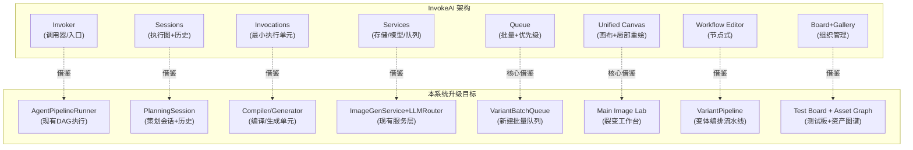
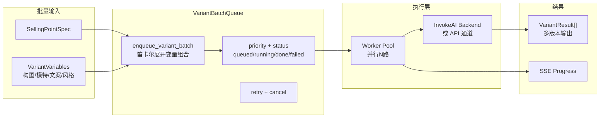
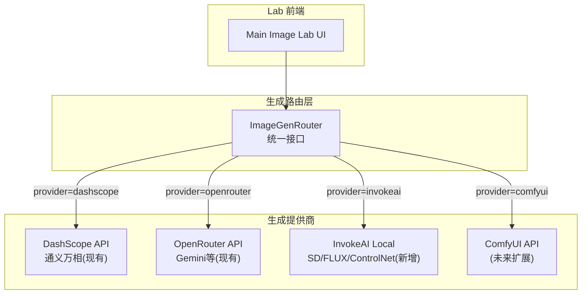

# 热点驱动裂变系统升级计划

## 一、升级目标一句话

将产品主链从 `OpportunityCard -> Brief -> Strategy -> Plan -> AssetBundle` 升级为 `TrendSignal -> Opportunity -> SellingPointSpec -> VariantSpec -> TestTask -> ResultSnapshot -> AmplificationPlan -> AssetGraph`，同时保留原四阶段编译作为 Expert 模式。

---

## 二、当前系统可复用资产盘点

### 完全可复用（改路由/包装即可）

| 现有能力 | 代码位置 | 升级映射 |
|----------|----------|----------|
| 多平台情报采集 | `apps/intel_hub/workflow/` (TrendRadar, MediaCrawler, SourceRouter) | -> Radar 的信号输入层 |
| 机会卡编译 | `apps/intel_hub/compiler/`, `xhs_opportunity_pipeline.py` | -> TrendOpportunity 编译 |
| 信号归一/本体投影 | `apps/intel_hub/normalize/`, `projector/` | -> Radar 信号处理 |
| LLM Router + Fallback | `apps/content_planning/adapters/llm_router.py` | -> 全链路 LLM 调用 |
| Council 多角色讨论 | `apps/content_planning/agents/discussion.py` | -> 卖点编译/策略讨论的 AI 协同 |
| Agent Memory + Skill Registry | `agents/memory.py`, `agents/skill_registry.py` | -> 跨会话积累 |
| SSE EventBus + llm_trace | `gateway/event_bus.py`, `sse_handler.py` | -> 全局实时可观测 |
| 评分卡 + 门控 | `services/expert_scorer.py`, `note_to_card_flow.py` | -> 机会 + 变体质量门控 |
| B2B 多租户骨架 | `apps/b2b_platform/` | -> 品牌/店铺/workspace 隔离 |

### 需改造/升级

| 现有能力 | 改造方向 |
|----------|----------|
| Visual Builder (三栏 HTML) | -> Main Image Lab + First 3s Lab 双 Tab；新增变量控制面板、批量版本网格、测试建议 |
| ImageGeneratorService (API 文生图) | -> 增加本地 GPU 推理通道（InvokeAI 作为 backend）；增加批量变体生成队列 |
| PromptComposer (6 层融合) | -> 增加 SellingPointSpec + VariantVariable 作为新的高优先级输入层 |
| VariantGenerator (元数据快照) | -> 真正的内容差异化变体：不同构图/模特/文案的实际再生成 |
| AssetBundle/Exporter | -> 升级为 AssetPerformanceCard，挂载 ResultSnapshot 和 reuse 推荐 |

### 需全新构建

| 能力 | 说明 |
|------|------|
| SellingPointSpec 编译链 | 新对象 + 新编译器 + 新页面 |
| MainImageVariant / First3sVariant | 结构化变体规格 + 变量控制面板 + 批量生成 |
| TestTask / ResultSnapshot | 测试任务管理 + 结果录入 + 放大建议 |
| AmplificationPlan | 结果驱动的放大/再裂变逻辑 |
| AssetGraph 图谱 | 资产标签化 + 模式库 + 语义检索 |
| 视频处理管线 | ffmpeg + whisper + clip scorer（First 3s Lab 依赖） |
| 本地 GPU 推理引擎 | InvokeAI 集成（见下文详细映射） |

---

## 三、InvokeAI 借鉴映射

InvokeAI 是一个成熟的 Stable Diffusion 创意引擎（27k stars, Apache-2.0），其核心架构对本次升级有**四个层面的直接价值**。

### 3.1 架构映射



### 3.2 具体借鉴点与实现映射

#### 借鉴 1：Invocation Node 模式 -> Variant Compiler Nodes

**InvokeAI 做法**：每个功能单元是一个 `BaseInvocation` 子类，声明 `InputField`/`OutputField`，实现 `invoke()` 方法，通过自动发现注册。

**我们的映射**：将当前散落的 Generator/Compiler 统一改造为 Node 模式。

| InvokeAI Node | 我们对应的 Node | 复用/新建 |
|---------------|-----------------|-----------|
| `TextToImageInvocation` | `MainImageGenerateNode` | 改造 ImageGeneratorService |
| `ImageToImageInvocation` | `RefImageVariantNode` | 改造现有 ref_image 模式 |
| `PromptInvocation` | `SellingPointToPromptNode` | 新建，包裹 PromptComposer |
| `UpscaleInvocation` | `ImagePostProcessNode` | 新建 |
| `ControlNetInvocation` | `VariantVariableControlNode` | **新建核心**：控制构图/模特/场景变量 |
| `CompelInvocation`(prompt 编码) | `HookScriptCompileNode` | 新建，First 3s 钩子编译 |
| `CanvasOutputInvocation` | `VariantExportNode` | 改造 AssetExporter |

**实现方式**：不直接 fork InvokeAI 代码，而是借鉴 `BaseInvocation` 抽象模式，在 [apps/content_planning/agents/plan_graph.py](apps/content_planning/agents/plan_graph.py) 现有 `GraphNode`/`GraphEdge`/`PlanGraph` 基础上扩展。现有 `GraphExecutor` 已支持 DAG 执行、checkpoint、中间件链。

**缺口**：
- 现有 `GraphNode` 是 Agent 级别的，粒度太大；需要新增更细粒度的 `CompilerNode` 基类
- 现有 `PlanGraph` 的 `build_*_subgraph()` 都是固定拓扑，需要支持动态变量驱动的图构建

---

#### 借鉴 2：Queue + Batch 管理 -> VariantBatchQueue

**InvokeAI 做法**：
- 统一的 `SessionQueue`：支持 `enqueue_batch`（单次提交多组参数）、优先级排序、前端实时状态
- 每个 batch item 独立执行、独立结果、独立重试
- Socket.IO 实时推送执行进度

**我们的映射**：这是本次升级**最需要新建的核心基础设施**。



**当前缺口**：
- 现有 `ImageGeneratorService.generate_batch()` 是**同步顺序**执行，无队列、无优先级、无独立重试
- 现有 `FileJobQueue`（[apps/intel_hub/workflow/job_queue.py](apps/intel_hub/workflow/job_queue.py)）是采集任务队列，可借鉴其结构但需要新建面向变体生成的 `VariantBatchQueue`
- 需要新增 Worker Pool 来支持并行生成（InvokeAI 的 `SessionProcessor` 模式）

---

#### 借鉴 3：Unified Canvas -> Main Image Lab

**InvokeAI 做法**：
- 基于 Konva.js 的 Canvas 画布，支持 inpainting（局部重绘）、outpainting（外扩）
- 图层管理、笔刷工具、选区、mask
- 生成结果直接渲染到画布，支持迭代修改

**我们的映射**：不需要完整 Canvas 功能，但需要借鉴其**变量控制 + 多版本网格**模式。

| InvokeAI Canvas 能力 | Main Image Lab 需要 | 优先级 |
|----------------------|---------------------|--------|
| 局部重绘 (inpainting) | 主图局部替换（换模特脸/背景） | P1 - 核心 |
| 选区 + Mask | 框选主图区域做变量替换 | P2 |
| 图层管理 | 字卡层/模特层/背景层分离 | P2 |
| 批量输出 | 多版本网格展示 + 一键导出 | P1 - 核心 |
| 对比视图 | A/B 版本对比 | P1（现有 Visual Builder 已有简版） |

**现有可复用**：`visual_builder.html` 的三栏布局、Prompt Builder、SSE 进度、生成历史、原图对比。

**缺口**：
- 无 Canvas 局部操作能力（Konva.js 或类似库）
- 无变量控制面板（模特/构图/文案/风格的离散变量选择器）
- 无多版本并排网格（当前一次只预览一张）

---

#### 借鉴 4：Board & Gallery -> Test Board + Asset Graph

**InvokeAI 做法**：
- Board 是有组织的图片集，支持拖拽、标签、元数据检索
- Gallery 支持按 workflow/参数/评分筛选
- 图片元数据中嵌入完整的生成参数（prompt、seed、model、steps），支持一键复用

**我们的映射**：
- `Test Board`：按版本类型/平台/店铺/SKU 组织测试任务；结果卡片带 CTR/退款率等业务指标
- `Asset Graph`：资产卡片按卖点/场景/人群/结果标签组织；支持「一键复用到新变体」

**现有可复用**：
- `opportunity_workspace.html` 的列表+侧边布局模式
- `feedback.py` + `pattern_extractor.py` 的反馈->模式提取链路
- `AssetBundle` + `ExportPackage` 的资产导出能力

**缺口**：
- 无 TestTask/ResultSnapshot 对象与管理
- 无业务指标（CTR/退款率/引流量）的录入与展示
- 无资产语义检索（当前只有 FTS5 文本搜索）

---

### 3.3 InvokeAI 作为可选生成后端的集成方案

PRD 9.3 节提到「InvokeAI 作为私有部署备选」。具体集成方式：



**InvokeAI Provider 实现要点**：
- InvokeAI 本身提供 REST API（FastAPI）+ Socket.IO，可作为本地服务运行
- 新建 `InvokeAIProvider` 类（继承现有 [llm_router.py](apps/content_planning/adapters/llm_router.py) 的 `BaseLLMProvider` 模式），调用 InvokeAI 的 `/api/v1/queue/enqueue_batch` 端点
- InvokeAI 支持 SD1.5/SDXL/FLUX/ControlNet/LoRA，适合**需要精细控制（构图/模特/背景替换）的主图裂变场景**
- 需要 GPU 服务器（推荐 A10G/4090 级别），MVP 阶段可不部署，走 API 通道

**关键缺口**：
- 需要新建 `InvokeAIProvider` adapter
- 需要将 InvokeAI 的 Workflow JSON 格式与我们的 `ImageVariantSpec` 做双向映射
- 需要一个 `InvokeAIModelManager` 来管理加载哪些模型/LoRA/ControlNet

---

## 四、核心挑战分析

### 挑战 1（最高风险）：主图裂变的「变量控制」不是简单文生图

**问题**：天空树要的不是「给我一张新图」，而是「同一张主图，换模特/换发色/换构图/换字卡，生成 N 个可控版本」。这需要的是**结构化变量+局部编辑**，远超当前 API 文生图能力。

**解法路径**：
- **P0 (MVP)**：用现有 API 通道 + PromptComposer 变量注入，通过 prompt 差异来驱动变体。虽然可控性有限，但能快速上线
- **P1**：集成 InvokeAI 的 ControlNet + IP-Adapter，实现参考图+控制条件的精细变体
- **P2**：集成 InvokeAI 的 Canvas inpainting，实现「选中模特区域->替换为另一模特」

### 挑战 2（高风险）：前 3 秒裂变需要全新的视频处理管线

**问题**：当前系统**零视频处理能力**（无 ffmpeg、无 whisper、无 clip）。First 3s Lab 需要：爆款视频导入、前 3 秒切片、语音转写、钩子类型识别、混剪计划生成。

**解法路径**：
- **P0 (MVP)**：先做**文本层面**的前 3 秒裂变——钩子脚本生成、口播开头句裂变、混剪文案计划。视频处理暂不做，用户手动上传切好的片段
- **P1**：引入 `ffmpeg`(切片/转码) + `whisper`(语音转写)，自动从上传视频中提取前 3 秒 + 转文字
- **P2**：引入 clip scorer / 视频理解模型，自动识别钩子类型和视觉反差

### 挑战 3（中风险）：批量变体生成的任务编排和资源管理

**问题**：一个 SKU 可能需要生成 20-50 张主图变体。当前 `ImageGeneratorService` 是同步顺序调用，无法支撑。

**解法路径**：借鉴 InvokeAI 的 `SessionQueue` + `SessionProcessor` 模式
- 新建 `VariantBatchQueue`（基于现有 `FileJobQueue` 模式改造）
- Worker Pool 并行执行（`ThreadPoolExecutor` 或 `asyncio` 协程）
- SSE 实时推送每个 slot 的进度
- 支持单个 variant 重试/取消

### 挑战 4（中风险）：测试结果数据来源

**问题**：CTR、退款率、引流量等数据分散在各电商平台后台。PRD 设计了 `ResultSnapshot` 对象，但数据怎么来？

**解法路径**：
- **P0 (MVP)**：手动录入。Board 页面提供表单，运营手动填写 CTR/退款率等
- **P1**：CSV 批量导入，支持从飞书多维表/Excel 批量导入结果数据
- **P2**：轻量 API 对接（如千牛开放 API），自动回流部分指标

### 挑战 5（低风险但范围大）：新旧链路并存的路由与数据隔离

**问题**：新链路 `/api/radar/*`、`/api/compiler/*`、`/api/lab/*`、`/api/board/*`、`/api/assets/*` 要与现有 `/content-planning/*` 并存。

**解法路径**：
- 新链路使用独立命名空间（如 `/growth-lab/*` 或 `/trend-to-test/*`）
- 新增 `apps/growth_lab/` 目录，独立的 schemas、services、routes
- `TrendOpportunity` 可通过 `source_opportunity_id` 关联到现有 `XHSOpportunityCard`
- Expert 模式仍走 `/content-planning/*`，不改现有路由

---

## 五、分阶段实施计划

### Phase 1：Radar + Compiler + Main Image Lab MVP（0-30天）

**目标**：打穿 热点 -> 卖点 -> 主图版本 的最小闭环。

**重点工作**：

1. **Schema + 存储层**（5天）
   - 在 [apps/](apps/) 下新建 `growth_lab/` 模块
   - 新建 Pydantic schemas：`TrendOpportunity`、`SellingPointSpec`、`MainImageVariant`、`VariantVariable`
   - SQLite 表结构（复用现有自迁移模式）
   - `TrendOpportunity` 从 `XHSOpportunityCard` 做 adapter 映射

2. **Radar 页（MVP）**（5天）
   - 复用现有 `opportunity_workspace.html` 布局模式
   - 路由：`GET /growth-lab/radar`
   - 数据源：复用 `intel_hub` 的 `opportunity_cards` + `xhs_opportunities`
   - 新增 `freshness_score`、`actionability_score` 字段
   - 关键动作：收藏 / 晋升 / 发送到编译器

3. **Compiler 页（MVP）**（7天）
   - 新建 `SellingPointCompilerService`
   - 三栏布局：来源机会 | 卖点编辑 | 平台表达
   - LLM 驱动卖点编译（复用 `LLMRouter`），规则 fallback
   - 输出 `SellingPointSpec` 并持久化

4. **Main Image Lab（MVP）**（10天）
   - 改造 `visual_builder.html` 为 Main Image Lab
   - 新增变量控制面板（模特/构图/文案/风格/场景选择器）
   - 新建 `MainImageVariantCompiler`：从 SellingPointSpec + 变量组合 -> 结构化 `ImageVariantSpec` -> PromptComposer 增强
   - 新建 `VariantBatchQueue`（P0 简版：异步 + SSE 进度，基于 `ThreadPoolExecutor`）
   - 多版本网格展示（替代当前单张预览）
   - 测试任务创建入口（跳转 Board，Phase 2 实现）

5. **InvokeAI Provider 骨架**（3天）
   - 新建 `apps/growth_lab/adapters/invokeai_provider.py`
   - 定义接口：`generate_variant(spec) -> VariantResult`
   - MVP 先实现为 mock/passthrough，真正接入放 Phase 2

### Phase 2：First 3s Lab + Board + 批量增强（31-60天）

**目标**：打穿 版本 -> 测试 -> 结果 -> 放大。

1. **First 3s Lab（MVP）**（10天）
   - 文本层面先行：钩子脚本生成、口播句式裂变
   - 新建 `HookPatternExtractor`、`First3sVariantCompiler`
   - 视频上传 + 元数据管理（不做自动切片，P3 做）
   - 页面复用 Lab 左右栏模式

2. **Test Board（MVP）**（8天）
   - 新建 `TestTask`、`ResultSnapshot`、`AmplificationPlan` schemas
   - 测试任务列表 + 结果手动录入表单
   - 放大/停/再裂变决策面板
   - 从 Board 跳回 Lab 做再裂变

3. **批量生成增强**（7天）
   - `VariantBatchQueue` 升级为真正的优先级队列 + Worker Pool
   - InvokeAI Provider 真正接入（如果 GPU 服务器就绪）
   - ControlNet 变量控制集成（P1 级别）

4. **InvokeAI 深度集成**（5天）
   - InvokeAI 本地部署脚本
   - `InvokeAIProvider.generate_variant()` 真正实现：构建 InvokeAI Graph -> enqueue -> poll result
   - Workflow 模板管理（常用裂变 workflow 预设）

### Phase 3：Asset Graph + 闭环增强（61-90天）

**目标**：打穿 结果 -> 资产 -> 模板复用。

1. **Asset Graph（MVP）**（10天）
   - 新建 `AssetPerformanceCard`、`PatternTemplate`
   - 资产搜索（FTS5 + 标签筛选）
   - 高表现资产沉淀（从 ResultSnapshot 自动推入）
   - 复用推荐

2. **视频处理管线（P1）**（10天）
   - 引入 ffmpeg + whisper
   - 视频上传 -> 自动切前 3 秒 -> 语音转写
   - 钩子类型自动识别

3. **结果数据增强**（5天）
   - CSV 批量导入
   - 结果趋势图表
   - 跨版本对比看板

4. **全链路闭环**（5天）
   - Asset Graph -> Radar 的反馈回流
   - 高表现模式 -> Compiler 模板推荐
   - AmplificationPlan -> Lab 自动创建新变体

---

## 六、InvokeAI 关键能力缺口清单

| 我们需要的能力 | InvokeAI 对应能力 | 集成难度 | 优先级 |
|---------------|-------------------|----------|--------|
| 批量变体生成队列 | `SessionQueue` + `enqueue_batch` | 中等（API 调用 + 状态轮询） | P0 |
| 参考图+变量控制生成 | ControlNet + IP-Adapter Invocation | 中等（需理解 InvokeAI Graph JSON） | P1 |
| 局部重绘（换模特/换背景） | Canvas Inpainting | 较高（需 Canvas 前端集成） | P2 |
| 模型/LoRA 管理 | ModelManager Service | 中等（API 调用） | P1 |
| Workflow 模板复用 | Workflow JSON 序列化 | 低（JSON 映射） | P1 |
| 图片元数据+生成参数保存 | Image Metadata Service | 低（参考其 schema 设计） | P0 |
| 实时进度推送 | Socket.IO Events | 低（映射到现有 SSE EventBus） | P0 |

### InvokeAI 无法覆盖的缺口

| 缺口 | 说明 | 自建方案 |
|------|------|----------|
| 卖点编译链 | InvokeAI 是图片生成引擎，不涉及电商卖点/文案 | 自建 `SellingPointCompilerService` + LLM |
| 前 3 秒视频理解 | InvokeAI 仅做图片，不处理视频 | ffmpeg + whisper + 自建 HookExtractor |
| 测试任务管理 | InvokeAI 无业务指标概念 | 自建 TestTask/ResultSnapshot |
| 电商结果回流 | InvokeAI 无电商平台数据对接 | 自建 ResultIngestor |
| 资产语义检索 | InvokeAI Gallery 仅支持标签/元数据筛选 | 自建 FTS5 + 未来向量检索 |
| 多租户/品牌隔离 | InvokeAI 有 User Isolation 但非 B2B 模型 | 复用现有 B2B Platform |

---

## 七、文件/目录结构建议

```
apps/
  growth_lab/                     # 新模块
    __init__.py
    schemas/
      trend_opportunity.py        # TrendOpportunity
      selling_point_spec.py       # SellingPointSpec + PlatformExpressionSpec
      main_image_variant.py       # MainImageVariant + VariantVariable + ImageVariantSpec
      first3s_variant.py          # First3sVariant + HookPattern + HookScript + ClipAssemblyPlan
      test_task.py                # TestTask + ResultSnapshot + AmplificationPlan
      asset_performance.py        # AssetPerformanceCard + PatternTemplate
    services/
      selling_point_compiler.py   # 卖点编译
      main_image_variant_compiler.py  # 主图裂变编译
      first3s_variant_compiler.py     # 前3秒裂变编译
      variant_batch_queue.py      # 批量生成队列（借鉴 InvokeAI SessionQueue）
      test_task_manager.py        # 测试任务管理
      result_ingestor.py          # 结果录入
      amplification_planner.py    # 放大建议
      asset_graph_service.py      # 资产图谱
      hook_pattern_extractor.py   # 钩子模式提取
    adapters/
      invokeai_provider.py        # InvokeAI 本地推理 adapter
      opportunity_adapter.py      # XHSOpportunityCard -> TrendOpportunity 映射
    api/
      routes.py                   # 新路由 /growth-lab/*
    storage/
      growth_lab_store.py         # SQLite 持久化
    templates/                    # 新页面模板
      radar.html
      compiler.html
      main_image_lab.html
      first3s_lab.html
      board.html
      asset_graph.html
  intel_hub/                      # 不动
  content_planning/               # 不动（Expert 模式）
  b2b_platform/                   # 不动
```

---

## 八、关键技术决策清单

| 编号 | 决策 | 建议 |
|------|------|------|
| D-030 | 新链路命名空间 | `/growth-lab/*`，与 `/content-planning/*` 并存 |
| D-031 | 新模块目录 | `apps/growth_lab/`，独立 schemas/services/routes |
| D-032 | 存储 | MVP 继续 SQLite，`data/growth_lab.sqlite` |
| D-033 | 批量生成队列 | 借鉴 InvokeAI `SessionQueue` + 本地 `VariantBatchQueue` |
| D-034 | InvokeAI 集成方式 | adapter 模式，不 fork 源码；通过 InvokeAI REST API 调用 |
| D-035 | 视频处理 | Phase 3 引入，MVP 阶段 First 3s Lab 仅做文本层 |
| D-036 | 前端技术 | 继续 Jinja2 + 原生 JS/CSS（与现有一致），不引入 React |
| D-037 | TrendOpportunity 与 OpportunityCard 关系 | adapter 映射，不改原对象；`source_opportunity_id` 关联 |

