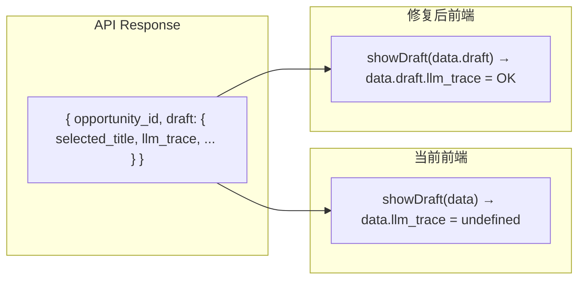

# 视觉工作台 Bug 修复 + 日志面板升级

## 问题诊断

### Bug 1: AI 优化提示词 400 Bad Request

**根因**：前后端请求/响应格式不匹配。

- 前端发送 `{ slot_id, subject, style_tags, ... }`
- 后端期望 `{ "prompt": { slot_id, subject, ... } }`，取不到就抛 400

相关代码：

后端 [routes.py](apps/content_planning/api/routes.py) 第 1549-1552 行：

```python
body = await request.json()
slot_data = body.get("prompt")  # <-- 前端没有 "prompt" 这个 key
if not slot_data or not isinstance(slot_data, dict):
    raise HTTPException(status_code=400, detail="缺少 prompt 数据")
```

前端 [visual_builder.html](apps/intel_hub/api/templates/visual_builder.html) 第 511-514 行：

```javascript
fetch(API + '/v6/image-gen/' + oid + '/optimize-prompt', {
  method: 'POST',
  body: JSON.stringify(data),  // <-- 直接发 data，没有包裹在 { prompt: data }
})
```

此外，后端返回 `{ "slot_id": "...", "result": { llm_trace, optimized, subject, ... } }`，但前端直接读 `res.llm_trace` / `res.optimized` / `res.subject`（应该读 `res.result.xxx`）。

### Bug 2: Quick Draft 生成后预览和 trace 都不显示

**根因**：POST/GET quick-draft 接口返回 `{ "opportunity_id": "...", "draft": {...} }`，但前端直接把整个 response 传给 `showDraft(data)`，导致访问 `data.selected_title`、`data.llm_trace` 都是 `undefined`。



### Bug 3: LLM 调用日志面板无数据

**根因**：是 Bug 1 和 Bug 2 的连锁效应。因为上面两个 bug 导致 `addTrace()` 从未被调用，日志面板始终为空。修复 Bug 1 + Bug 2 后，trace 数据就能正常注入。

## 修复方案

### 修复 1: AI 优化请求格式 (前端)

在 [visual_builder.html](apps/intel_hub/api/templates/visual_builder.html) 的 `vbAiOptimize` 函数中：

- 将 `body: JSON.stringify(data)` 改为 `body: JSON.stringify({ prompt: data })`
- 将响应处理从 `res.llm_trace` 改为 `res.result.llm_trace`，`res.optimized` 改为 `res.result.optimized`，`res.subject` 改为 `res.result.subject` 等

### 修复 2: Quick Draft 响应解包 (前端)

在 [visual_builder.html](apps/intel_hub/api/templates/visual_builder.html) 中：

- `generate()` 的 `.then(data => showDraft(data))` 改为 `.then(data => showDraft(data.draft || data))`
- 初始加载的 `.then(data => { if (data && data.selected_title) showDraft(data) })` 改为 `.then(data => { var d = data && data.draft ? data.draft : data; if (d && d.selected_title) showDraft(d); })`

### 修复 3: 日志面板升级为可拉伸底部浮动窗口

当前日志面板嵌在右侧栏，max-height 250px，只在修复后才有数据。升级为底部固定面板，更像浏览器 DevTools 的 Console：

- 底部固定定位 (`position:fixed; bottom:0`)
- 标题栏可点击折叠/展开
- 可拖拽调整高度
- 面板内容复用现有 `_traceEntries` 数据和 `renderTraces()` 逻辑
- 右侧栏原位置改为一个简短的 trace 计数器 + "打开日志" 按钮

```
+----------------------------------------------------------------------+
|  左栏：来源证据  |  中栏：预览画布  |  右栏：Prompt Builder           |
|                  |                  |  [LLM 日志 (3)] ← 按钮跳到底部  |
+----------------------------------------------------------------------+
| [LLM 调用日志 (3) ▲]  清除   收起                          拖拽调高  |
| ┌─────────────────────────────────────────────────────────────────┐  |
| │ optimize_prompt  14:32:15  [完成] 850ms                        │  |
| │ ▸ 模型: qwen-max  输入: [system]... [user]...  输出: {...}     │  |
| │ quick_draft      14:32:02  [完成] 1200ms                       │  |
| │ ▸ ...                                                          │  |
| └─────────────────────────────────────────────────────────────────┘  |
+----------------------------------------------------------------------+
```

涉及文件：仅 [visual_builder.html](apps/intel_hub/api/templates/visual_builder.html) 一个文件

## 实施步骤

1. 修复 `vbAiOptimize` 请求体包裹 `{ prompt: data }` + 响应读 `res.result`
2. 修复 `generate()` 和初始加载的 draft 解包逻辑
3. 新增底部浮动日志面板 HTML/CSS，替换右栏内嵌面板为精简版
4. 日志面板 JS：折叠/展开、拖拽调高、清除、将渲染目标改为新面板
5. 重启验证三个场景：一键生成预览有 trace、AI 优化不再 400 且有 trace、生图有 trace
