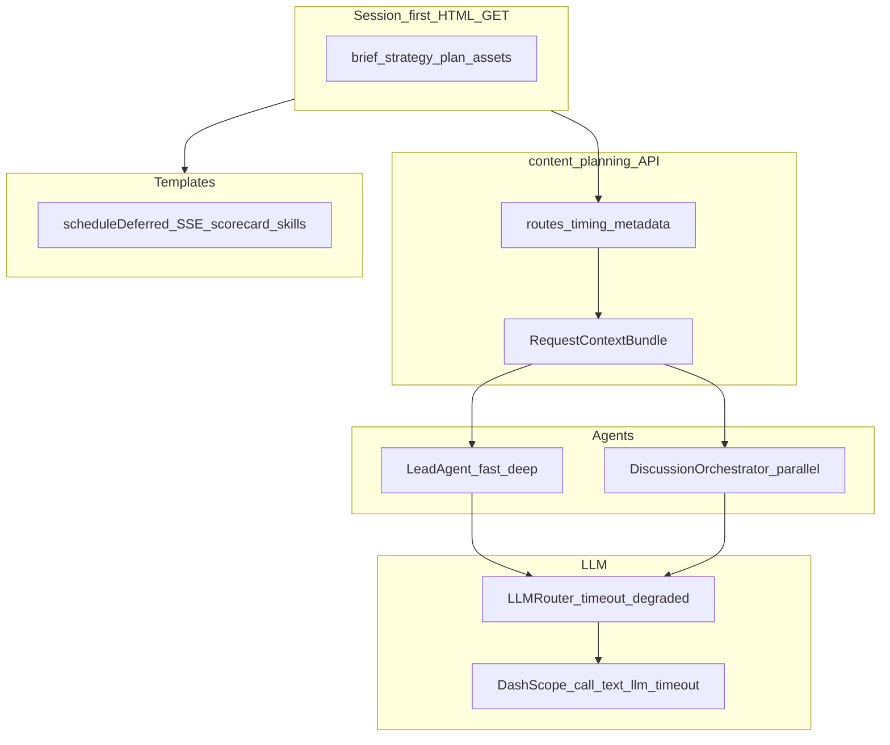

# 架构说明 V2：内容策划工作台与 Agent 性能控制层

> 本文描述 `intel_hub` 中 **内容策划四阶段工作台**（Brief / Strategy / Plan / Assets）与 `content_planning` 服务在 **2026-04 Agent 性能优化** 之后的运行时架构。与根目录 `ARCHITECTURE.md`（旧版/全产品）并存；以 `docs/` 下产品文档为 intel_hub 相关实现的优先参考时，**对象工作台与性能策略以本文为准**。

## 1. 目标与边界

- **目标**：在保持对象中心工作流不变的前提下，降低用户可感知的等待时间，并区分「快交互」与「深分析」路径。
- **边界**：不改变管线阶段语义（card → brief → match → strategy → plan → asset）；优化集中在 **HTTP 热路径、LLM 调用形态、前端次要请求时机**。

## 2. 逻辑分层

## 3. Session-first 页面加载

- **行为**：`GET /content-planning/brief|strategy|plan/{id}` 在 **无 `?refresh=1`** 时只读会话快照（`get_session_data`），不隐式调用 `build_brief` / `build_note_plan`。
- **显式重编**：用户通过「重新生成」「刷新」类操作或 `?refresh=1` 触发编译链。
- **可观测性**：HTML 响应头 `X-Render-Timing-Ms` 记录服务端渲染耗时。

## 4. Fast / Deep 执行模式

- **`run-agent` / `chat`**：默认 **`mode=fast`** — 跳过子 Agent 的 `_enhance_with_llm`；`LeadAgent` 优先阶段映射与关键词路由，避免每条消息都走 LLM routing。
- **`mode=deep`**：保留 richer 路径（含 LLM 路由与增强）。
- **阶段讨论**：`run_mode` 支持多 Agent council 与单 Agent 轻量模式（如 `agent_assisted_single`）；显式 Council 入口保持 deep 语义。

## 5. Request-scoped 上下文装配

- **`RequestContextBundle`**（在 `routes` 层一次性构建，经 `AgentContext.extra` 传递）包含：`card`、`source_notes`、`review_summary`、`template`、`memory_context`、`object_summary`。
- **作用**：`LeadAgent` 深度路由、`DiscussionOrchestrator`、各子 Agent 优先复用预计算字段，避免同请求内重复 `recall` / 对象摘要。

## 6. Council 并行与顺序保证

- **并行**：各 specialist 的 `_get_agent_opinion` 在 **有界线程池**（`ThreadPoolExecutor`，`max_workers` 与参与者数量上限）内并发执行。
- **顺序**：聚合结果按原 `participants` 顺序写回 `DiscussionRound.messages`，持久化与 UI 结构稳定。
- **容错**：单个 specialist 失败时记录 `failed_participants`，其余观点仍可进入共识综合。

## 7. LLM 超时与降级

- **`LLMRouter`**：`chat` 经线程池 `future.result(timeout=…)`；环境变量 `LLM_TIMEOUT_SECONDS`、`LLM_FAST_MODE_TIMEOUT_SECONDS`；返回 `LLMResponse.degraded` + `degraded_reason`。
- **DashScope**：`call_text_llm` / VLM 在 `_run_with_timeout` 中调用 SDK，避免单次调用无限挂起。
- **评估**：`stage_evaluator` 在 LLM 不可用或 degraded 时回退 **规则评分**（`evaluator: rule`）。

## 8. 前端次要请求延后（Chunk 7）

- **`scheduleDeferred`**：`requestIdleCallback`（不可用则 `setTimeout`）延后执行非首屏逻辑。
- **延后内容**：评分卡拉取（`loadLatestScorecard`）、SSE 连接建立、Assets 页 `skills` 列表；Plan 页 **不再首屏自动** `loadCollab()`，需用户点击「刷新协同状态」再拉 `timeline` + `graph`。

## 9. 与测试的对应关系

- 性能与页面路径：`apps/content_planning/tests/test_agent_performance_paths.py`、`apps/intel_hub/tests/test_content_page_fast_paths.py`。
- 全量回归：`pytest apps/content_planning/tests apps/intel_hub/tests`。

## 10. 参考文档

- 实施进度与基线数字：`docs/IMPLEMENT.md`（检索「Agent 性能优化 Chunk」）。
- 设计决策：`docs/DECISIONS.md`（D-026）。
