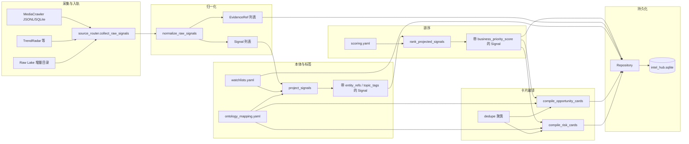

# 小红书（MediaCrawler）→ Intel Hub 数据流水线说明

本文说明 **MediaCrawler 抓取的小红书笔记** 如何进入 `apps/intel_hub`，经清洗、归一化、本体投影后，落地为 **Signal / EvidenceRef**，再编译为 **Opportunity / Risk 卡片**，以及 **Watchlist** 在流程中的角色。

---

## 1. 总览（一张图）

**入口代码**：`apps/intel_hub/workflow/refresh_pipeline.py` 中的 `run_pipeline()`。

---

## 2. 阶段一：从文件到「原始信号」Raw Record

### 2.1 配置从哪里来

`config/runtime.yaml` 中 `mediacrawler_sources` 列出启用的小红书输出路径，例如：

- `output_path: third_party/MediaCrawler/data/xhs/jsonl`  
  指向 MediaCrawler 产出的 **JSONL 目录**（按修改时间读取 `.jsonl` / `.json` / `.db`）。

若目录为空，可回退到 `fixture_fallback`（便于 CI / 无爬虫环境）。

### 2.2 谁在读文件

`apps/intel_hub/ingest/source_router.py` → `_collect_mediacrawler()` 调用  
`apps/intel_hub/ingest/mediacrawler_loader.py` → `load_mediacrawler_records()`。

### 2.3 行级映射规则（笔记 → raw dict）

对每条带 `note_id` 的记录，`_map_note_to_raw_signal()` 产出 **统一的扁平 dict**（还不是 Pydantic 模型），主要字段包括：

| 字段 | 小红书来源 |
|------|------------|
| `title` | `title` 或 `desc` 截断 |
| `summary` / `raw_text` | `desc` |
| `source_url` | `note_url`，缺省则拼 explore 链接 |
| `source_name` | 固定「小红书」 |
| `platform` | 配置里的 `platform`（如 `xiaohongshu`） |
| `published_at` / `captured_at` | `time`、`last_modify_ts`（毫秒/秒 → ISO） |
| `author` / `account` | `nickname`、`user_id` |
| `metrics` | 点赞/收藏/评论/分享及合成的 `engagement` |
| `keyword` | `source_keyword`（搜索词） |
| `tags` | `tag_list` 逗号拆分 |
| `raw_source_type` | 如 `mediacrawler_jsonl` |
| `raw_payload` | `note_id`、`note_type`、`ip_location` 等轻量保留 |

**注意**：同一轮 `run_pipeline` 还会合并 TrendRadar、`xhs_sources` 旧路径、以及 `data/raw_lake/` 增量 run（见 `source_router` 注释），小红书只是其中一条支路。

---

## 3. 阶段二：归一化 → `Signal` + `EvidenceRef`

模块：`apps/intel_hub/normalize/normalizer.py` → `normalize_raw_signals()`。

| 步骤 | 行为 |
|------|------|
| 去重 | `source_url` + `title` + `published_at` 拼成 `dedupe_key`，同轮只保留一条 |
| 稳定 ID | `signal_{sha1 前12位}`、`evidence_{sha1 前12位}` |
| 时间 | `published_at` / `captured_at` 规范为 UTC ISO |
| 置信度 `confidence` | 优先 `metrics.trending_score`；否则评论+点赞启发式；小红书常有 `engagement`，会走 **engagement/2000 封顶** 的简化公式 |
| 成对写出 | 每条 **1 个 `Signal` + 1 个 `EvidenceRef`**，`evidence_refs` 互相指向 |

此时 **尚未** 做赛道/竞品/政策等本体扩展，只有原文与基础元数据。

---

## 4. 阶段三：本体投影 → Watchlist 命中 + 主题标签 + 平台归一

模块：`apps/intel_hub/projector/ontology_projector.py` → `project_signals()`。

内部串联：

1. **`entity_resolver.resolve_entities`**  
   - 把 `title/summary/raw_text/keyword/source_name` 拼成检索串。  
   - **`canonicalizer.canonicalize_entities`** 对照 `config/ontology_mapping.yaml` 的 `entities`（别名 + `watchlist_ids`）以及各 Watchlist 的 `keywords`/`aliases`。  
   - 命中后得到 `canonical_entity_refs`、`raw_entity_hits`、关联的 **matched_watchlists**。

2. **`topic_tagger.tag_topics`**  
   - 继承 Watchlist 的 `watchlist_type` 与 `topic_tags`。  
   - 按 `ontology_mapping.topics` 里各 topic 的 `keywords` 做子串匹配，打上如 `opportunity` / `risk` / `competitor` / `category` 等标签。  
   - **桌布演示**：若命中 `category_tablecloth` 实体，会追加一组风格/材质/场景等细分标签。  
   - **小红书增强**：平台为 xhs / 文案特征命中时，追加「用户真实体验」「购买意向」等评论向标签。

3. **`platform_refs` 扩展**  
   - 保留原 `platform`；并按 `ontology_mapping.platform_refs` 的同义词把 `xiaohongshu` 等归一到如 `xiaohongshu` 键（与 `synonyms` 配置一致）。

输出：**仍是一列表 `Signal`**，但字段已带 `entity_refs`、`canonical_entity_refs`、`topic_tags`、`watchlist_hits`（若在 raw 阶段有）、`platform_refs` 等。

---

## 5. 阶段四：业务优先级排序

模块：`apps/intel_hub/compiler/priority_ranker.py` → `rank_projected_signals()`。

依据 `config/scoring.yaml` 的权重，综合：

- 实体数量（`entity_refs`）  
- 主题影响（`topic_impacts`）  
- 发布时间新鲜度  
- 证据链（`evidence_refs`、`source_url`）  
- 热度 / 排序（`metrics`、`rank`）

写入每条 Signal 的 **`business_priority_score`**，供 Dashboard / 列表排序使用。

---

## 6. 阶段五：结构化卡片 —— Opportunity 与 Risk

模块：

- `apps/intel_hub/compiler/opportunity_compiler.py`
- `apps/intel_hub/compiler/risk_compiler.py`
- 共用 `apps/intel_hub/compiler/dedupe.py` 做 **按主题与实体的聚类**

### 6.1 准入条件（由配置驱动）

`config/ontology_mapping.yaml` → `card_compiler`：

- **Opportunity**：`topic_tags` 与 `opportunity_topics` 有交集，且 **不含** `risk` 主题。  
  默认 `opportunity_topics`: `opportunity`, `competitor`, `category`。
- **Risk**：`topic_tags` 与 `risk_topics` 有交集。  
  默认 `risk_topics`: `risk`, `platform_policy`。

因此：**同一条小红书信号** 能否进机会池或风险池，取决于 **投影阶段打上的 `topic_tags`**，而标签又依赖 **ontology 关键词 + Watchlist + 桌布/xhs 规则**。

### 6.2 聚类与卡片字段

多条 Signal 可能聚成 **一张卡片**：合并 `source_refs`、`evidence_refs`、`entity_refs`、`platform_refs`，并带 `trigger_signals`、`merged_signal_ids`、`suggested_actions`、`impact_hint` 等，便于经营侧阅读。

---

## 7. Watchlist 的双重角色（避免混淆）

| 角色 | 说明 |
|------|------|
| **配置输入** | `config/watchlists.yaml` 在 **投影阶段** 参与实体解析与标签继承（关键词、别名、`entity_refs`）。 |
| **持久化输出** | `Repository.save_watchlists(watchlists)` 把同一份定义写入 SQLite，供 API / Dashboard 展示「当前监控清单」。 |

Watchlist **不是**从爬虫里动态「学习」出来的列表；它是 **人工/配置维护的监控范围**，用于过滤和加权 **哪些 raw 信号应挂上哪些实体与主题**。

---

## 8. 持久化与原始快照

`apps/intel_hub/storage/repository.py` 将以下对象写入 `data/intel_hub.sqlite`（路径由 `runtime.yaml` 的 `storage_path` 决定）：

- Watchlists  
- Signals（已排序）  
- EvidenceRefs  
- OpportunityCards  
- RiskCards  

同时 `refresh_pipeline._write_raw_snapshot()` 把本轮合并后的 **全部 raw dict** 写入 `data/raw/latest_raw_signals.jsonl`，便于审计与排错。

---

## 9. 可读性优化建议（实现与文档）

- **代码**：`run_pipeline()` 已用短注释标出阶段；更细逻辑以 **本文 + 各模块 docstring** 为准。  
- **排障顺序**：raw 条数 → `normalize` 后 signal 条数 → `project` 后带 `topic_tags` 的分布 → `opportunity_topics`/`risk_topics` 命中数 → 卡片数。  
- **扩展小红书**：优先改 `mediacrawler_loader` 映射与 `topic_tagger` / `ontology_mapping`，避免在 `refresh_pipeline` 堆叠业务分支。

---

## 10. 关键文件索引

| 用途 | 路径 |
|------|------|
| 流水线入口 | `apps/intel_hub/workflow/refresh_pipeline.py` |
| 多源汇总 | `apps/intel_hub/ingest/source_router.py` |
| 小红书文件加载 | `apps/intel_hub/ingest/mediacrawler_loader.py` |
| 归一化 | `apps/intel_hub/normalize/normalizer.py` |
| 本体投影 | `apps/intel_hub/projector/ontology_projector.py` |
| 实体/别名 | `apps/intel_hub/projector/canonicalizer.py`、`entity_resolver.py` |
| 主题标签 | `apps/intel_hub/projector/topic_tagger.py` |
| 排序 | `apps/intel_hub/compiler/priority_ranker.py` |
| 机会/风险卡 | `apps/intel_hub/compiler/opportunity_compiler.py`、`risk_compiler.py` |
| 运行时路径 | `config/runtime.yaml` |
| 本体与卡片规则 | `config/ontology_mapping.yaml` |
| 监控清单 | `config/watchlists.yaml` |
| 打分权重 | `config/scoring.yaml` |
| 领域模型 | `apps/intel_hub/schemas/signal.py`、`evidence_ref.py`、`cards.py`、`watchlist.py` |

与全局对象定义对照：`docs/DATA_MODEL.md`。
