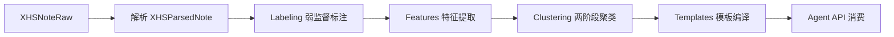

# 桌布主图策略模板库提取

## 项目目标

从小红书桌布笔记中提取封面/图组策略特征，通过弱监督标注、特征提取、两阶段聚类，编译成 6 套可供主图策划 Agent 直接消费的策略模板。

## 架构概览



说明：`XHSNoteRaw` / `XHSParsedNote` 来自 `intel_hub` 解析层；标注与特征模块消费解析结果与 `XHSNoteLabeled`；聚类产出 `ClusterSample` 与簇–模板映射；编译器生成 `TableclothMainImageStrategyTemplate`；Agent 侧完成检索、匹配与 `MainImagePlan` 编译。

## 目录结构

```text
apps/template_extraction/
├── schemas/         # Pydantic 数据模型
├── labeling/        # 弱监督标注器
├── features/        # 特征提取
├── clustering/      # 两阶段聚类
├── templates/       # 模板编译
├── agent/           # Agent 消费接口
├── evaluation/      # 评估脚本
└── tests/           # 测试（按里程碑补充）

config/template_extraction/
├── label_taxonomy.yaml
├── feature_rules.yaml
├── clustering_params.yaml
└── template_defaults.yaml

data/template_extraction/
├── labeled/
├── features/
├── clusters/
├── templates/
└── exports/for_agent/
```

## 数据模型

### 核心对象

| 对象 | 说明 |
|------|------|
| **XHSNoteLabeled** | 单条笔记的四层标注结果容器：封面任务、图组任务、视觉结构、经营语义、风险标签列表（`LabelResult`）。 |
| **CoverFeaturePack** | 封面侧数值/向量特征：图像启发式、关键词布尔位、任务/视觉/语义/风险标签向量、桌布与道具占比代理等。 |
| **GalleryFeaturePack** | 图组侧特征：角色序列、一致性分数、场景/特写/选购引导等布尔与语义向量、互动代理分等。 |
| **ClusterSample** | 单条笔记在两阶段聚类中的簇归属、是否代表元、簇摘要文案、模板候选提示等。 |
| **TableclothMainImageStrategyTemplate** | 可落盘的策略模板：适用平台/品类/场景/风格/价格带、用户动机、钩子机制、图序模式、视觉/文案/场景/可见度规则、风险与评估字段等。 |
| **MainImagePlan** | Agent 输出：在匹配模板基础上结合机会卡/商品 brief 编译的主图策划方案（含 `ImageSlotPlan` 等）。 |

标签枚举类型（`labels` 模块）：`CoverTaskLabel`、`GalleryTaskLabel`、`VisualStructureLabel`、`BusinessSemanticLabel`、`RiskLabel`、`LabelResult`。

## 标签体系

四层体系定义于 `config/template_extraction/label_taxonomy.yaml`：

| 层级 | 含义 | 数量（约） |
|------|------|------------|
| **L1 任务** | 封面任务（10）+ 图组任务（5） | 15 |
| **L2 视觉结构** | 景别、构图、主体元素、桌布露出、文案叠层、色板、光线（多选） | 43（shot 4 + composition 5 + subject 10 + cloth_exposure 6 + text_overlay 8 + palette 7 + lighting 3） |
| **L3 经营语义** | 情绪与购买动机相关语义（多选） | 12 |
| **L4 风险** | 内容泛化、商品焦点、难复现等风险（多选） | 8 |

## 流水线使用

以下示例均需在仓库根目录、已配置 `PYTHONPATH` 指向项目根（或等价包路径）的前提下执行。输入一般为 `XHSParsedNote` 列表（可用 `apps.intel_hub.parsing.xhs_note_parser.load_and_parse_notes` 从 MediaCrawler JSONL 目录加载）。

### 1. 标注

```python
from pathlib import Path
from apps.intel_hub.parsing.xhs_note_parser import load_and_parse_notes
from apps.template_extraction.labeling import run_labeling_pipeline

notes = load_and_parse_notes(Path("data/fixtures/mediacrawler_output/xhs/jsonl"))
labeled = run_labeling_pipeline(
    notes,
    mode="rule",  # rule | vlm | ensemble
    output_dir="data/template_extraction/labeled",
)
```

### 2. 特征提取

```python
from apps.template_extraction.features import run_feature_pipeline

pairs = [(parsed, lab) for parsed, lab in zip(notes, labeled)]
feature_rows = run_feature_pipeline(
    pairs,
    output_dir="data/template_extraction/features",
)
# feature_rows: list[tuple[CoverFeaturePack, GalleryFeaturePack]]
```

### 3. 聚类

```python
from apps.template_extraction.clustering import run_cluster_pipeline

cover_packs = [c for c, _ in feature_rows]
gallery_packs = [g for _, g in feature_rows]
note_ids = [lab.note_id for lab in labeled]
samples = run_cluster_pipeline(
    cover_packs,
    gallery_packs,
    config_path="config/template_extraction/clustering_params.yaml",
    output_dir="data/template_extraction/clusters",
    note_ids=note_ids,
)
```

`run_cluster_pipeline` 内部先对封面特征做 KMeans（默认簇数见 `clustering_params.yaml`），再在融合封面簇 one-hot 的策略特征上做第二阶段聚类，并写出 `cluster_report.md` 与 `cluster_samples.jsonl`。

### 4. 模板编译

```python
from apps.template_extraction.clustering.strategy_clustering import map_clusters_to_templates, run_strategy_clustering, run_cover_clustering
from apps.template_extraction.templates import compile_templates, save_templates, validate_template_set

# 若从聚类流水线外部调用：需自行得到 strategy_labels 与 cluster_to_template；
# 与 run_cluster_pipeline 内部逻辑一致时，可直接复用上一步 samples 所依赖的同一次聚类输出。
# 典型用法：根据第二次聚类标签调用 map_clusters_to_templates，再 compile_templates。

# 示例：假设已有 cover_labels, strategy_labels（与聚类模块一致）
cluster_to_template = map_clusters_to_templates(
    strategy_labels, gallery_packs, cover_packs=cover_packs
)
# 注意：map_clusters_to_templates 产出短名（如 scene_seed），而 template_defaults.yaml 的键为 tpl_001_scene_seed 等；
# 集成时请将短名映射为 YAML 中的完整 template_id，或在配置层统一键名。

templates = compile_templates(samples, cluster_to_template)
validate_template_set(templates)
save_templates(templates, "data/template_extraction/templates")
```

### 5. Agent 消费

```python
from apps.template_extraction.agent import build_main_image_plan

plan, matches = build_main_image_plan(
    template_id=None,  # 或指定具体 template_id
    opportunity_card={"title": "示例机会卡"},
    product_brief="棉麻桌布，奶油风",
    intent="氛围种草",
    templates_dir="data/template_extraction/templates",
)
```

也可分步使用 `TemplateRetriever`、`TemplateMatcher`、`MainImagePlanCompiler`。

## 6 套模板

配置源：`config/template_extraction/template_defaults.yaml`。聚类侧目标名（`TARGET_TEMPLATES` / `clustering_params.yaml` 的 `target_templates`）为短名；落盘模板 ID 以 YAML 键为准。

| ID（配置键） | 名称 | 核心场景 | 核心动机 |
|--------------|------|----------|----------|
| tpl_001_scene_seed | 氛围感场景种草型 | 早餐、下午茶、居家晚餐、朋友聚餐、桌搭 | 提升家居氛围、低成本改造、出片桌搭 |
| tpl_002_style_anchor | 风格定锚型 | 法式/奶油/原木/中古/北欧餐桌 | 确认风格身份、抄风格作业 |
| tpl_003_texture_detail | 质感细节打动型 | 中高客单、材质差异明显的选款 | 品质感、工艺溢价、触感联想 |
| tpl_004_affordable_makeover | 平价改造型 | 租房、学生党、小户型、预算有限 | 省钱又要变化、快速焕新 |
| tpl_005_festival_gift | 节庆礼赠型 | 圣诞、生日、纪念日、节日聚会 | 节点布置、仪式感、礼赠 |
| tpl_006_set_combo | 桌搭方案型 | 整套搭配、抄作业、多品连带 | 照着摆、降低搭配决策成本 |

## 评估指标

- **标注**：覆盖率（各层非空比例）、规则与 VLM 一致性、疑难样本比例。
- **聚类**：簇内纯度、簇规模均衡性、代表样本可解释性。
- **模板**：字段完整性、校验器通过、`best_for` / `avoid_when` 与簇统计是否一致、可执行性（能否稳定生成 `MainImagePlan`）。

模块入口见 `apps.template_extraction.evaluation`（标注/聚类/模板质量与验收报告生成）。

## 复用的现有代码

- **Schemas**：`apps.intel_hub.schemas.xhs_raw.XHSNoteRaw`、`apps.intel_hub.schemas.xhs_parsed.XHSParsedNote`。
- **解析**：`apps.intel_hub.parsing.xhs_note_parser`（`parse_raw_note` / `parse_note` / `load_and_parse_notes`）。
- **LLM（标注扩展）**：可与 `intel_hub` 的 `llm_client` 等能力对接；当前 VLM 标注器含 mock 路径，便于无密钥跑通流水线。

更细的标签定义与人工标注规范见 [ANNOTATION_GUIDE.md](./ANNOTATION_GUIDE.md)；模板字段语义见 `docs/template_define.md`、`docs/compile_template.md`。
