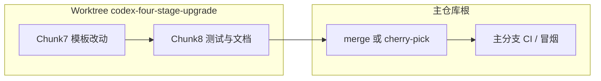

# Agent Performance Optimization Implementation Plan

> **For agentic workers:** REQUIRED: Use superpowers:subagent-driven-development (if subagents available) or superpowers:executing-plans to implement this plan. Steps use checkbox (`- [ ]`) syntax for tracking.

**Goal:** Reduce end-user waiting time for Agent interactions and stage pages by cutting avoidable recomputation, reducing LLM round-trips, and separating fast interactive paths from deep multi-agent analysis.

**Architecture:** Keep the current object-centric workflow and stage substrate intact, but introduce a performance control layer: session-first page reads, request-scoped context assembly, fast/deep execution modes, parallel council execution, and fail-fast LLM boundaries. Optimize the hot path before introducing deeper runtime changes like graph execution.

**Tech Stack:** FastAPI, Jinja templates, SQLite, current `content_planning` stage workflow substrate, current `llm_router`, current `DiscussionOrchestrator`, current SSE/timeline stack.

---

## File Map

**Primary backend files**
- Modify: `apps/intel_hub/api/app.py`
  - Stop expensive page GETs from eagerly recompiling objects unless explicitly requested.
- Modify: `apps/content_planning/api/routes.py`
  - Add execution mode flags, request-scoped context assembly, and timing instrumentation.
- Modify: `apps/content_planning/agents/discussion.py`
  - Parallelize specialist opinions and reduce duplicated work.
- Modify: `apps/content_planning/agents/lead_agent.py`
  - Add fast-path routing and avoid unnecessary deep routing for simple requests.
- Modify: `apps/content_planning/adapters/llm_router.py`
  - Add timeout, provider fallback policy, and lightweight timing hooks.
- Modify: `apps/intel_hub/extraction/llm_client.py`
  - Add explicit timeout / fail-fast behavior and cleaner degraded return paths.
- Modify: `apps/content_planning/agents/memory.py`
  - Reduce per-call connection churn where possible and support request-level reuse.

**Primary frontend/template files**
- Modify: `apps/intel_hub/api/templates/content_brief.html`
- Modify: `apps/intel_hub/api/templates/content_strategy.html`
- Modify: `apps/intel_hub/api/templates/content_plan.html`
- Modify: `apps/intel_hub/api/templates/content_assets.html`
  - Make expensive secondary calls opt-in or deferred.

**Tests**
- Modify: `apps/content_planning/tests/test_stage_workflow_api.py`
- Add: `apps/content_planning/tests/test_agent_performance_paths.py`
- Add: `apps/intel_hub/tests/test_content_page_fast_paths.py`

**Docs**
- Modify: `docs/IMPLEMENT.md`
- Modify: `docs/ARCHITECTURE_V2.md`
- Modify: `docs/DECISIONS.md`

---

## Success Metrics

- `GET /content-planning/brief/{id}` median server time: target `<= 250ms` on warm session
- `GET /content-planning/strategy/{id}` median server time: target `<= 300ms` on warm session
- `GET /content-planning/plan/{id}` median server time: target `<= 350ms` on warm session
- `GET /content-planning/assets/{id}` median server time: target `<= 300ms` on warm session
- `/content-planning/run-agent/{id}` fast mode median: target `<= 2.5s` with provider available
- `/content-planning/stages/{stage}/{id}/discussions` council mode median: target `<= 5.0s` with provider available
- All current `apps/intel_hub/tests` and `apps/content_planning/tests` remain green

---

## Chunk 1: Baseline and Instrumentation

### Task 1: Add request timing around the hot paths

**Files:**
- Modify: `apps/content_planning/api/routes.py`
- Modify: `apps/intel_hub/api/app.py`
- Test: `apps/content_planning/tests/test_agent_performance_paths.py`

- [ ] **Step 1: Write the failing test scaffold**

```python
def test_fast_page_request_does_not_trigger_full_rebuild():
    ...

def test_discussion_response_exposes_timing_metadata():
    ...
```

- [ ] **Step 2: Run the focused test to verify it fails**

Run: `PYTHONPATH=$PWD .venv311/bin/pytest apps/content_planning/tests/test_agent_performance_paths.py -q`
Expected: FAIL because timing metadata / fast-path behavior is not implemented yet

- [ ] **Step 3: Add lightweight timing instrumentation**

Implement:
- request-level elapsed measurement for:
  - page render handlers
  - `run-agent`
  - `chat`
  - stage discussion
- attach non-breaking metadata in JSON responses, for example:

```python
{
    "timing_ms": 842,
    "timing_breakdown": {
        "context_ms": 115,
        "llm_ms": 640,
        "persist_ms": 23,
    }
}
```

- [ ] **Step 4: Run the focused test to verify it passes**

Run: `PYTHONPATH=$PWD .venv311/bin/pytest apps/content_planning/tests/test_agent_performance_paths.py -q`
Expected: PASS

- [ ] **Step 5: Commit**

```bash
git add apps/content_planning/api/routes.py apps/intel_hub/api/app.py apps/content_planning/tests/test_agent_performance_paths.py
git commit -m "feat: add agent performance timing instrumentation"
```

### Task 2: Record baseline numbers before optimization

**Files:**
- Modify: `docs/IMPLEMENT.md`

- [ ] **Step 1: Add a baseline measurement section**
- [ ] **Step 2: Record current timings for page GET, run-agent, chat, and discussion**
- [ ] **Step 3: Commit**

```bash
git add docs/IMPLEMENT.md
git commit -m "docs: record agent performance baseline"
```

---

## Chunk 2: Make Page Loads Session-First

### Task 3: Remove eager compilation from page GET handlers

**Files:**
- Modify: `apps/intel_hub/api/app.py`
- Test: `apps/intel_hub/tests/test_content_page_fast_paths.py`

- [ ] **Step 1: Write failing tests**

```python
def test_brief_page_uses_session_snapshot_when_available():
    ...

def test_strategy_page_does_not_call_build_note_plan_on_plain_get():
    ...

def test_plan_page_does_not_generate_assets_on_plain_get():
    ...
```

- [ ] **Step 2: Run focused tests to verify failure**

Run: `PYTHONPATH=$PWD .venv311/bin/pytest apps/intel_hub/tests/test_content_page_fast_paths.py -q`
Expected: FAIL because pages still rebuild on GET

- [ ] **Step 3: Implement session-first page loading**

Rules:
- `GET /content-planning/brief/{id}`:
  - read current session first
  - only call `build_brief()` when explicitly requested or object missing
- `GET /content-planning/strategy/{id}`:
  - read session snapshot
  - do not call `build_note_plan(...with_generation=False)` on plain load
- `GET /content-planning/plan/{id}`:
  - read session snapshot
  - do not call `build_note_plan(...with_generation=True)` on plain load
- `GET /content-planning/assets/{id}`:
  - keep current asset-safe assembly behavior

- [ ] **Step 4: Add explicit refresh actions instead of implicit rebuild**

Template change pattern:
- keep current “regenerate” / “refresh scorecard” / “run agent” actions
- if session object missing, show a CTA button instead of rebuilding automatically

- [ ] **Step 5: Run focused tests**

Run: `PYTHONPATH=$PWD .venv311/bin/pytest apps/intel_hub/tests/test_content_page_fast_paths.py -q`
Expected: PASS

- [ ] **Step 6: Commit**

```bash
git add apps/intel_hub/api/app.py apps/intel_hub/tests/test_content_page_fast_paths.py
git commit -m "perf: make content planning pages session-first"
```

---

## Chunk 3: Introduce Fast Mode and Deep Mode

### Task 4: Add explicit execution modes for agent interactions

**Files:**
- Modify: `apps/content_planning/api/routes.py`
- Modify: `apps/content_planning/agents/lead_agent.py`
- Modify: `apps/intel_hub/api/templates/content_brief.html`
- Modify: `apps/intel_hub/api/templates/content_strategy.html`
- Modify: `apps/intel_hub/api/templates/content_plan.html`
- Modify: `apps/intel_hub/api/templates/content_assets.html`
- Test: `apps/content_planning/tests/test_agent_performance_paths.py`

- [ ] **Step 1: Write failing tests**

```python
def test_run_agent_fast_mode_skips_deep_routing():
    ...

def test_stage_discussion_fast_mode_reduces_participants():
    ...
```

- [ ] **Step 2: Run focused tests to verify failure**

Run: `PYTHONPATH=$PWD .venv311/bin/pytest apps/content_planning/tests/test_agent_performance_paths.py -q`
Expected: FAIL because execution mode does not exist yet

- [ ] **Step 3: Add non-breaking request flags**

API defaults:
- `run-agent`: default `mode="fast"`
- `chat`: default `mode="fast"`
- stage discussion: default remains `deep` for explicit council entry

Semantics:
- `fast`
  - no LLM routing if stage already maps to an obvious agent
  - no `_enhance_with_llm()`
  - memory recall limited or skipped
- `deep`
  - current richer path

- [ ] **Step 4: Update UI buttons**

Template strategy:
- keep current “Ask the Council” as deep path
- make single-agent quick actions use fast mode
- add optional “深度分析” button only where helpful

- [ ] **Step 5: Run focused tests**

Run: `PYTHONPATH=$PWD .venv311/bin/pytest apps/content_planning/tests/test_agent_performance_paths.py -q`
Expected: PASS

- [ ] **Step 6: Commit**

```bash
git add apps/content_planning/api/routes.py apps/content_planning/agents/lead_agent.py apps/intel_hub/api/templates/content_brief.html apps/intel_hub/api/templates/content_strategy.html apps/intel_hub/api/templates/content_plan.html apps/intel_hub/api/templates/content_assets.html apps/content_planning/tests/test_agent_performance_paths.py
git commit -m "perf: add fast and deep agent execution modes"
```

---

## Chunk 4: Remove Duplicated Context Assembly

### Task 5: Add request-scoped context bundles

**Files:**
- Modify: `apps/content_planning/api/routes.py`
- Modify: `apps/content_planning/agents/discussion.py`
- Modify: `apps/content_planning/agents/lead_agent.py`
- Modify: `apps/content_planning/agents/brief_synthesizer.py`
- Modify: `apps/content_planning/agents/strategy_director.py`
- Modify: `apps/content_planning/agents/visual_director.py`
- Modify: `apps/content_planning/agents/asset_producer.py`
- Modify: `apps/content_planning/agents/trend_analyst.py`
- Modify: `apps/content_planning/agents/template_planner.py`
- Test: `apps/content_planning/tests/test_agent_performance_paths.py`

- [ ] **Step 1: Write failing tests**

```python
def test_run_agent_builds_context_once_per_request():
    ...

def test_discussion_reuses_shared_memory_context():
    ...
```

- [ ] **Step 2: Run focused tests**

Run: `PYTHONPATH=$PWD .venv311/bin/pytest apps/content_planning/tests/test_agent_performance_paths.py -q`
Expected: FAIL because context is rebuilt repeatedly

- [ ] **Step 3: Implement `RequestContextBundle`**

Fields should include:
- `card`
- `source_notes`
- `review_summary`
- `template`
- `memory_context`
- `object_summary`

Usage:
- build once in routes
- pass through `AgentContext.extra`
- agents read from precomputed values first

- [ ] **Step 4: Run focused tests**

Run: `PYTHONPATH=$PWD .venv311/bin/pytest apps/content_planning/tests/test_agent_performance_paths.py -q`
Expected: PASS

- [ ] **Step 5: Commit**

```bash
git add apps/content_planning/api/routes.py apps/content_planning/agents/discussion.py apps/content_planning/agents/lead_agent.py apps/content_planning/agents/brief_synthesizer.py apps/content_planning/agents/strategy_director.py apps/content_planning/agents/visual_director.py apps/content_planning/agents/asset_producer.py apps/content_planning/agents/trend_analyst.py apps/content_planning/agents/template_planner.py apps/content_planning/tests/test_agent_performance_paths.py
git commit -m "perf: add request scoped context bundles for agent calls"
```

---

## Chunk 5: Parallelize Council Specialists

### Task 6: Replace serial council calls with bounded parallel execution

**Files:**
- Modify: `apps/content_planning/agents/discussion.py`
- Test: `apps/content_planning/tests/test_agent_performance_paths.py`

- [ ] **Step 1: Write failing test**

```python
def test_discussion_parallelizes_specialist_calls():
    ...
```

- [ ] **Step 2: Run the test to verify failure**

Run: `PYTHONPATH=$PWD .venv311/bin/pytest apps/content_planning/tests/test_agent_performance_paths.py -q`
Expected: FAIL because discussion is serial

- [ ] **Step 3: Implement bounded parallel execution**

Rules:
- run specialist opinion gathering in parallel
- keep final synthesis as a single trailing step
- preserve deterministic ordering in stored discussion output
- if one specialist fails:
  - keep partial results
  - mark failed participant in metadata
  - still synthesize if at least one result exists

- [ ] **Step 4: Run focused tests**

Run: `PYTHONPATH=$PWD .venv311/bin/pytest apps/content_planning/tests/test_agent_performance_paths.py -q`
Expected: PASS

- [ ] **Step 5: Commit**

```bash
git add apps/content_planning/agents/discussion.py apps/content_planning/tests/test_agent_performance_paths.py
git commit -m "perf: parallelize council specialist execution"
```

---

## Chunk 6: Fail Fast on Slow or Unavailable LLM Providers

### Task 7: Add timeout, fallback, and degraded-mode policy

**Files:**
- Modify: `apps/content_planning/adapters/llm_router.py`
- Modify: `apps/intel_hub/extraction/llm_client.py`
- Modify: `apps/content_planning/evaluation/stage_evaluator.py`
- Test: `apps/content_planning/tests/test_agent_performance_paths.py`

- [ ] **Step 1: Write failing tests**

```python
def test_llm_timeout_returns_degraded_response_quickly():
    ...

def test_evaluation_skips_judge_when_provider_unavailable():
    ...
```

- [ ] **Step 2: Run focused tests**

Run: `PYTHONPATH=$PWD .venv311/bin/pytest apps/content_planning/tests/test_agent_performance_paths.py -q`
Expected: FAIL because calls wait too long or silently fall through

- [ ] **Step 3: Implement fail-fast rules**

Add:
- configurable timeout per provider call
- clear degraded response metadata
- optional env settings:
  - `LLM_TIMEOUT_SECONDS`
  - `LLM_FAST_MODE_TIMEOUT_SECONDS`
- stage evaluation fast fallback:
  - if provider unavailable or slow, use rule score only

- [ ] **Step 4: Run focused tests**

Run: `PYTHONPATH=$PWD .venv311/bin/pytest apps/content_planning/tests/test_agent_performance_paths.py -q`
Expected: PASS

- [ ] **Step 5: Commit**

```bash
git add apps/content_planning/adapters/llm_router.py apps/intel_hub/extraction/llm_client.py apps/content_planning/evaluation/stage_evaluator.py apps/content_planning/tests/test_agent_performance_paths.py
git commit -m "perf: add fail fast llm timeout and degraded mode"
```

---

## Chunk 7: Reduce Frontend Chatter on Page Load

### Task 8: Defer non-critical sidebar requests

**Files:**
- Modify: `apps/intel_hub/api/templates/content_brief.html`
- Modify: `apps/intel_hub/api/templates/content_strategy.html`
- Modify: `apps/intel_hub/api/templates/content_plan.html`
- Modify: `apps/intel_hub/api/templates/content_assets.html`
- Test: `apps/intel_hub/tests/test_content_page_fast_paths.py`

- [ ] **Step 1: Write failing test scaffold**

```python
def test_asset_page_initial_render_does_not_require_skills_and_timeline_requests():
    ...
```

- [ ] **Step 2: Run focused tests**

Run: `PYTHONPATH=$PWD .venv311/bin/pytest apps/intel_hub/tests/test_content_page_fast_paths.py -q`
Expected: FAIL because current page assumes eager sidebar behavior

- [ ] **Step 3: Defer secondary calls**

Defer or lazy-load:
- `skills`
- `timeline`
- `scorecard` auto-refresh

Keep immediate:
- core object content
- stale warnings
- primary action buttons

- [ ] **Step 4: Run focused tests**

Run: `PYTHONPATH=$PWD .venv311/bin/pytest apps/intel_hub/tests/test_content_page_fast_paths.py -q`
Expected: PASS

- [ ] **Step 5: Commit**

```bash
git add apps/intel_hub/api/templates/content_brief.html apps/intel_hub/api/templates/content_strategy.html apps/intel_hub/api/templates/content_plan.html apps/intel_hub/api/templates/content_assets.html apps/intel_hub/tests/test_content_page_fast_paths.py
git commit -m "perf: defer non critical content planning sidebar requests"
```

---

## Chunk 8: Validation and Rollout

### Task 9: Full verification and before/after report

**Files:**
- Modify: `docs/IMPLEMENT.md`
- Modify: `docs/ARCHITECTURE_V2.md`
- Modify: `docs/DECISIONS.md`

- [ ] **Step 1: Run full test suite**

Run: `PYTHONPATH=$PWD .venv311/bin/pytest apps/content_planning/tests -q`
Expected: PASS

Run: `PYTHONPATH=$PWD .venv311/bin/pytest apps/intel_hub/tests apps/content_planning/tests -q`
Expected: PASS

Run: `PYTHONPATH=$PWD .venv311/bin/python -m compileall apps/content_planning apps/intel_hub`
Expected: PASS

- [ ] **Step 2: Run page smoke checks**

Verify:
- `/content-planning/brief/{id}`
- `/content-planning/strategy/{id}`
- `/content-planning/plan/{id}`
- `/content-planning/assets/{id}`

- [ ] **Step 3: Record before/after metrics**

Document:
- page GET timing
- run-agent fast timing
- council timing
- degraded-mode behavior without provider

- [ ] **Step 4: Update docs**

Add:
- fast vs deep execution model
- session-first page loading
- council parallelism
- timeout/degraded-mode policy

- [ ] **Step 5: Commit**

```bash
git add docs/IMPLEMENT.md docs/ARCHITECTURE_V2.md docs/DECISIONS.md
git commit -m "docs: capture agent performance optimization architecture and metrics"
```

---

## Risks

- Parallel council execution may change exact discussion ordering, so stored output must preserve deterministic ordering after fan-in.
- Session-first page loading can surface “missing object” states more often; templates must handle empty session objects cleanly.
- Fast mode may reduce answer quality for some prompts; UI copy must make the fast/deep distinction explicit.
- Timeout tuning that is too aggressive can over-trigger degraded mode and hurt quality.

---

## Recommended Execution Order

1. Chunk 1: instrumentation
2. Chunk 2: session-first GET handlers
3. Chunk 3: fast vs deep modes
4. Chunk 4: request-scoped context bundle
5. Chunk 5: parallel council
6. Chunk 6: LLM fail-fast
7. Chunk 7: frontend request deferral
8. Chunk 8: full validation and metric report

---

## Rollout Strategy

- Release 1:
  - instrumentation
  - session-first page loads
  - fast mode
- Release 2:
  - request-scoped context cache
  - parallel council
  - timeout/degraded mode
- Release 3:
  - frontend deferred loading
  - full metrics review

---

## 实现路径（Implementation Path）

本节回答「接下来怎么落地」：默认在 **git worktree** 目录  
`/Users/yichen/Desktop/OntologyBrain/Ai- native 经营操作OS/.worktrees/codex-four-stage-upgrade`  
内开发与提交；验证通过后再合并回主工作区仓库根目录。

### 当前进度锚点

- **Chunk 1–6**：已在上述 worktree 中实现并通过相关 pytest（详见 `docs/IMPLEMENT.md` 中 2026-04-09 / 2026-04-10 各 Chunk 记录）。
- **Chunk 7–8**：待实现；以下为推荐实现顺序与文件级路径。

### Chunk 7：前端侧栏与非关键请求延后（Reduce Frontend Chatter）

**目标**：首屏只渲染对象与主操作；`skills` / `timeline` / 自动轮询类请求改为「空闲时或用户交互后再拉」。

**建议实现顺序**

1. **盘点各模板首屏 `DOMContentLoaded` / 内联脚本**  
   文件：  
   - `apps/intel_hub/api/templates/content_brief.html`  
   - `apps/intel_hub/api/templates/content_strategy.html`  
   - `apps/intel_hub/api/templates/content_plan.html`  
   - `apps/intel_hub/api/templates/content_assets.html`  
   记录：哪些 `fetch` / `loadXxx` 在页面加载即执行。

2. **抽一层「延后加载」小工具（同构四页）**  
   - 用 `requestIdleCallback`（无则 `setTimeout(0)`）包装非关键请求；或  
   - 「展开协同面板 / 点击刷新」时再拉 `timeline` / `skills`。  
   原则：**核心对象与 CTA 不依赖这些请求即可交互**。

3. **补/调测试**  
   - `apps/intel_hub/tests/test_content_page_fast_paths.py`  
   按计划中的用例意图断言：首屏 HTML 不强制依赖某些 JSON 端点（或 mock 下请求次数）。

4. **提交**  
   - 单 commit：`perf: defer non critical content planning sidebar requests`

### Chunk 8：全量验证与文档收口（Validation and Rollout）

**顺序**

1. **命令**（在 worktree 根目录，`PYTHONPATH=$PWD`）：  
   - `pytest apps/content_planning/tests -q`  
   - `pytest apps/intel_hub/tests apps/content_planning/tests -q`  
   - `python -m compileall apps/content_planning apps/intel_hub`

2. **手工冒烟**：四页 GET + 一次 `run-agent` fast + 一次 council（可选 deep）。

3. **文档**（与计划 File Map 一致）：  
   - `docs/IMPLEMENT.md`：补 **Chunk 6** 小结、修正 Chunk 3 中已过时的「仍未并行/无 timeout」表述；记录前后指标。  
   - `docs/ARCHITECTURE_V2.md`：session-first、fast/deep、并行 council、超时降级。  
   - `docs/DECISIONS.md`：记录默认超时与环境变量（`LLM_TIMEOUT_SECONDS`、`LLM_FAST_MODE_TIMEOUT_SECONDS`）及权衡。

4. **提交**  
   - `docs: capture agent performance optimization architecture and metrics`

### 合并回主仓路径



- 在 worktree 内 `git status` 干净、`pytest` 全绿后，在主仓库执行：  
  `git merge codex-four-stage-upgrade`（或从 worktree 分支提 PR），再跑同一套验证。

### 一键验证清单（Chunk 7 完成后每次改模板可跑）

- `PYTHONPATH=$PWD .venv311/bin/pytest apps/intel_hub/tests/test_content_page_fast_paths.py -q`
- `PYTHONPATH=$PWD .venv311/bin/pytest apps/content_planning/tests/test_agent_performance_paths.py -q`

---

Plan complete and saved to `docs/superpowers/plans/2026-04-09-agent-performance-optimization.md`. Ready to execute?
