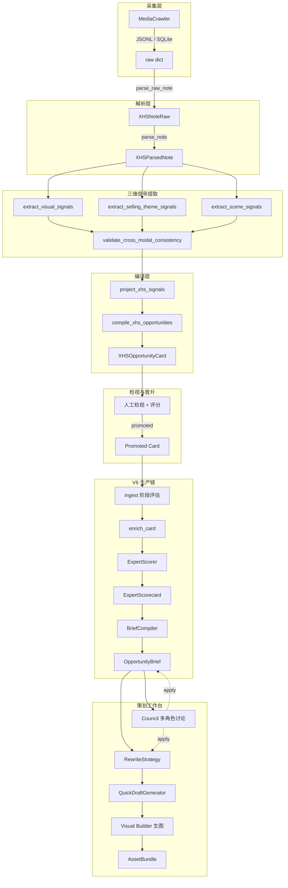
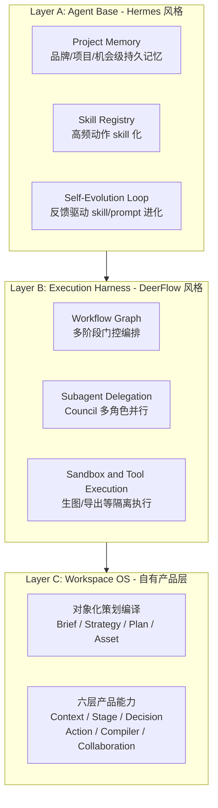
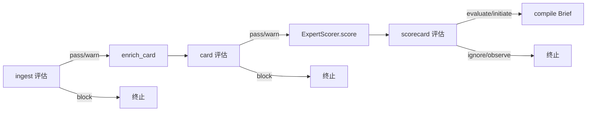
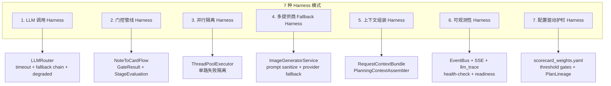
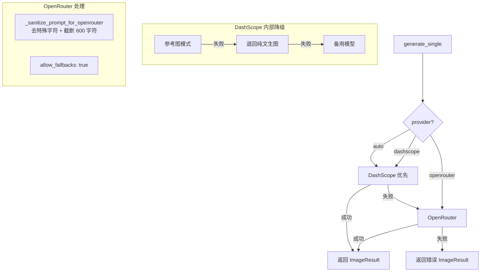
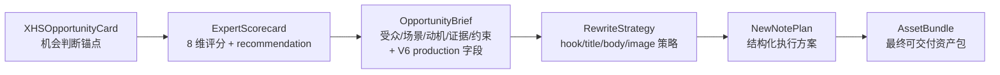

# 小红书内容生产链技术报告

> **从原始笔记到内容策划台：Hermes 基座 + DeerFlow Harness + 对象化编译的三层架构实践**

---

## 第 1 章：定位

我们不是「在页面里塞 Agent 功能」，而是：

**Hermes-style 记忆/技能/自进化基座 + DeerFlow-style 长链路编排 Harness + 自有的对象化策划编译层**

三句话讲清楚分工：

- **Hermes-Agent** 负责「Agent 会不会越用越懂你、越做越会做」
- **DeerFlow** 负责「Agent 能不能把复杂长链路任务稳定跑下来」
- **我们自己的系统** 负责「这些能力最终服务什么对象、什么工作流、什么业务产物」

最终落点是一个**机会驱动的内容策划编译与执行操作系统**。

---

## 第 2 章：端到端数据链路

### 2.1 全链路总览



### 2.2 代码路径索引

| 阶段 | 产物 | 主要代码路径 |
|------|------|-------------|
| 采集 | MediaCrawler JSONL/SQLite | `data/xhs/`，`mediacrawler_loader.load_mediacrawler_records()` |
| 解析 | `XHSNoteRaw` / `XHSParsedNote` | `apps/intel_hub/parsing/xhs_note_parser.py` |
| 三维提取 | 视觉/卖点/场景信号 + 跨模态校验 | `apps/intel_hub/extraction/visual_signals.py`，`selling_theme_signals.py`，`scene_signals.py`，`cross_modal_validator.py` |
| 本体映射 | 信号 -> canonical refs | `apps/intel_hub/projection/xhs_signal_projector.py` |
| 编译 | `XHSOpportunityCard` | `apps/intel_hub/compiler/opportunity_compiler.py` |
| 管线编排 | pipeline_details.json | `apps/intel_hub/workflow/xhs_opportunity_pipeline.py` |
| 检视存储 | promoted / archived | `apps/intel_hub/storage/xhs_review_store.py` |
| V6 门控 | `NoteToCardFlow` -> `GateResult` | `apps/content_planning/services/note_to_card_flow.py` |
| 评分 | `ExpertScorecard`（8 维 + recommendation） | `apps/content_planning/services/expert_scorer.py` |
| Brief 编译 | `OpportunityBrief` | `apps/content_planning/services/brief_compiler.py` |
| 策略 | `RewriteStrategy` | `apps/content_planning/services/strategy_generator.py` |
| Council | 多角色讨论 + 共识 | `apps/content_planning/agents/discussion.py` |
| 快草稿 | quick_draft（标题+正文+图位） | `apps/content_planning/services/quick_draft_generator.py` |
| 生图 | `ImageGeneratorService` + `PromptComposer` | `apps/content_planning/services/image_generator.py`，`prompt_composer.py` |
| Visual Builder | 三栏视觉工作台 | `apps/intel_hub/api/templates/visual_builder.html` |

### 2.3 V6 API 端点一览

| 方法 | 路径 | 作用 |
|------|------|------|
| POST | `/v6/ingest-eval/{id}` | 对原始笔记做 ingest 阶段评估 |
| POST | `/v6/enrich-card/{id}` | 富化 card 的 V6 语义字段 |
| POST | `/v6/score/{id}` | ExpertScorer -> ExpertScorecard |
| GET | `/v6/scorecard/{id}` | 读取最新评分卡 |
| POST | `/v6/compile-brief/{id}` | 编译 OpportunityBrief |
| POST | `/v6/run-pipeline/{id}` | 一键全链路：ingest -> enrich -> score -> brief |
| GET | `/v6/pipeline-status/{id}` | 管线状态查询 |
| POST | `/v6/quick-draft/{id}` | 快速生成笔记草稿 |
| POST | `/v6/image-gen/{id}/preview-prompts` | 预览结构化 prompt |
| POST | `/v6/image-gen/{id}` | 启动批量生图 |
| POST | `/v6/image-gen/{id}/optimize-prompt` | AI 优化图片 prompt |
| GET | `/v6/image-gen/{id}/history` | 生图历史 |
| GET | `/planning/{id}/visual-builder` | 视觉工作台独立页 |

---

## 第 3 章：为什么借鉴 Hermes + DeerFlow

### 3.1 问题诊断：两类短板

| 短板类别 | 典型表现 | 需要的能力 |
|---------|---------|-----------|
| 「记不住、不成长」 | 跨会话记忆断裂；策划偏好每次重来；高频动作无法沉淀为 skill | Hermes：built-in learning loop / skills / persistent knowledge / cross-session user model |
| 「跑不稳、串行慢」 | 多阶段任务不稳定；子任务难拆分和并行；缺乏沙箱执行隔离 | DeerFlow：super-agent harness / sub-agents / sandboxes / LangGraph-based workflow |

### 3.2 为什么两个都要

Hermes 回答的是「会不会越来越懂」——跨会话记忆、技能化沉淀、自进化循环。

DeerFlow 回答的是「能不能跑完跑稳」——长链路编排、子代理委派、沙箱执行、线程级隔离。

两者互补，缺一不可。只有 Hermes 没有编排引擎，Agent 记住了但做不完；只有 DeerFlow 没有记忆基座，任务跑完了但下次又从零开始。

### 3.3 关键设计决策

**D-020：adapter-first + embedded runtime**

业务代码只依赖本地适配层（`apps/content_planning/adapters/*`），不直接耦合第三方框架内部 API。`third_party/hermes-agent/` 作为 git submodule 占位，实际复用的是 Hermes 风格的 SOUL 扫描与截断机制，实现在 `apps/content_planning/agents/soul_context_hermes.py`。

这意味着：上游框架升级时只改 adapter，不扩散到 routes / services / templates。

---

## 第 4 章：三层架构



### 4.1 Layer A: Agent Base（Hermes 风格）

解决「Agent 记不住、不成长、不会技能化」的问题。

- **Project Memory**：不是泛泛聊天记忆，而是项目级记忆——某个 opportunity 的历史判断、某个 brief 的修改轨迹、某个品牌的语气与调性。
- **Skill Substrate**：高频动作沉淀为可调用 skill（如 `generate_brief_from_promoted_opportunity`、`compare_strategy_blocks`），不是每次临时 prompting。
- **Self-Evolution Loop**：把评测、人工反馈、采纳率转成 skill 版本更新、prompt 版本更新、路由策略更新。

### 4.2 Layer B: Execution Harness（DeerFlow 风格）

解决「多阶段任务跑不稳、子任务难拆、执行能力弱」的问题。

- **Workflow Graph**：用门控流水线跑 Opportunity -> Brief -> TemplateMatch -> Strategy -> NotePlan -> AssetBundle。
- **Subagent Delegation**：每个 Workspace 内部可以委派不同子代理（BrandGuardian、GrowthStrategist、CreativeDirector、RiskAssessor、LeadSynthesizer）。
- **Sandbox & Tool Execution**：生成图片、调视觉 Agent、批量导出等走隔离执行路径。

### 4.3 Layer C: Workspace OS（自有产品层）

> 无论 Hermes 还是 DeerFlow，都不能直接替代我们的核心产品层。真正的壁垒是**对象化的策划编译系统**。

围绕 `OpportunityCard -> OpportunityBrief -> RewriteStrategy -> NewNotePlan -> AssetBundle` 这条业务对象链，在四个 Workspace（Opportunity / Planning / Creation / Asset）中落地六层产品能力。

---

## 第 5 章：Hermes 借鉴的具体落地

### 5.1 SOUL 系统

Hermes-Agent 强调 agent 应有持久化的「人格」与「专业知识」。我们将这一思想具体化为 SOUL 文件系统：

**5 个角色 SOUL.md**，存放于 `apps/content_planning/agents/souls/{role_id}/SOUL.md`：

| 角色 | 文件 | 核心定位 |
|------|------|---------|
| brand_guardian | `souls/brand_guardian/SOUL.md` | 品牌一致性与调性合规。品牌资产优先于单次爆款。 |
| growth_strategist | `souls/growth_strategist/SOUL.md` | 增长、转化与平台机制。从漏斗看问题，数据导向。 |
| creative_director | `souls/creative_director/SOUL.md` | 创意叙事与差异化。先找用户停下来的理由。 |
| risk_assessor | `souls/risk_assessor/SOUL.md` | 合规、舆情与不确定性。先识别会不会出事。 |
| lead_synthesizer | `souls/lead_synthesizer/SOUL.md` | 综合共识与结构化提案。忠实反映各方，产出可执行。 |

每个 SOUL.md 定义：核心立场、思维框架、关注重点、评判标准、交流风格。

**加载链路**：

```
SOUL.md 文件 -> SoulLoader.load()
  -> scan_context_content() [注入检测]
  -> truncate_content() [头尾截断, max 12000 chars]
  -> 缓存
  -> 作为 system 消息第一段注入 LLM
```

`SoulLoader`（`apps/content_planning/agents/soul_loader.py`）从文件系统加载，经安全扫描和截断后缓存。SOUL 缺失时有 fallback 兜底文本。

### 5.2 安全扫描（Hermes-style）

直接借鉴 Hermes Agent 的 `agent/prompt_builder.py`。`scan_context_content`（`apps/content_planning/agents/soul_context_hermes.py`）实现：

- **10 种 prompt injection 模式检测**：`ignore previous instructions`、`system prompt override`、`disregard rules`、`bypass restrictions`、HTML 注释注入、隐藏 div、translate-execute、exfil curl、读取 secrets 等
- **10 种不可见 Unicode 字符检测**：零宽空格、零宽非连接符、双向控制字符等
- 发现威胁时返回 `[BLOCKED]` 标记，拒绝加载

`truncate_content` 采用 Hermes 风格的头尾截断策略：保留 65% 头部 + 25% 尾部 + 中间截断标记。

### 5.3 项目级记忆

`AgentMemory`（`apps/content_planning/agents/memory.py`）实现 Hermes 风格的 persistent knowledge：

- **SQLite + FTS5 全文检索**：持久化存储，支持语义搜索
- **`council_memory_block`**：按 `opportunity_id + role + question` 检索相关历史，拼入 LLM 调用的「相关记忆」段
- **`store_project_consensus`**：项目级共识持久化，跨会话可用
- **`inject_context`**：自动上下文注入，角色加权 relevance
- **`nudge` / `process_nudge_response`**：主动提示与响应处理

### 5.4 技能化沉淀

`SkillRegistry`（`apps/content_planning/agents/skill_registry.py`）管理可调用技能：

- **`SkillDefinition`**：包含 `executable_steps`（`SkillStep` -> `tool_name`）和 `workflow_steps`
- **`execute_skill` / `aexecute_skill`**：按步调用 `tool_registry.handle_tool_call`，`$ctx.*` 参数解析；失败则中断并记计数
- **`load_defaults()`**：内置多条技能，含 `full_pipeline`（多步工具链 + `evaluate_stage`）

`PromptComposer`（`apps/content_planning/services/prompt_composer.py`）体现多源融合的技能化思想，优先级从高到低：

1. `image_briefs`（逐槽精细指令）
2. `note_plan.image_plan`（结构化 visual brief）
3. `strategy`（全局策略方向）
4. `brief`（方向性指引）
5. `draft`（基础 prompt）
6. `match_result`（风格锚点）

另有 `apply_user_preferences` 从好评 + 用户编辑历史合并偏好标签（近似 0.5 层优先级）。

---

## 第 6 章：DeerFlow Harness 借鉴的具体落地

### 6.1 多阶段门控流水线

`NoteToCardFlow`（`apps/content_planning/services/note_to_card_flow.py`）实现 DeerFlow 风格的门控编排：



- **`GateResult`**：`status` 为 `pass|warn|block`，附 `StageEvaluation` 和 `suggestions`
- **阈值**：`overall_score < 0.25` -> block；`< 0.45` -> warn
- **`/v6/run-pipeline`** 一键串联所有阶段，内部按顺序执行

### 6.2 Council 多角色并行（Sub-agent Delegation）

`DiscussionOrchestrator`（`apps/content_planning/agents/discussion.py`）实现 DeerFlow 的子代理委派模式：

- **`STAGE_DISCUSSION_ROLES`**：按 `brief|strategy|plan|asset` 阶段自动选角色
- **`ThreadPoolExecutor`** 并行收集 4 个专家意见，`as_completed` 收集
- **两轮制**：第一轮独立判断；可选第二轮阅读他人观点后修正/反驳/补充
- **`lead_synthesizer`** 读所有发言后产出 JSON 结构化共识（agreements / disagreements / proposed_updates / recommended_next_steps）
- **`reconcile_council_decision_type` / `compute_applyability`**：决定共识能否自动 apply 到 Brief/Strategy

Council 的完整流程：

```
用户提问 -> 阶段选角色 -> 并行专家第一轮
  -> [可选] 专家第二轮
  -> lead_synthesizer 合成共识
  -> reconcile decision type
  -> 返回结构化 proposal
  -> [可选] apply 到 Brief/Strategy
```

### 6.3 顺序可写 rollout（D-021）

借鉴 DeerFlow 的线程级隔离思想，四阶段共用一套 `task/run/discussion/proposal/evaluation` 底座，但按顺序开放写权限：

- Brief 首先开放 apply
- Strategy / Plan / Asset 逐步开放
- 每个阶段开放前需前一阶段通过：持久化 / partial apply / stale propagation / comparison gate
- 避免 `Brief -> Strategy -> Plan -> Asset` 一次性全可写导致版本失控

---

## 第 7 章：Harness Engineering 在系统中的全面应用

> **Harness 的本质**：不是让 Agent 自己裸跑，而是为每一次 AI 调用包上「编排层 + 护栏 + 降级路径 + 可观测」，让系统在 LLM 不稳定、多提供商、多阶段复杂任务下仍然可控、可追溯、可恢复。

我们在系统中识别并落地了 **7 种 Harness 模式**，覆盖从单次 LLM 调用到端到端管线的每一层。



### 7.1 LLM 调用 Harness（最底层包裹）

**代码位置**：`apps/content_planning/adapters/llm_router.py`

每一次 LLM 调用都经过统一的 harness 包裹，这是整个系统最底层的安全网：

**超时控制**

- `LLM_TIMEOUT_SECONDS`（默认 90s）：常规调用上限
- `LLM_FAST_MODE_TIMEOUT_SECONDS`（默认 2s）：快速模式上限
- 实现：`_call_with_timeout` 将同步 `prov.chat` 放进 `ThreadPoolExecutor` 单线程池，`FuturesTimeoutError` 触发降级
- 异步路径：`asyncio.wait_for` + 超时捕获

**Fallback Chain**

- `LLM_FALLBACK_CHAIN`：`openai,dashscope,anthropic`
- `_resolve_provider` 按链逐一尝试，首个可用即用

**Degraded Response 语义**

`LLMResponse.degraded` 为 `True` 时，`degraded_reason` 标明原因：

| 原因 | 含义 |
|------|------|
| `timeout` | LLM 调用超时 |
| `no_provider` | 所有 provider 均不可用 |
| `empty_response` | LLM 返回空内容且无 tool_calls |

`chat_json` 在 degraded 时返回 `{}`，调用方统一走规则路径。

**典型消费方的降级链路**：

```
LLMRouter.chat() 返回 degraded
  -> QuickDraftGenerator._rule_fallback(brief, card)
  -> CouncilAgentRunner: rule_based_fallback 回调
  -> StageEvaluator._rule_based_scores()
  -> quality_explainer: raise RuntimeError("llm_degraded")
```

### 7.2 门控管线 Harness（阶段级编排）

**代码位置**：`apps/content_planning/services/note_to_card_flow.py`，`apps/content_planning/services/opportunity_to_plan_flow.py`

**GateResult 模型**：

```
status: pass | warn | block
evaluation: StageEvaluation (多维度评分)
suggestions: 优化建议列表
```

每个管线阶段有明确的 gate 判定：

- `ingest` 评估：`overall_score < 0.25` -> block；`< 0.45` -> warn；否则 pass
- `card` 评估：同逻辑
- `scorecard` -> `recommendation`：`ignore|observe|evaluate|initiate`，只有 `evaluate/initiate` 才继续

**`_handle_flow_error` 装饰器**：统一将业务异常映射为 HTTP 状态码：

| 异常 | HTTP 状态码 |
|------|------------|
| `OpportunityNotPromotedError` | 403 |
| `StageApplyConflictError` | 409（附 stale_flags） |
| `ValueError` | 404 |
| 其它 | 500 |

**`OpportunityToPlanFlow` 的 harness 行为**：

- 会话状态 + `pipeline_run_id` + `stale_flags`：下游失效与版本冲突检测
- `emit_object_updated`：对象级可观测（对接 SSE 总线）
- `_evaluate_compilation`：多 stage 调 `evaluate_stage`，记录 `degraded_stages`

### 7.3 并行隔离 Harness（子任务不互相拖死）

**核心原则**：任何单路失败都不能拖死整个流程。

**Council 专家并行**（`discussion.py`）

```
ThreadPoolExecutor(max_workers = min(len(participants), 4))
  -> futures = [pool.submit(_run_one, role) for role in participants]
  -> as_completed(futures) 逐个收集
  -> 单个超时/失败 -> 记入 failed_participants
  -> 合成阶段仍可使用已收集的意见
```

**三路生成并行**（`opportunity_to_plan_flow.py`）

```
ThreadPoolExecutor(max_workers=3)
  -> title_future = pool.submit(_gen_titles)
  -> body_future = pool.submit(_gen_body)
  -> image_future = pool.submit(_gen_images)
  -> 各 future.result(timeout=60)
  -> 失败记入 _generation_errors，其它正常产出
```

**LLM 超时隔离**（`llm_router.py`）

`_call_with_timeout` 把同步 `prov.chat` 放进单线程池，超时返回 degraded 而非阻塞调用方。

### 7.4 多提供商 Fallback Harness（生图链路）

**代码位置**：`apps/content_planning/services/image_generator.py`

生图是最典型的 harness 场景——外部 API 不稳定、内容策略差异大、单次调用耗时长。



- **输入净化**：`_sanitize_prompt_for_openrouter` 去特殊字符、截断 600 字符，降低 ToS 误判
- **DashScope 链式降级**：参考图模式失败 -> 退回纯文生图 -> 主模型非 200 -> 备用 `_DASHSCOPE_FALLBACK_MODEL`
- **OpenRouter 上游 fallback**：`extra_body={"provider": {"allow_fallbacks": True}}` 允许 OpenRouter 侧再切模型
- **轮询 deadline**：DashScope 异步任务轮询最长 120s，超时返回结构化错误
- **可追溯**：`ImageResult` 包含 `prompt_sent`、`ref_image_sent`、`provider`、`elapsed_ms`

### 7.5 上下文组装 Harness（一次组装、全链路复用）

**代码位置**：`apps/content_planning/agents/base.py`（`RequestContextBundle`），`apps/content_planning/agents/context_assembler.py`（`PlanningContextAssembler`）

**问题**：同一次请求中，run-agent / chat / council 都需要 card + source_notes + memory + council 快照，如果每个调用点各自组装，既重复计算又容易不一致。

**解法**：

- **`RequestContextBundle`**：同一次 API 请求内预装配所有上下文
- **`PlanningContextAssembler.assemble`**：统一组装 `planning_context`，写入 `AgentContext.extra`
- **`council_memory_block`**：按 `opportunity_id + role + question` 检索相关历史记忆
- 下游直接读 bundle，不重算

**路由层一次性组装**：

```
_build_request_context_bundle(opportunity_id)
  -> _build_agent_context_from_bundle(bundle)
  -> AgentContext.extra["planning_context"] = assembled
  -> 传给 run-agent / chat / council 统一使用
```

### 7.6 可观测性 Harness（SSE + Trace + 健康检查）

**代码位置**：`apps/content_planning/gateway/event_bus.py`，`apps/content_planning/gateway/sse_handler.py`，`apps/intel_hub/api/templates/visual_builder.html`

**EventBus 实时事件**

- `subscribe`/`publish`/`publish_sync`（跨线程 `call_soon_threadsafe`）
- 历史 ring buffer（最近 50 条），SSE 连接时先发最后 20 条
- 心跳 15s，断开自动 `unsubscribe`

**SSE 事件类型**

Council 使用 10 类标准事件：`council_session_started` / `council_participant_joined` / `council_opinion_received` / `council_synthesis_started` / `council_proposal_ready` / `council_session_completed` / `council_session_failed` 等。

生图使用：`image_gen_progress` / `image_gen_complete`。

**`llm_trace` 结构化追踪**

所有 LLM 驱动的操作都返回 `llm_trace` 对象：

```
{
  "operation": "quick_draft | optimize_prompt | image_gen",
  "model": "qwen-max | ...",
  "input_messages": [{"role": "system", "content": "..."}],
  "output_raw": "...",
  "latency_ms": 1200,
  "status": "success | error | degraded | parse_error",
  "error": "..."
}
```

Visual Builder 底部浮动日志面板实时渲染所有 trace 条目。

**health-check / readiness**

- `HealthChecker`：按 stage 检查 Brief/Strategy/Plan/Asset 完整性 -> `score + is_healthy + next_best_action_type`
- `OpportunityReadinessChecker`：加权算 `readiness_score` -> `is_ready` 阈值 -> `ActionSpec`（补证据 / Council / 进入 Brief）

### 7.7 配置驱动护栏 Harness（阈值可调，不改代码）

**代码位置**：`config/scorecard_weights.yaml`，`apps/content_planning/services/expert_scorer.py`

**评分权重外置**

```yaml
# config/scorecard_weights.yaml（结构示意）
dimensions:
  content_value:  { weight: 0.20, label: "内容价值" }
  audience_fit:   { weight: 0.15, label: "受众匹配" }
  visual_quality: { weight: 0.15, label: "视觉质量" }
  ...
risk_score: { inverse: true }
recommendation_thresholds:
  initiate: 0.75
  evaluate: 0.55
  observe:  0.35
```

- 8 维度权重 + `risk_score.inverse` + 推荐阈值 + 置信度权重全部在 YAML
- 变更阈值直接改变「是否推进/忽略/观察」，无需改业务分支代码
- `ExpertScorer._load_config()` 启动时加载并缓存

**stage evaluator 双通道**

- 优先 LLM 评估
- LLM 失败 -> `_rule_based_scores()`，标记 `evaluator="rule"`
- 前端可据此区分展示（LLM 判断 vs 规则判断）

**lineage 追溯**

`PlanLineage`（`apps/content_planning/schemas/lineage.py`）记录全链路产物溯源：

- `pipeline_run_id`：本次执行标识
- `source_note_ids`：原始笔记来源
- `opportunity_id` / `brief_id` / `strategy_id` / `plan_id`：各阶段产物关联
- `parent_version_id` / `derived_from_id`：版本衍生链

### Harness 模式总览表

| 模式 | 核心机制 | 代码位置 |
|------|---------|---------|
| 1. LLM 调用 Harness | timeout + fallback chain + degraded response | `llm_router.py` |
| 2. 门控管线 Harness | GateResult(pass/warn/block) + 阶段评估 + 异常映射 | `note_to_card_flow.py`，`_handle_flow_error` |
| 3. 并行隔离 Harness | ThreadPoolExecutor + 单路失败不拖死 | `discussion.py`，`opportunity_to_plan_flow.py` |
| 4. 多提供商 Fallback | 净化 + 链式降级 + deadline + 上游 fallback | `image_generator.py` |
| 5. 上下文组装 Harness | RequestContextBundle + 一次组装全链路复用 | `base.py`，`context_assembler.py` |
| 6. 可观测性 Harness | EventBus + SSE + llm_trace + health-check | `event_bus.py`，`sse_handler.py` |
| 7. 配置驱动护栏 | YAML 阈值 + lineage 追溯 + 双通道评估 | `scorecard_weights.yaml`，`PlanLineage` |

---

## 第 8 章：自有产品层 — 对象化策划编译系统

> 「真正的产品壁垒仍然是你们自己的对象化策划编译系统。」

### 8.1 核心业务对象链



| 对象 | Schema 位置 | 核心字段 |
|------|------------|---------|
| `XHSOpportunityCard` | `apps/intel_hub/schemas/opportunity.py` | source_note_ids, audience, scene, pain_point, hook, selling_points, card_status |
| `ExpertScorecard` | `apps/content_planning/schemas/expert_scorecard.py` | 8 dimensions, total_score, recommendation(ignore/observe/evaluate/initiate) |
| `OpportunityBrief` | `apps/content_planning/schemas/opportunity_brief.py` | target_user, target_scene, content_goal, visual_direction, title_directions, production_readiness_status |
| `RewriteStrategy` | `apps/content_planning/schemas/rewrite_strategy.py` | positioning_statement, hook_strategy, title_strategy, body_strategy, image_strategy |
| `NewNotePlan` | `apps/content_planning/schemas/note_plan.py` | titles, body_outline, image_slots, tags, publish_suggestions |
| `AssetBundle` | `apps/content_planning/schemas/asset_bundle.py` | titles, body, images, variants, export_package |

### 8.2 六层产品能力

| 能力层 | 含义 | 落地示例 |
|--------|------|---------|
| Context OS | 当前对象 + 来源 + 历史 + 相似案例 | RequestContextBundle, council_memory_block |
| Stage OS | 就绪度、完整度、阻塞项、下一步 | readiness, health-check, GateResult |
| Decision OS | 结构化分歧求解 | Council 多角色讨论 + reconcile + apply |
| Action OS | promote / archive / generate / lock / rematch | ActionSpec, SkillRegistry.execute_skill |
| Compiler OS | Brief -> Strategy -> Plan -> Asset 编译 | BriefCompiler, OpportunityToPlanFlow |
| Collaboration OS | AI 与人共创 | Visual Builder, Plan Board, inline edit |

### 8.3 四个 Workspace 的映射

| Workspace | 页面定位 | 核心对象 | 主要 Harness |
|-----------|---------|---------|-------------|
| Opportunity | 机会判断工作台 | OpportunityCard | 门控管线, 评分护栏 |
| Planning | 内容策划工作台 | Brief, Strategy | Council 并行, 上下文组装 |
| Creation | 创作与细化工作台 | NewNotePlan | 并行隔离, Visual Builder |
| Asset | 资产生产与交付 | AssetBundle | 多提供商 Fallback, lineage |

---

## 第 9 章：成果与下一步

### 9.1 已完成

**端到端链路可运行**
- 原始小红书笔记 -> 三维信号提取 -> 机会卡编译 -> 人工检视晋升 -> V6 门控评分 -> Brief 编译 -> Council 讨论 -> 快草稿 -> 生图预览 -> 资产包

**Hermes 基座落地**
- 5 个 SOUL.md 角色定义
- Hermes-style 安全扫描 + 头尾截断
- 项目级 AgentMemory（SQLite + FTS5）
- SkillRegistry 技能化管理

**DeerFlow Harness 落地**
- NoteToCardFlow 门控流水线
- Council 多角色并行 + 两轮制 + lead_synthesizer 合成
- 顺序可写 rollout（Brief 优先）

**7 种 Harness 模式全覆盖**
- LLM 调用 Harness / 门控管线 / 并行隔离 / 多提供商 Fallback / 上下文组装 / 可观测性 / 配置驱动护栏

**产品工作台**
- Visual Builder 独立页三栏布局 + 浮动日志面板
- 性能控制层（D-026）：Session-first / Fast-Deep / 并行 Council / 超时降级

### 9.2 下一步

| 方向 | 具体内容 | 对应层 |
|------|---------|--------|
| Visual DSL | PromptComposer 升级为结构化 `ImageSpec` + 双层表示（内部真相层 + 模型渲染层） | Layer C |
| Self-Evolution | publish feedback -> skill/prompt 版本更新 -> 路由策略更新 | Layer A |
| Plan Board | Creation Workspace 的对象化共创画布 | Layer C |
| B2B 多租户 | workspace_id / brand_id / campaign_id 隔离 | Layer C |
| Graph Executor | 从顺序管线升级为 LangGraph-style DAG 执行 | Layer B |
| Sandbox Provisioner | 生图/导出等重任务走独立 sandbox pod | Layer B |

### 9.3 关键设计决策索引

| 决策编号 | 标题 | 核心内容 |
|---------|------|---------|
| D-020 | DeerFlow/Hermes adapter-first | 业务只依赖本地适配层，不直接耦合第三方 |
| D-021 | 顺序可写 rollout | 四阶段共用底座，Brief 首先开放 apply |
| D-022 | 评价持久化 | baseline / stage_run / comparison 落库 |
| D-023 | Strategy 评分 strategy_v2 | 与旧四维历史隔离 |
| D-026 | 性能控制层 | Session-first / Fast-Deep / 并行 Council / 超时降级 |
| D-017 | Council v2 | HTTP 四段 + 10 类 SSE + 向后兼容 |

---

*报告生成时间：2026-04-12*
*代码库版本：基于当前工作区最新提交*
