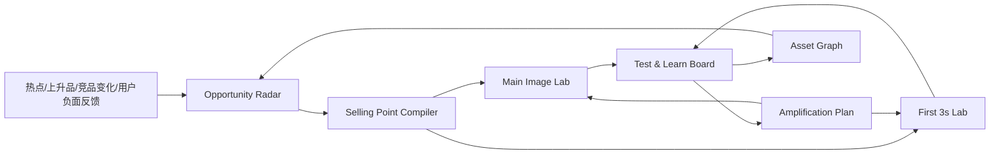
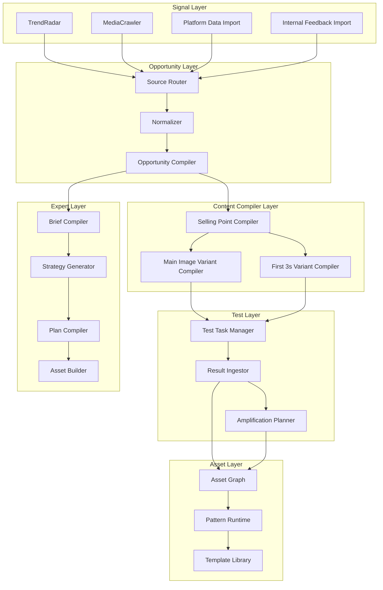

# 《热点驱动的主图/前3秒裂变与测款放大系统》PRD + 架构设计（可直接 AI-coding 开工）

> 适用对象：当前「本体大脑情报中枢 V0.8+」升级版
> 目标客户：天空树 / 众唯这类以热点跟进、主图裂变、前3秒裂变、多店多链接测款为核心打法的品牌客户
> 文档用途：产品设计、技术架构、页面骨架、对象模型、模块拆分、AI-coding 开工基准

---

## 1. 背景与升级结论

### 1.1 当前产品现状（As-Is）

当前系统已经具备较强的底座能力：

* 多平台情报采集与归一
* 机会卡/风险卡编译
* Brief → Strategy → Plan → AssetBundle 四阶段内容策划编译
* Visual Builder 生图工作台
* Council 多角色协同
* Agent Pipeline / Skill Registry / Memory / SSE 可观测性

当前系统的主对象链为：

`OpportunityCard -> Brief -> Strategy -> Plan -> AssetBundle`

这条链路适合“机会驱动的内容策划编译”，但与天空树的高频业务主链不完全一致。现有产品 PRD 已明确系统更偏机会发现、四阶段策划编译、视觉生成与协同，而尚未实现 Plan Board、强测试板、结果回流到资产层等关键能力。来源：现有产品功能 PRD。fileciteturn6file2L1-L39 fileciteturn6file2L160-L233

### 1.2 天空树访谈反映的真实客户主链

天空树的真实工作流不是重策划驱动，而是：

`热点捕捉 -> 卖点同步 -> 主图/前3秒裂变 -> 多店多链接测款 -> 看点击率/退款率 -> 放大/再裂变 -> 资产复用`

访谈中明确提到：

* 核心卡点在热点抓取时效，不在生产速度。
* 内容端大量依赖过往爆款裂变，尤其是前3秒混剪。
* 主图优化裂变与行业爆款裂变是最希望 AI 共创的方向。
* 当前裂变以人工为主，没有流程化与工具化。
* 测款会先小规模上架，看退款率，再扩大规模，再主推。
* 素材大量沉淀在网盘、硬盘、飞书多维表等，缺少统一资产语义层。
### 1.3 升级方向

因此本次升级不是推翻现有系统，而是将其前台产品主链从：

`OpportunityCard -> Brief -> Strategy -> Plan -> AssetBundle`

升级为：

`TrendSignal -> Opportunity -> SellingPointSpec -> VariantSpec -> TestTask -> ResultSnapshot -> AmplificationPlan -> AssetGraph`

产品定位从：

* AI-native 机会驱动的内容策划编译与执行操作系统

升级为：

* **热点驱动的主图/前3秒裂变与测款放大操作系统**
* **Trend-to-Test Content OS**

一句话定义：
**把外部热点、上升品、行业爆款和客户内部爆款资产，持续编译为可测试的主图/前3秒版本，并通过测试结果驱动放大与资产沉淀。**

---

## 2. 产品目标与设计原则

### 2.1 产品目标

本次升级目标分为四层：

1. **更快发现机会**

   * 让热点、上升品、竞品变化、跨域灵感进入统一机会池。

2. **更快把机会编译成卖点与裂变版本**

   * 让运营可直接把热点转成主图和前3秒可执行版本。

3. **更快组织测试与放大**

   * 让版本直接进入测试板，形成停/放大/再裂变动作。

4. **更快形成可复用资产**

   * 让高表现素材、高表现卖点、高表现钩子沉淀为可检索、可复用资产。

### 2.2 设计原则

#### 原则 A：AI-native，但前台极简

前台只暴露客户高频动作，不让客户先看 Brief/Strategy/Plan 这些内部对象。

前台四个一级动作：

* 看机会
* 编卖点
* 出裂变
* 看结果

#### 原则 B：对象化而不是聊天化

系统的核心不是聊天，而是对象编译：

* 机会对象
* 卖点对象
* 版本对象
* 测试对象
* 资产对象

#### 原则 C：先服务高频裂变，再扩展重策划

先命中天空树当前最高频场景：

* 主图裂变
* 前3秒裂变
* 热点跟进
* 测款放大

#### 原则 D：策划层保留，但下沉为专家模式

原有 Brief/Strategy/Plan/Asset 不删，保留给专家模式和高级用户；前台默认不让客户进入复杂对象链。

#### 原则 E：先轻数据闭环，再重平台打通

先接主图测试结果、短视频引流结果、退款率等轻量业务结果，不先做全量 ERP/BI 大一统。

---

## 3. 用户角色与核心任务

### 3.1 角色

1. 运营负责人
2. 视觉/内容负责人
3. 短视频团队负责人
4. 美工组长
5. 数据/IT 支撑人员
6. 老板/总监（看结果与方向）

### 3.2 核心任务

#### 运营负责人

* 看热点和上升品
* 选择值得跟进的机会
* 编译卖点方向
* 组织多店多版本测试

#### 视觉/内容负责人

* 用卖点生成主图裂变版本
* 用爆款视频生成前3秒裂变版本
* 组织素材生产与版本管理

#### 数据/IT

* 接基础结果数据
* 做测试状态回流
* 支持资产索引和标签管理

#### 老板/总监

* 看哪些机会值得跟
* 看哪些版本值得放大
* 看哪些打法沉淀成模板

---

## 4. 目标业务链路（To-Be）

### 4.1 工业级生成链路



### 4.2 旧链路与新链路映射关系

* `OpportunityCard` 继续保留，作为新链路里的 `Opportunity`
* `Brief/Strategy/Plan/AssetBundle` 继续保留，但作为：

  * 专家模式深编译层
  * 对某些高价值机会做重策划时调用
* `Visual Builder` 升级成：

  * `Main Image Lab`
  * `First 3s Lab`

---

## 5. 信息架构与页面骨架

本次升级后，默认前台 IA 收敛为 4 个一级页面 + 1 个资产页 + 1 个专家页。

---

### 5.1 Page A：Radar（机会雷达）

#### 页面定位

统一承接热点、上升品、竞品变化、跨域灵感、客户内部爆款反馈。

#### 页面目标

把“信息流”变成“可进入编译的机会池”。

#### 页面布局

* 顶部：时间窗口 / 平台 / 类目 / 人群 / 场景筛选
* 左侧：信号源选择

  * 热点流
  * 上升品流
  * 竞品变化流
  * 内部爆款反馈流
  * 跨域灵感流
* 中间：机会卡列表
* 右侧：机会详情与推荐动作

#### 卡片字段

* 标题
* 来源平台
* 来源类型
* 热度/新鲜度
* 涉及人群
* 涉及场景
* 可建议动作（开品 / 卖点升级 / 主图裂变 / 前3秒裂变 / 标品打法分析）
* 推荐优先级

#### 主要动作

* 收藏机会
* 晋升机会
* 发送到卖点编译器
* 关联现有爆款素材

#### MVP API

* `GET /radar/opportunities`
* `GET /radar/opportunities/{id}`
* `POST /radar/opportunities/{id}/promote`
* `POST /radar/opportunities/{id}/send-to-compiler`

---

### 5.2 Page B：Compiler（卖点编译器）

#### 页面定位

把机会对象编译成“可在平台上表达”的卖点对象。

#### 页面布局

* 左栏：来源机会 / 竞品素材 / 用户反馈 / 平台数据摘要
* 中栏：卖点编译工作区
* 右栏：平台表达映射（货架 / 抖音 / 小红书 / 口播）

#### 中栏模块

* 核心卖点
* 支撑卖点
* 风险点
* 适配人群
* 适配场景
* 竞品差异化

#### 右栏输出模块

* 主图表达版
* 前3秒表达版
* 口播表达版
* 标品打法表达版

#### 页面产出对象

* `SellingPointSpec`
* `PlatformExpressionSpec`

#### 主要动作

* 一键生成主图裂变方向
* 一键生成前三秒裂变方向
* 存为模板
* 发送到 Variant Lab

#### MVP API

* `POST /compiler/selling-point-specs`
* `GET /compiler/selling-point-specs/{id}`
* `PUT /compiler/selling-point-specs/{id}`
* `POST /compiler/selling-point-specs/{id}/to-main-image-lab`
* `POST /compiler/selling-point-specs/{id}/to-first3s-lab`

---

### 5.3 Page C：Lab（裂变实验室）

分为两个 tab：

* Main Image Lab
* First 3s Lab

#### C1. Main Image Lab

##### 页面定位

围绕主图做拆解、变量控制、版本生成、测试计划。

##### 页面布局

* 左栏：输入与参考

  * 原主图
  * 同行主图
  * 商品信息
  * 卖点对象
* 中栏：裂变变量控制面板
* 右栏：版本候选与测试建议

##### 裂变变量

* 模特 / 脸型 / 发色
* 构图 / 远近景 / 发缝细节
* 场景 / 背景
* 字卡利益点
* 色彩风格
* 强刺激 vs 稳定转化风格

##### 输出对象

* `MainImagePattern`
* `MainImageVariant`
* `MainImageTestPlan`

##### 关键动作

* 生成 N 个版本
* 锁定变量
* 批量导出测试图
* 创建测试任务

#### C2. First 3s Lab

##### 页面定位

围绕前3秒做爆款拆解、钩子编译、混剪计划和口播脚本生成。

##### 页面布局

* 左栏：输入与参考

  * 爆款视频片段
  * 现有高表现素材
  * 卖点对象
* 中栏：钩子结构拆解
* 右栏：前3秒候选版本与混剪计划

##### 核心拆解维度

* 钩子类型
* 冲突类型
* 视觉反差
* 文案开头句型
* 适配平台
* AI/实拍/混剪适配度

##### 输出对象

* `HookPattern`
* `First3sVariant`
* `HookScript`
* `ClipAssemblyPlan`

##### 关键动作

* 生成前3秒脚本
* 提取口播开头句
* 生成混剪版本计划
* 创建测试任务

#### MVP API

* `POST /lab/main-image/variants`
* `POST /lab/first3s/variants`
* `GET /lab/main-image/variants/{id}`
* `GET /lab/first3s/variants/{id}`
* `POST /lab/main-image/variants/{id}/create-test-task`
* `POST /lab/first3s/variants/{id}/create-test-task`

---

### 5.4 Page D：Board（测试放大板）

#### 页面定位

管理版本测试、结果回流、停/放大/再裂变。

#### 页面布局

* 顶部：按平台 / 店铺 / SKU / 时间窗筛选
* 左侧：测试任务队列
* 中间：结果面板
* 右侧：下一步动作建议

#### 列表字段

* 版本类型（主图 / 前3秒）
* 版本编号
* 平台
* 店铺
* SKU / 链接
* 上线时间
* 观察周期
* 当前状态

#### 结果字段

* CTR
* 引流量
* 收藏加购
* 退款率
* 评论信号
* 对比基线提升

#### 下一步动作

* 停止
* 继续观察
* 放大
* 再裂变
* 跨平台迁移

#### 输出对象

* `TestTask`
* `ResultSnapshot`
* `AmplificationPlan`

#### MVP API

* `GET /board/test-tasks`
* `GET /board/test-tasks/{id}`
* `POST /board/test-tasks/{id}/result-snapshots`
* `POST /board/test-tasks/{id}/amplify`
* `POST /board/test-tasks/{id}/re-variant`

---

### 5.5 Page E：Asset Graph（资产图谱）

#### 页面定位

把素材资产、卖点资产、钩子资产、结果资产统一沉淀为可检索、可复用图谱。

#### 页面布局

* 顶部搜索栏：按平台 / 场景 / 卖点 / 人群 / 结果标签 搜索
* 左侧：资产类型切换
* 中间：资产卡片瀑布/表格
* 右侧：资产详情

#### 资产类型

* 主图模板
* 前3秒钩子
* 爆款片段
* 卖点模板
* 高表现版本
* 失败案例

#### 资产详情字段

* 来源机会
* 来源卖点
* 来源版本
* 结果表现
* 最适合的平台
* 最适合的人群/场景
* 复用方向建议

#### 输出对象

* `AssetPerformanceCard`
* `PatternTemplate`
* `ReuseRecommendation`

#### MVP API

* `GET /assets/search`
* `GET /assets/{id}`
* `POST /assets/{id}/tag`
* `POST /assets/{id}/save-as-template`

---

### 5.6 Expert Workspace（专家模式，保留原四阶段编译）

#### 页面定位

保留原有 `Brief -> Strategy -> Plan -> Asset` 深编译能力。

#### 用途

* 对高价值机会做完整重策划
* 让高级用户继续使用原系统能力
* 让未来从“裂变系统”向“品牌经营 OS”延展仍有连续性

#### 改造原则

* 原页面可保留
* 从默认导航中降级
* 在 Opportunity/Compiler/Lab/Board 中以“进入专家模式”方式打开

---

## 6. 对象模型（升级版）

本次升级重点新增轻量对象，而不是扩充更多抽象层。

### 6.1 新核心对象

#### 1. TrendOpportunity

```yaml
object_type: TrendOpportunity
fields:
  - opportunity_id
  - title
  - source_platform
  - source_type   # trend / rising_product / competitor_shift / cross_domain_idea
  - freshness_score
  - relevance_score
  - linked_topics
  - linked_people
  - linked_scenarios
  - suggested_actions
  - evidence_refs
  - status
```

#### 2. SellingPointSpec

```yaml
object_type: SellingPointSpec
fields:
  - spec_id
  - source_opportunity_ids
  - core_claim
  - supporting_claims
  - target_people
  - target_scenarios
  - differentiation_notes
  - shelf_expression
  - first3s_expression
  - spoken_expression
  - risk_notes
  - confidence_score
  - status
```

#### 3. MainImageVariant

```yaml
object_type: MainImageVariant
fields:
  - variant_id
  - source_selling_point_id
  - source_asset_ids
  - platform
  - sku_id
  - key_variables
  - image_prompt_spec
  - visual_pattern_refs
  - expected_goal
  - status
```

#### 4. First3sVariant

```yaml
object_type: First3sVariant
fields:
  - variant_id
  - source_selling_point_id
  - source_video_ids
  - platform
  - key_hook_type
  - key_conflict_type
  - hook_script
  - clip_assembly_plan
  - pattern_refs
  - expected_goal
  - status
```

#### 5. TestTask

```yaml
object_type: TestTask
fields:
  - task_id
  - source_variant_id
  - variant_type
  - platform
  - store_id
  - link_id
  - sku_id
  - test_window
  - metrics_to_watch
  - baseline_refs
  - decision_rule
  - owner
  - status
```

#### 6. ResultSnapshot

```yaml
object_type: ResultSnapshot
fields:
  - snapshot_id
  - task_id
  - date
  - ctr
  - traffic
  - conversion
  - refund_rate
  - save_rate
  - comments_signal
  - overall_result
  - notes
```

#### 7. AmplificationPlan

```yaml
object_type: AmplificationPlan
fields:
  - plan_id
  - based_on_task_id
  - amplification_type   # original_link_scale / same_product_variant / cross_platform_migration / new_hook_variant
  - recommended_actions
  - next_variants
  - priority
  - expected_risk
  - status
```

#### 8. AssetPerformanceCard

```yaml
object_type: AssetPerformanceCard
fields:
  - asset_id
  - asset_type
  - source_platform
  - linked_selling_points
  - linked_patterns
  - linked_scenarios
  - best_metrics
  - usage_count
  - reusable
  - reuse_directions
  - status
```

### 6.2 旧对象保留方式

* `OpportunityCard`：并入 `TrendOpportunity` 或作为其父类
* `Brief/Strategy/Plan/AssetBundle`：保留到 Expert Workspace
* `Visual Builder`：演进为 Main Image Lab + First 3s Lab 的底层生成器

### 6.3 关键关系

```text
TrendOpportunity -> SellingPointSpec
SellingPointSpec -> MainImageVariant
SellingPointSpec -> First3sVariant
MainImageVariant -> TestTask
First3sVariant -> TestTask
TestTask -> ResultSnapshot
ResultSnapshot -> AmplificationPlan
ResultSnapshot -> AssetPerformanceCard
AssetPerformanceCard -> PatternTemplate
```

---

## 7. 核心编译链设计

### 7.1 编译阶段拆分

#### Stage 1：Signal Ingest

输入：

* 社媒热点
* 上升品
* 内部爆款与负面反馈
* 竞品素材

输出：

* RawSignal
* TrendOpportunity

#### Stage 2：Selling Point Compile

输入：

* TrendOpportunity
* 用户反馈
* 竞品表达
* 平台偏好

输出：

* SellingPointSpec

#### Stage 3A：Main Image Variant Compile

输出：

* MainImageVariant[]

#### Stage 3B：First 3s Variant Compile

输出：

* First3sVariant[]

#### Stage 4：Test Task Compile

输出：

* TestTask[]

#### Stage 5：Result Ingest

输出：

* ResultSnapshot[]

#### Stage 6：Amplification / Asset Compile

输出：

* AmplificationPlan
* AssetPerformanceCard
* PatternTemplate

### 7.2 与原编译链的关系

当机会价值很高、客户希望做完整策划时，可以进入专家模式：

`TrendOpportunity -> Brief -> Strategy -> Plan -> AssetBundle`

换句话说：

* 默认路径：轻编译，服务高频裂变
* 高级路径：深编译，服务品牌级重策划

---

## 8. 技术架构设计

### 8.1 总体架构



### 8.2 服务拆分建议

#### Service 1：intel_service

负责：

* 趋势采集接入
* 机会编译
* 机会池查询

可复用现有：

* TrendRadar
* MediaCrawler
* SourceRouter
* OpportunityCard compiler

#### Service 2：selling_point_service

负责：

* 卖点编译
* 平台表达映射
* 卖点模板管理

新增核心服务。

#### Service 3：variant_service

负责：

* 主图裂变生成
* 前3秒裂变生成
* pattern retrieval
* 生成历史与版本管理

在现有 Visual Builder 基础上改造。

#### Service 4：test_service

负责：

* 测试任务创建
* 状态管理
* 结果录入/回流
* 放大建议生成

新增核心服务。

#### Service 5：asset_service

负责：

* 资产图谱
* 模板库
* 资产结果绑定
* 可复用推荐

从现有 Asset Workspace 升级。

#### Service 6：expert_planning_service

负责：

* 继续运行原 Brief/Strategy/Plan/Asset 链

保留原有服务即可。

### 8.3 存储建议

#### 关系型数据库（建议 Postgres，MVP 可继续 SQLite）

表建议：

* trend_opportunities
* selling_point_specs
* main_image_variants
* first3s_variants
* test_tasks
* result_snapshots
* amplification_plans
* asset_performance_cards
* pattern_templates

#### 对象存储

* 主图素材
* 视频片段
* 版本输出
* 结果快照截图

#### 向量/检索层（MVP 可先 FTS）

* 爆款素材检索
* 钩子模板检索
* 卖点语义检索

### 8.4 运行架构建议

* 重任务（主图批量生成、视频片段裁切）走异步 worker
* 前台任务走 API + SSE
* 模式库与资产图谱走缓存层
* 版本生成任务支持重试、取消、从节点重跑

---

## 9. 重点模块详细设计

### 9.1 热点捕捉模块

#### 目标

让机会捕捉成为统一入口，而非散落在采集页、信号页、机会卡页。

#### 功能

* 热点订阅
* 上升品订阅
* 竞品变化提醒
* 跨域灵感池
* watchlist + priority score

#### 升级要点

* 当前 intel hub 的采集与机会编译能力保留
* 前台产品上统一进 Radar 页
* 引入 `freshness_score` 和 `actionability_score`

---

### 9.2 卖点编译模块

#### 目标

让“卖点”成为独立对象，而不是隐藏在 Brief 里。

#### 功能

* 机会到卖点的一键编译
* 卖点差异化分析
* 平台表达映射
* 风险点提示
* 生成主图表达与前3秒表达

#### 核心算法/Agent

* `SellingPointCompilerAgent`
* 输入：机会 + 竞品 + 负面反馈 + 资产检索结果
* 输出：`SellingPointSpec`

---

### 9.3 主图裂变模块

#### 目标

围绕货架主图测试做工业化版本生成。

#### 功能

* 参考图 / 原主图导入
* 同行主图对照
* 裂变变量选择
* 批量生成版本
* 测试顺序建议
* 版本导出与任务创建

#### 技术方案建议

* 当前 PromptComposer / Prompt Inspector / 生成历史保留
* 引入结构化 `ImageVariantSpec`
* 变量拆成：

  * 模特变量
  * 发色/发型变量
  * 构图变量
  * 近景细节变量
  * 文案字卡变量
  * 风格变量
* 生成引擎可接：

  * 现有 DashScope / Gemini fallback
  * ComfyUI 作为可选后端
  * InvokeAI 作为私有部署备选

#### Pattern Runtime

高表现主图沉淀为：

* 主图模板
* 发缝近景模板
* 利益点字卡模板
* 高 CTR 主图组合模板

---

### 9.4 前3秒裂变模块

#### 目标

围绕短视频前3秒做爆款裂变、钩子提炼、混剪计划。

#### 功能

* 爆款视频导入
* 前3秒切片与转写
* 钩子类型识别
* 口播开头句生成
* 混剪版本生成计划
* 版本导出与测试任务创建

#### 技术方案建议

* 新增 `HookPatternExtractor`
* 新增 `First3sVariantCompiler`
* 视频处理可对接：

  * ffmpeg
  * whisper/transcript
  * clip scorer
* 可参考开源：

  * tiktok-agent
  * claude-shorts
  * vidpipe
  * cut-ai

#### 重点不是长视频生成，而是：

* 爆款片段理解
* 钩子复用
* 混剪计划生成
* 口播句式裂变

---

### 9.5 测款放大模块

#### 目标

把创意对象转成经营动作对象。

#### 功能

* 创建测试任务
* 录入测试结果
* 自动推荐放大/停/再裂变
* 跟踪多版本表现
* 把高表现版本推入资产图谱

#### 核心规则

* 支持按平台设定不同基线
* 支持按 CTR、退款率、引流量等多指标综合判断
* 支持将“放大计划”继续送回 Variant Lab

---

### 9.6 资产沉淀模块

#### 目标

让素材和结果形成复利，而不是继续堆网盘。

#### 功能

* 资产标签化
* 高表现资产沉淀
* 模式库生成
* 失败案例沉淀
* 复用推荐

#### 关键资产类型

* 主图模板
* 前3秒钩子模板
* 口播开头模板
* 高表现卖点模板
* 平台迁移模板

---

## 10. 页面模块改造骨架（可直接前端开工）

### 10.1 顶级导航

* Radar
* Compiler
* Lab
* Board
* Assets
* Expert（隐藏或二级入口）

### 10.2 通用布局组件

* `TopFilterBar`
* `LeftSourcePanel`
* `CenterWorkCanvas`
* `RightInspectorPanel`
* `ObjectHeaderBar`
* `ActionFooterBar`
* `ResultMetricStrip`
* `PatternReferenceDrawer`

### 10.3 页面级组件建议

#### Radar 页

* `SignalSourceTabs`
* `OpportunityCardList`
* `OpportunityDetailPanel`
* `ActionSuggestionPanel`

#### Compiler 页

* `OpportunityInputPanel`
* `SellingPointCanvas`
* `PlatformExpressionPanel`
* `CompilerHistoryPanel`

#### Main Image Lab

* `ImageReferencePanel`
* `VariantVariableController`
* `GeneratedVariantGrid`
* `TestSuggestionPanel`

#### First 3s Lab

* `VideoClipPanel`
* `HookStructurePanel`
* `HookScriptList`
* `ClipAssemblyPlanPanel`
* `GeneratedVariantTimeline`

#### Board 页

* `TestTaskTable`
* `ResultSnapshotCard`
* `AmplificationSuggestionPanel`
* `ActionLogTimeline`

#### Assets 页

* `AssetSearchBar`
* `AssetTypeSwitcher`
* `AssetCardGrid`
* `PatternTemplatePanel`
* `ReuseSuggestionPanel`

---

## 11. API 骨架（第一版）

### Radar

* `GET /api/radar/opportunities`
* `GET /api/radar/opportunities/:id`
* `POST /api/radar/opportunities/:id/promote`

### Compiler

* `POST /api/compiler/selling-point-specs`
* `GET /api/compiler/selling-point-specs/:id`
* `PUT /api/compiler/selling-point-specs/:id`

### Lab

* `POST /api/lab/main-image/variants`
* `POST /api/lab/first3s/variants`
* `GET /api/lab/main-image/variants/:id`
* `GET /api/lab/first3s/variants/:id`
* `POST /api/lab/main-image/variants/:id/test-task`
* `POST /api/lab/first3s/variants/:id/test-task`

### Board

* `GET /api/board/test-tasks`
* `GET /api/board/test-tasks/:id`
* `POST /api/board/test-tasks/:id/result-snapshots`
* `POST /api/board/test-tasks/:id/amplify`
* `POST /api/board/test-tasks/:id/revariant`

### Assets

* `GET /api/assets/search`
* `GET /api/assets/:id`
* `POST /api/assets/:id/tag`
* `POST /api/assets/:id/template`

### Expert

* 复用原有 `/content-planning/*`

---

## 12. 实施计划（90 天）

### 阶段 1：0-30 天

目标：打穿热点 → 卖点 → 主图/前3秒版本

交付：

* Radar MVP
* Compiler MVP
* Main Image Lab MVP
* First 3s Lab MVP
* 新对象 schema 与表结构

### 阶段 2：31-60 天

目标：打穿版本 → 测试 → 结果 → 放大

交付：

* Board MVP
* TestTask / ResultSnapshot / AmplificationPlan
* 主图与前3秒版本任务联动

### 阶段 3：61-90 天

目标：打穿结果 → 资产 → 模板复用

交付：

* Asset Graph MVP
* Pattern Runtime
* 可复用建议
* 轻量结果回流看板

---

## 13. 验收标准

### 产品层

* 用户能从 Radar 进入机会
* 用户能在 Compiler 生成卖点对象
* 用户能在 Lab 生成主图或前3秒候选版本
* 用户能在 Board 创建和查看测试任务
* 用户能在 Assets 找到高表现资产并复用

### 业务层

* 热点跟进准备时间缩短
* 主图裂变/前三秒裂变流程标准化
* 测试结果和版本形成绑定
* 高表现资产沉淀率提升

### 工程层

* 新旧链路可并存
* 新对象层可独立运行
* 重任务异步可追踪
* 资产与结果可检索

---

## 14. AI-coding 开工建议

### 第一批要先生成的文件

```text
/frontend/pages/radar
/frontend/pages/compiler
/frontend/pages/lab/main-image
/frontend/pages/lab/first3s
/frontend/pages/board
/frontend/pages/assets

/backend/services/selling_point_service
/backend/services/variant_service
/backend/services/test_service
/backend/services/asset_service

/backend/models/trend_opportunity
/backend/models/selling_point_spec
/backend/models/main_image_variant
/backend/models/first3s_variant
/backend/models/test_task
/backend/models/result_snapshot
/backend/models/amplification_plan
/backend/models/asset_performance_card
```

### 第一批优先实现顺序

1. Schema + DB migration
2. Radar 列表 + 详情
3. Compiler 页面 + 保存卖点对象
4. Main Image Lab 页面 + 版本对象生成
5. First 3s Lab 页面 + 钩子脚本对象生成
6. 创建测试任务
7. Board 列表 + 结果录入
8. Assets 搜索与详情

### 重要实现原则

* 不推翻原 `/content-planning/*`
* 新链路单独命名空间 `/trend-to-test/*` 或 `/growth-lab/*`
* 先做对象 + 页面 + API 通路，再逐步增强 Agent 深度

---

## 15. 一句话交付定义

**本次升级的交付，不是一个更复杂的策划平台，而是一个更贴近客户真实工作流的：热点驱动、卖点编译、主图/前3秒裂变、测款放大、资产沉淀的一体化操作系统。**
