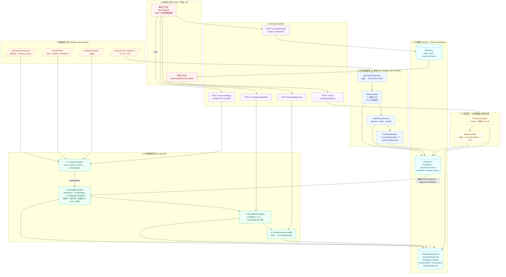

# 视觉策略方法论：离线/在线全链路 × Retrieval 形式化报告

> 适用范围：`apps/content_planning/` + `apps/growth_lab/` 视觉策略链路
> （SOP → RuleSpec → RulePack → StrategyCandidate → CreativeBrief → PromptSpec → Feedback）。
> 写作目的：用 Retrieval / Re-rank 的形式化语言重新阅读现有实现，指出每一段在工程上的对应物、命中度与改造杠杆。

---

## 0. TL;DR

- **离线（一次/版本）**：`assets/SOP/{category}/01..06.md` → `MDIngestionService` → `RuleExtractor`（确定性表格 + LLM/启发式抽 trigger/constraints/scoring/evidence）→ 人审 `RuleReviewService` → `RulePackBuilder` 装包并 activate（同 category 单 active）。
- **在线（每请求）**：`POST /content-planning/visual-strategy/compile-from-content` → `ContextCompiler`（Query 构造）→ `StrategyCompiler`（per-archetype × per-dim 召回 → 一阶打分 → 多目标 re-rank → 冲突惩罚 → Top-K=archetype 数）→ `VisualBriefCompiler`（结构化 contextization）→ `VisualPromptCompiler`（prompt linearization）。
- **反馈（半在线）**：`FeedbackEngine.submit()` 落 `visual_feedback_records`，`WeightUpdater` 仅基于 `expert_score.overall` 调 `RuleSpec.scoring.base_weight`，并写 `rule_weight_history`。
- **核心结论**：当前的"基于场景目标最大化"是由 **re-rank 的 8 子维度加权 + 冲突惩罚**承担的；召回阶段非常薄（substring 命中 + 维度分桶），`trigger.conditions` / `must_follow` 在召回与 prompt 化阶段存在信息断层；最大改造 ROI 在三处——**召回硬过滤接 trigger** / **must_follow 全程透传到 PromptSpec** / **conflict_rules 与 archetype 一起入 RulePack 配置**。

---

## 1. 技术架构图（分层）



> 图例颜色：橙=数据资产；蓝=离线；青=存储；绿=在线编译；紫=API；红=前端；黄=反馈。
> 重点观察 `RuleStore` 同时承接离线写入与在线读取——这是"离线/在线"分离但又共享一致状态的关键。

---

## 2. 架构流程描述（按"用户一次完整动作"贯穿）

> 设定：运营在 `/planning/cd6e652a...` 的 Step 3 点击「立即编译 6 类候选」。

### 2.1 离线侧（事先已发生一次/per-category）

1. **L0 → L1 知识入库**：`POST /visual-strategy/source-documents/import` 触发 `MDIngestionService.ingest_category("children_desk_mat")`，按文件名前缀 01..06 映射到六大维度，写 `SourceDocument`。
2. **L1 抽规则**：`POST /rules/extract` → `RuleExtractor.extract_for_category` 对每个 SourceDocument 跑两段抽取（表格行 + LLM/启发式），输出 `RuleSpec(status=draft)`。
3. **L1 人审**：审核台 `PATCH /rules/{id}/review` → `approved`；权重也可在此手调（v0.1 默认 0.5）。
4. **L1 装包**：`POST /rulepacks/build` → 选 approved 规则 + `ArchetypeConfig × 6`（离线注入的"目标条件"模板）→ activate，其它版本自动 archived。
5. **L2 存储**：以上全部落到 `RuleStore`（SQLite），以便在线一次性加载。

### 2.2 在线侧（每次「立即编译」）

1. **L4 接入** `POST /content-planning/visual-strategy/compile-from-content { opportunity_id, scene }`。
2. **L3 ① ContextCompiler.compile_from_opportunity**：把 `XHSOpportunityCard + BrandProfile + scene` 装成 `ContextSpec`（product / store_visual_system / audience / competitor / platform / extra）——这是检索系统的 **Query 表达**，落库供后续溯源。
3. **L3 ② StrategyCompiler.compile**（在线 retrieval 三步合并执行）：
   - **召回**：从 RulePack 取 approved 规则，按 `_DIMENSIONS` 分 6 桶；每个桶用 `category_scope ∩ scene_scope` 做硬过滤。
   - **一阶打分**：对每个 archetype × 每个 dim，`_pick_best_rule` 计算
     `score = base_weight × confidence × (1 + 0.15·命中preferred) × max(0.1, 1 − 0.25·命中avoided)`
     取 argmax 作为该 archetype 在该 dim 的"选定规则"。
   - **多目标 re-rank**：`_compute_score` 把 6 维度归一分与 brand_fit / audience_fit / differentiation / function_clarity / category_recognition / generation_control / conversion_potential 加权和，再减 `conflict_penalty × 0.3`；6 个候选按 `score.total` 降序排序，落 `VisualStrategyStore`。
4. **L5 前端**：Step 3 网格渲染 6 个候选，用户点中后 →
5. **L3 ③ VisualBriefCompiler.compile**：把候选的 `selected_variables[dim]` + `ContextSpec` 拼成 `CreativeBrief`（canvas / scene / product / style / people / copywriting / negative）——这是**结构化 contextization**。
6. **L3 ④ VisualPromptCompiler.compile**：把 `CreativeBrief` 线性化为 `PromptSpec.positive_prompt_zh / negative_prompt_zh + generation_params`。
7. **L4 推送** `POST /candidates/{id}/send-to-workbench` → `PlanStore.saved_prompts` 写入 → 跳转 `/planning/{id}/visual-builder?prompt_id=...`，进入 L5 视觉工作台。

### 2.3 反馈回路（在线触发 → 离线生效）

1. 视觉工作台或资产工作台采集到专家评分/采纳决策 → `POST /visual-strategy/feedback`。
2. **L6 FeedbackEngine.submit**：`_fill_rule_ids` 自动从 `StrategyCandidate.rule_refs` 回填，写 `FeedbackRecord`。
3. **L6 WeightUpdater.update_from_expert_score**：`delta = 0.05 × (overall/10 − 0.5)`，对命中规则 `base_weight` 做 ±25‰ 级别微调，限幅 `[0.05, 1.0]`，写 `rule_weight_history`。
4. **下一次在线编译**读 `RuleStore` 时自动用上更新后的权重——无需重发包，但同样也不会跨场景区分（这是已知差距，见 P2）。

---

## 3. 离线生产线：从 SOP 到 RulePack（实现细节）

### 3.1 知识抽取（RuleSpec）
- 入口：`POST /visual-strategy/source-documents/import` → `MDIngestionService.ingest_category` → 扫描 `assets/SOP/{slug}/01_*.md…06_*.md`，文件名编号映射 6 维度。
- 抽取：`RuleExtractor.extract_from_source(source)`
  - 第一段（确定性）：`_parse_table` 解析"变量类别 | 细分变量 | 选项 | 适用场景 | 主匹配原则"5 列宽表。
  - 第二段（增强）：`_llm_extract`（DeepSeek/OpenRouter 走 `apps.intel_hub.extraction.llm_client`）→ 输出 `{trigger, constraints, scoring, evidence}` JSON；失败/无 KEY 时降级到 `_heuristic_extract`（正则匹配"避免/优先/弱化/慎用/若店铺…"）。
  - 落库：`status=draft`、`base_weight=0.5`、`confidence=0.4~0.55`。

### 3.2 人审（治理钩子）
- `RuleReviewService` 提供 approve / reject / request_edit / update_weight / patch（`apps/content_planning/api/visual_strategy_routes.py` 第 280 起）。
- 这是规则进入"可被在线召回"的硬门槛——`StrategyCompiler._load_approved_rules` 只取 `review.status == 'approved'`。

### 3.3 RulePack 装包
- `RulePackBuilder.build`：
  - 取 `approved` 规则 → `RulePack.rule_ids`。
  - 注入 `default_strategy_archetypes`（K 个 `ArchetypeConfig`，儿童桌垫默认 6 类）。Archetype 是**离线注入的"任务/目标条件"**：每个 archetype 写明 `preferred_keywords[dim]`、`avoid_keywords`、`target_audience`、`hypothesis`。
  - `activate=True` 时同 category 旧 active 自动 archived，保证全局唯一在线版本。

### 3.4 反馈回流（半在线）
- `FeedbackEngine.submit(record)` 落 `visual_feedback_records`，并调 `WeightUpdater.update_from_expert_score`：
  - `delta = 0.05 × (overall/10 − 0.5)`，限幅 `[0.05, 1.0]`，写 `rule_weight_history` 审计。
  - **作用域**：仅修改 `RuleSpec.scoring.base_weight`，下一次在线编译时被读到——所以是"在线触发 + 离线生效"的回路。
  - CTR/转化等业务指标仍是 Phase 5 占位（`update_from_business_metrics` 空实现）。

---

## 4. 在线服务：用 Retrieval 形式化重写

把"在线编译 6 类候选"建模为：**给定场景目标 g（archetype hypothesis × audience × store visual），从候选规则集合 R 中检索每个维度的最优规则 r\*，再合成结构化输出 y（CreativeBrief / PromptSpec）。** 它正好对应三步骤：召回 → 排序 → 上下文生成。

### 4.1 步骤 ①：规则候选召回（Retrieval / Recall）

**形式化**：
\[
R_{recall}(d, g) = \{ r \in R_{pack} \mid r.dimension = d \land g.category \in r.category\_scope \land g.scene \in r.scene\_scope \}
\]

| 形式化要素 | 当前实现 |
|---|---|
| 候选池 R | `StrategyCompiler._load_approved_rules(pack)` → 只装载 active RulePack 中 `review.status==approved` 的 `RuleSpec` |
| 维度划分 | `_DIMENSIONS = ['visual_core', 'people_interaction', 'function_selling_point', 'pattern_style', 'marketing_info', 'differentiation']`，按 `r.dimension` 分桶 |
| 硬过滤 | `rule.category_scope` / `rule.scene_scope` 二元命中（`_pick_best_rule` 第 216-219 行）|
| 软过滤 | 无（不区分召回与排序，下一步直接打分）|

**特征**：召回是 **per archetype × per dim** 嵌套循环；候选池是预先按维度分桶后的 list。**没有向量索引、没有语义召回**——纯字符 in 命中。

### 4.2 步骤 ②：策略集合排序（Re-rank / Scoring）

#### 4.2.1 维度内（rule-level）打分
**形式化**：
\[
s(r \mid d, g) = w_{base}(r) \cdot c(r) \cdot (1 + \beta \cdot |\text{prefer} \cap H(r)|) \cdot \max(0.1, 1 - \pi \cdot |\text{avoid} \cap H(r)|)
\]
其中：
- `w_base = rule.scoring.base_weight`（受 WeightUpdater 反馈调控）
- `c = rule.evidence.confidence`（抽取期写入）
- `H(r) = variable_name + option_name + creative_direction + boost_factors + source_quote` 拼成的 haystack
- `prefer = archetype.preferred_keywords[d]`
- `avoid = archetype.avoid_keywords ∪ ctx.store_visual_system.avoid_elements`
- `β = 0.15`，`π = 0.25`（写死在 `_pick_best_rule` 229-233 行）

每维度取 `argmax_r s(r|d,g)` 一个最佳规则；6 维度 × 6 archetype = 36 次召回，每个 archetype 产生 1 个 6 维"选定变量包"。

#### 4.2.2 候选级（candidate-level）多目标聚合
**形式化**：
\[
S(c) = \underbrace{0.35\,\text{norm}(c) + 0.15\,\text{brand} + 0.15\,\text{aud} + 0.10\,\text{diff} + 0.10\,\text{fn} + 0.05\,\text{cat} + 0.05\,\text{ctrl} + 0.05\,\text{conv}}_{\text{组合分}} - 0.30 \cdot \pi_{conflict}(c)
\]

| 子维度 | 当前实现位置 |
|---|---|
| `norm` | 6 维度 base_score 之和归一（`_compute_score` 300-302）|
| `brand_fit` | archetype 文本 ∩ store_visual.style/colors（`_brand_fit`）|
| `audience_fit` | archetype.target_audience ∩ ctx.audience.{buyer,user,decision_logic}（`_audience_fit`）|
| `differentiation` | archetype.preferred_keywords ∩ competitor.differentiation_opportunities − ∩ common（`_differentiation_score`）|
| `function_clarity` / `category_recognition` | 维度内 score 平均（function_selling_point / visual_core）|
| `generation_control` | `1 - conflict_penalty`（生图可控度）|
| `conversion_potential` | (audience_fit + function_clarity)/2（启发式）|
| 冲突惩罚 `π_conflict` | `_detect_conflicts` 顶层常量 `CONFLICT_RULES[category]`（如 satin_with_kids、function_with_warm）|

最终 `candidates.sort(key=lambda c: c.score.total, reverse=True)`。

### 4.3 步骤 ③：上下文生成（Prompt Synthesis）

候选里 `selected_variables[dim] = {variable_name, option_name, creative_direction, must_follow, must_avoid, ...}` 是**结构化变量包**。两段渲染：

| 渲染段 | 实现 | Retrieval 形式化角色 |
|---|---|---|
| `VisualBriefCompiler.compile` | `candidate × ContextSpec → CreativeBrief(canvas, scene, product, style, people, copywriting, negative)` | **结构化 contextization**：把检索结果填入 6 字段模板；负面词从 `must_avoid` 与 `store_visual.avoid_elements` 取并集；canvas 比例由 scene 决定 |
| `VisualPromptCompiler.compile` | `CreativeBrief → PromptSpec(positive_zh, negative_zh, generation_params)` | **prompt linearization**：把结构化字段串成 7 段中文 prompt + 默认 steps=30/cfg=7；`generation_params` 由 ratio 映射宽高 |

**注意**：当前 `positive_prompt_en / workflow_json` 留空，下游若是 ComfyUI/InvokeAI 还需要在 `image_generator` / 视觉工作台再做一次模板组装；**这里有断层**——RulePack 的 prompt_direction、constraints.must_follow 等字段在中文 prompt 里部分丢失（`VisualPromptCompiler` 只用了 brief 的有限字段，未直接读 candidate.rule_refs 的 must_follow）。

---

## 5. 形式化 vs 实现对照表

| Retrieval 标准范式 | 当前实现 | 命中度 | 说明 |
|---|---|---|---|
| **(a) Query 表达** | `ContextSpec`（product / store_visual / audience / competitor / platform / extra）| ⭐⭐⭐⭐ | 字段完整；但当前 ContextCompiler 把 audience 推断写得比较粗（如"宝妈→user=儿童"），缺少向量化 query embedding |
| **(b) 候选池索引** | RuleStore SQLite + 内存分桶 (`rules_by_dim`) | ⭐⭐ | 仅按维度分桶；无 BM25 / 向量索引；规则量 < 200 时尚可，扩品类后 O(N) 扫描会成瓶颈 |
| **(c) 召回过滤** | `category_scope ∩ scene_scope` | ⭐⭐⭐ | 硬过滤；缺少 trigger.required_context 的实时校验（`r.trigger.conditions` 在召回阶段被忽略，仅作为人审证据）|
| **(d) 一阶打分** | `base × conf × (1 + 0.15·prefer) × (1 − 0.25·avoid)` | ⭐⭐⭐ | 加性命中，不区分关键词位置/权重；β、π 是常量 |
| **(e) 多目标 re-rank** | 8 子维度加权和 − 冲突惩罚×0.3 | ⭐⭐⭐⭐ | 业务相关度高（brand/audience/diff/conv）；conflict_penalty 是基于硬编码 keywords 的规则式惩罚 |
| **(f) 多样性约束 (MMR)** | 每个 archetype 独立选最优规则；archetype 之间不做去重 | ⭐⭐ | 隐式靠 archetype 多样性保证，但同 dimension 同 rule 仍可能在多个 archetype 重复出现 |
| **(g) Top-K 选择** | 固定 K=6（archetype 数量） | ⭐⭐⭐ | K 由 RulePack 决定，可配置 |
| **(h) 上下文压缩 / prompt 化** | Brief + Prompt 双阶段模板渲染 | ⭐⭐⭐ | 中文 prompt OK；但 PromptSpec 缺少对 `must_follow` 的强约束传递（Phase 4 接 ComfyUI workflow_json 才能闭环）|
| **(i) Online learning / Bandit** | WeightUpdater 调 `base_weight` | ⭐⭐ | 仅 expert_score；CTR/CVR 占位未实装；非真正的 contextual bandit |

---

## 6. 主要差距与改进建议（按 ROI 排序）

### 🔴 P0 — 在线召回的"硬条件"过粗
**现象**：`r.trigger.conditions`（如"若店铺主打森系简约"、"针对宝妈"）被 RuleExtractor 抽出来后，仅作为审核台展示，**StrategyCompiler 召回阶段没用到**。
**建议**：在 `_pick_best_rule` 之前增加 `_match_trigger(rule, ctx)`，对 `rule.trigger.conditions` 做关键词命中或短文本相似度判定，未命中的规则直接排除（提升精度，避免"无关规则被高 base_weight 拉进来"）。

```python
# strategy_compiler.py 第 213 行附近
for rule in rules:
    if rule.trigger.conditions:
        ctx_haystack = " ".join([
            ctx.audience.buyer, ctx.audience.user,
            ctx.store_visual_system.style,
            " ".join(ctx.product.claims),
        ])
        if not any(cond and cond[:6] in ctx_haystack for cond in rule.trigger.conditions):
            continue  # 触发条件不命中
```

### 🔴 P0 — Brief 与 Prompt 之间约束信息丢失
**现象**：`StrategyCandidate.selected_variables[dim].must_follow` 在 `VisualBriefCompiler` 里只被部分使用，`VisualPromptCompiler` 完全没读 candidate.rule_refs 的 must_follow，导致专家规则"产品必须居中"、"留白≥20%"等无法落到生图侧。
**建议**：
- 在 `BriefProduct` / `BriefStyle` 增加 `must_follow: list[str]` 字段；
- `VisualPromptCompiler._build_positive_zh` 末尾增加 `约束语段：…`；
- `workflow_json` 里把 `must_follow` 同步成 ComfyUI 的 ControlNet weight / region prompt 参数（Phase 4）。

### 🟡 P1 — 召回缺向量化，扩品类时性能与覆盖会塌
**现象**：当前是 Python 内循环对所有 approved rule 按维度全量扫描；haystack 命中是 substring。扩到 5+ 类目、规则池 > 1k 时会同时遭遇：① 速度慢；② 同义词召回漏（"无成年人"和"无家长"匹配不到）。
**建议**：
- 维度桶内对 `option_name + creative_direction + boost_factors` 建 BM25（rank_bm25 库；离线一次构建，增量更新）；
- 进阶：对 archetype.preferred_keywords 做 query embedding，对 rule haystack 做 doc embedding，用 BGE-zh 之类做 dense + sparse 混合召回，再交给现有 `_compute_score` re-rank。

### 🟡 P1 — Archetype 多样性不强制
**现象**：6 archetype 各自挑各维度的"最佳"规则；如果 RulePack 中某条规则同时在多个维度的 best 里，6 候选会高度相似。
**建议**：在 `compile()` 末尾加一步 MMR：
\[
\text{mmr}(c_i) = \lambda S(c_i) - (1-\lambda) \max_{c_j \in selected} \text{sim}(c_i, c_j)
\]
`sim` 用 selected_variables 的 option_name 集合 Jaccard 即可，λ=0.7。

### 🟡 P1 — `conflict_penalty` 硬编码到代码
**现象**：`CONFLICT_RULES` 写在 `strategy_compiler.py` 顶层常量，扩品类需改代码。
**建议**：把它迁移到 `RulePack.conflict_rules: list[ConflictRule]`，由 RulePackBuilder 装包时携带，在线只读。这样 `assets/SOP/{category}/conflicts.md` 可以纳入抽取流程。

### 🟢 P2 — 反馈环路不是真正的 contextual bandit
**现象**：`WeightUpdater` 只对 `expert_score.overall` 求 delta，调 `base_weight`；不区分 ContextSpec 上下文（同一规则在 A 场景好用，在 B 场景失败也共用同一权重）。
**建议**：
- 短期：把 `base_weight` 拓展为 `weight_by_scene: dict[scene, float]`；
- 中期：把 weight 拆为 `prior + θ · features(ctx, rule)`（线性 bandit），`θ` 由 expert + CTR + CVR 共同 SGD 更新；
- 长期：候选选择走 Thompson Sampling / LinUCB，给探索预算。

### 🟢 P2 — Query/Doc Embedding 与 OpportunityCard 未对齐
**现象**：`ContextSpec.competitor.{common_visuals, common_claims, differentiation_opportunities}` 来自 `OpportunityCard.value_proposition_refs / why_worth_doing`，但都是粗粒度文本；audience.decision_logic 的"使用场景：xxx"是字符串。
**建议**：在抽 OpportunityCard 时同步生成 `query_embedding` 字段（768d，存 SQLite 二进制），在 ContextCompiler 里直接复用，配合 P1 的向量召回闭环。

### 🟢 P3 — 召回与排序可观测性不足
**现象**：`StrategyCandidate.rationale` 只记录最佳规则的 source_quote 头 60 字；落选规则的得分、被淘汰原因（trigger 失败 / 冲突）不可见。
**建议**：在 `StrategyCandidate` 加 `retrieval_trace: list[{dim, rule_id, base_score, conflict_hit, kept}]`，上传 ELK / 写到 plan_store；前端 Co-pilot Inspect tab 直接展示——这是"专家可信编排"的关键证据链。

---

## 7. 关键源码索引

| 关注点 | 文件 |
|---|---|
| API 路由 | `apps/content_planning/api/visual_strategy_routes.py` |
| MD → SourceDocument | `apps/content_planning/services/md_ingestion_service.py` |
| 规则抽取 | `apps/content_planning/services/rule_extractor.py`、`apps/content_planning/prompts/extract_rules.md` |
| 人审 | `apps/content_planning/services/rule_review_service.py` |
| RulePack 装包 | `apps/content_planning/services/rulepack_builder.py`、`apps/content_planning/schemas/rule_pack.py` |
| 在线 Query | `apps/content_planning/services/context_compiler.py`、`apps/content_planning/schemas/context_spec.py` |
| 召回 + 排序 | `apps/growth_lab/services/strategy_compiler.py` |
| Brief 渲染 | `apps/growth_lab/services/visual_brief_compiler.py` |
| Prompt 渲染 | `apps/growth_lab/services/visual_prompt_compiler.py` |
| 反馈回流 | `apps/growth_lab/services/feedback_engine.py`、`apps/growth_lab/services/weight_updater.py` |
| 存储 | `apps/content_planning/storage/rule_store.py`、`apps/growth_lab/storage/visual_strategy_store.py` |

---

## 8. 一句话结论

> 当前实现已经把"专家 SOP → 规则 → 策略包 → 候选 → Brief → Prompt"的**对象链与生命周期**完整搭起来了，且**离线 / 在线 / 反馈三段切得清楚**；但从 Retrieval 视角看，召回阶段使用了非常薄的 substring + 维度分桶过滤，**真正承担"基于场景目标最大化"的是 re-rank 阶段的 8 子维度加权 + 冲突惩罚**。改造的最大杠杆点不是换检索引擎，而是把 `trigger.conditions` 接入召回硬过滤、把 `must_follow` 全程透传到 PromptSpec、把 `conflict_rules` 与 archetype 一起纳入 RulePack 配置——这三件做完，整条 pipeline 就能成为"可扩品类 / 可观测 / 反馈闭环"的、严格的目标条件检索系统。
